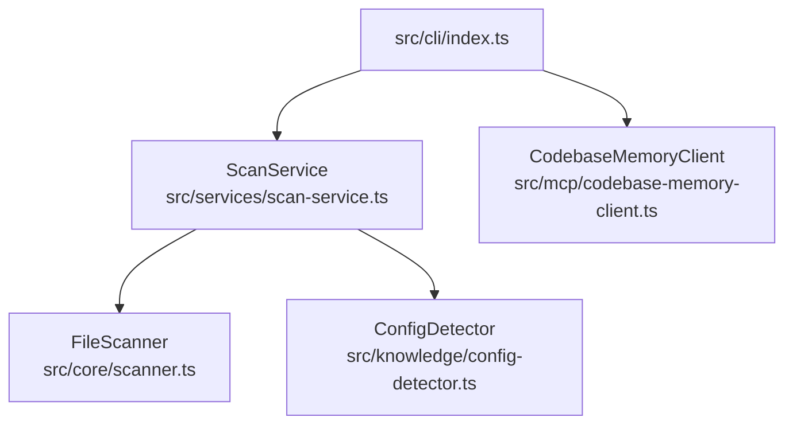

# 项目概述

Relevant source files

- src/cli/index.ts
- src/core/scanner.ts
- src/knowledge/config-detector.ts
- src/mcp/codebase-memory-client.ts
- src/services/scan-service.ts
- tests/fixtures/nestjs-project/src/user.controller.ts
- tests/fixtures/nestjs-project/src/user.module.ts
- tests/fixtures/nestjs-project/src/user.service.ts
- tests/fixtures/sample-project/src/index.ts
- tests/fixtures/sample-project/src/user.service.ts

> 本页基于提供的 JSON 数据分析得出。JSON 中未包含 `package.json` 的 `name`/`description` 字段、README 内容或 git 元数据，因此项目的**正式名称与官方定位**属于「待确认」项，以下描述严格限定在可锚定的证据范围内。

本项目是一个以 `commander` 构建的 **TypeScript 命令行工具（CLI）**，入口位于 `src/cli/index.ts`。从技术栈与符号命名（`sanitizeWikiOutput`、`validatePageContent`、`pageRelPath`、`findPageDescriptor`）可以确认，该工具的核心业务是利用大模型（`ai` 与 `@ai-sdk/openai`）**生成 Wiki 形式的 Markdown 文档**，并对其内容与输出路径进行校验和清理。代码扫描侧由 `FileScanner`（`src/core/scanner.ts`）与 `ScanService`（`src/services/scan-service.ts`）负责，配合 `ignore` 库实现文件过滤；配置探测由 `ConfigDetector`（`src/knowledge/config-detector.ts`）承担。项目通过 `tsup` 打包、`vitest` 测试，并在 `tests/fixtures/` 下放置了 `sample-project` 与 `nestjs-project` 作为多框架扫描的验证样本。

---

## 核心设计思路

**分层架构：CLI 入口 → 服务编排 → 核心能力。** 项目把命令解析集中在 `src/cli/index.ts`，把可复用的业务编排下沉到 `src/services/`（`ScanService`），把与业务无关的底层能力（文件遍历 `src/core/scanner.ts`、配置识别 `src/knowledge/config-detector.ts`、MCP 通信 `src/mcp/codebase-memory-client.ts`）独立成模块。这种切分使得 CLI 只负责参数与输出，扫描与知识提取逻辑可以被单独测试与复用，也解释了为什么 `ScanService` 与 `FileScanner` 是两个独立的类而非合并。

**以"证据驱动"为文档生成的约束。** 从符号命名可读出明显的证据链设计：`collectEvidenceFiles`（收集证据文件）→ `generate`（生成内容）→ `validatePageContent`（校验页面内容）→ `sanitizeWikiOutput`（清理输出）→ `pageRelPath` / `findPageDescriptor`（确定页面路径与描述符）。`generate` 以复杂度 11 位居 `topSymbols` 首位，说明它是整个流程中分支最多、承载最多编排逻辑的核心函数，很可能负责把扫描结果、证据与提示词组装后交给 `ai` / `@ai-sdk/openai` 生成内容。这一链路表明项目不是简单地"把代码丢给模型"，而是先收集证据、再生成、最后强制校验与清洗，以保证产出的 Markdown 结构合法、路径安全。

**技术选型的取向：轻依赖、强测试、可打包。** 运行时依赖只有 4 个（`commander`、`ignore`、`ai`、`@ai-sdk/openai`），构建与测试工具（`tsup`、`vitest`）放在开发依赖中，属于典型的"薄 CLI + 少量高质量依赖"风格。`commander` 是最成熟的 Node CLI 框架，`ignore` 直接复用 `.gitignore` 语义避免自研忽略规则，`ai` + `@ai-sdk/openai` 则让模型供应商可替换（换 provider 只改 SDK 层）。`tsup` 基于 esbuild，适合 CLI 这种需要快速产出单文件 ESM/CJS 的场景；`vitest` 与 TS 生态无缝，配合 `tests/fixtures/` 下的真实项目样本，可以对扫描器做端到端验证。

---

## 技术栈

| 技术 | 类型 | 在项目中的用途（基于证据） |
| --- | --- | --- |
| `commander` | 运行时依赖 | 构建 CLI 命令与参数解析（入口 `src/cli/index.ts`） |
| `ai` | 运行时依赖 | 大模型调用的统一抽象层，被 `generate` 等生成逻辑使用 |
| `@ai-sdk/openai` | 运行时依赖 | 为 `ai` 提供 OpenAI 供应商适配 |
| `ignore` | 运行时依赖 | 按 `.gitignore` 语义过滤文件，服务于 `FileScanner`（`src/core/scanner.ts`）文件扫描 |
| `tsup` | 开发依赖 | TypeScript 打包构建（CLI 产物构建） |
| `vitest` | 开发依赖 | 单元/集成测试框架，配合 `tests/fixtures/` 下的样本项目 |
| TypeScript | 语言 | 项目主语言（`hasTypeScript: true`），源码位于 `src/` |

**选型合理性分析。** 运行时依赖被压缩到 4 个，且每一个都对应明确的职责：`commander` 解决命令解析、`ignore` 解决文件过滤、`ai` + `@ai-sdk/openai` 解决模型调用。没有引入 `chalk`、`ora` 之类的 CLI 美化库，说明输出风格偏向纯文本/管道友好，利于被其他工具消费。把 `ai` 与 `@ai-sdk/openai` 分开，是为了让 `ai` 作为抽象、`@ai-sdk/openai` 作为具体实现，后续替换模型供应商时只影响适配层。

**工具链合理性分析。** `tsup` + `vitest` 的组合在 CLI 项目中很常见：`tsup` 提供零配置的 TS 打包，`vitest` 与 Vite/TS 生态共享配置。`tests/fixtures/` 下同时放置 `sample-project` 和 `nestjs-project` 两类样本，说明测试覆盖了"通用项目"和"框架特定项目（NestJS）"两种扫描场景。

---

## 项目结构

JSON 中 `sourceDirs` 只声明了顶层 `src`，但 `supplementalSymbols` 的 `file` 字段揭示了 `src` 下的实际子目录划分。以下按已出现的路径归纳，**未在数据中出现的目录不予推测**：

| 目录 | 职责 | 关键符号锚点 |
| --- | --- | --- |
| `src/cli/` | CLI 入口层，负责命令注册与参数解析 | `src/cli/index.ts`（入口） |
| `src/services/` | 业务编排层，对外提供扫描等服务能力 | `ScanService` @ `src/services/scan-service.ts` |
| `src/core/` | 底层核心能力，与业务无关的基础设施 | `FileScanner` @ `src/core/scanner.ts` |
| `src/knowledge/` | 知识/配置识别层 | `ConfigDetector` @ `src/knowledge/config-detector.ts` |
| `src/mcp/` | 与 codebase-memory（MCP）通信的客户端 | `CodebaseMemoryClient` @ `src/mcp/codebase-memory-client.ts` |
| `tests/fixtures/` | 测试样本项目（**测试资源，非项目功能**） | `sample-project`、`nestjs-project` |

**目录间关系。** `src/cli/` 是最外层入口，向下调用 `src/services/` 的 `ScanService`；`ScanService` 作为编排者，组合使用 `src/core/scanner.ts` 的 `FileScanner` 做文件遍历、`src/knowledge/config-detector.ts` 的 `ConfigDetector` 做配置识别；`src/mcp/codebase-memory-client.ts` 的 `CodebaseMemoryClient` 提供远程/外部记忆能力，供上层按需调用。这种 `cli → services → {core, knowledge, mcp}` 的依赖方向保证了核心能力不反向依赖 CLI，便于测试。

> 图中所有节点均来自 `entryFiles` 与 `supplementalSymbols` 的真实路径，未添加数据外的模块。

---

## 入口文件

| 入口 | 类型 | 说明 |
| --- | --- | --- |
| `src/cli/index.ts` | 项目真实入口 | CLI 主入口。基于 `commander` 解析命令与参数，是 `src/services/`、`src/core/` 等能力的调用起点。 |
| `tests/fixtures/sample-project/src/index.ts` | 测试样本入口 | **属于测试 fixture，不是本项目功能入口**，仅作为扫描器的输入样本存在。 |

**启动流程（基于现有证据）。** `src/cli/index.ts` 通过 `commander` 注册命令并解析参数，随后按命令调用服务层（如 `ScanService`）执行扫描或生成流程。由于 JSON 未提供 `src/cli/index.ts` 的内部实现细节（命令名、选项、子命令列表等），**具体命令与参数定义属于「待确认」**，需要该文件的源码才能补全。

---

## 核心组件（基于 topSymbols）

项目中复杂度最高、处于流程中枢的核心组件是 **`generate`（函数，复杂度 11）**。它以显著高于其他符号的复杂度位居首位，说明它承担了整个文档生成流程的主干编排：很可能负责整合扫描/证据结果、构造模型输入、调用 `ai` / `@ai-sdk/openai` 并处理返回。围绕它，项目形成了一条清晰的"证据-生成-校验-清洗"流水线：`collectEvidenceFiles`（复杂度 3）负责收集证据文件，`generate` 负责产出内容，`validatePageContent`（复杂度 3）对页面内容做合规校验，`sanitizeWikiOutput`（复杂度 2）对最终 Markdown 输出做清理，而 `pageRelPath`（复杂度 3）与 `findPageDescriptor`（复杂度 3）则负责页面路径与描述符的解析，`labelToSymbolType`（复杂度 5）承担标签到符号类型的映射。另一个复杂度为 5 的 `exec` 属于底层执行封装，为文件或子进程操作提供统一入口。辅助函数如 `relativePath`（复杂度 2）、`getFileLanguage`（复杂度 2）则提供路径与语言识别等基础能力。总体来看，`generate` 是"决策与编排中心"，其余函数是围绕它的输入准备、校验与输出处理环节，这种以单一高复杂度函数为核心、周边函数保持低复杂度的分布，体现了"核心逻辑集中、辅助逻辑原子化"的设计取向。

---

### 待确认清单

以下方面因 JSON 数据不足，**无法基于证据描述，需补充源码或元数据后才能填写**：

| 待确认项 | 缺失的证据 |
| --- | --- |
| 项目正式名称与一句话定位 | 缺少 `package.json` 的 `name`/`description` 或 README |
| CLI 的具体命令、参数与子命令 | 缺少 `src/cli/index.ts` 源码内容 |
| `CodebaseMemoryClient` 接入的 MCP 服务细节 | 缺少 `src/mcp/codebase-memory-client.ts` 实现与调用点 |
| `ConfigDetector` 识别的配置类型清单 | 缺少 `src/knowledge/config-detector.ts` 实现 |
| 运行/构建的具体脚本命令 | 缺少 `package.json` 的 `scripts` 字段 |
| 支持的模型与 provider 配置方式 | 缺少模型调用与配置读取代码 |

> 说明：`tests/fixtures/` 下的 `UserController`、`UserModule`、`UserService` 等类均为测试样本内容，**不属于本项目功能**，故未在上文作为项目组件描述。
## Related

- 同目录：[tech-stack.md](tech-stack.md) · [environment.md](environment.md)
- 总入口：[README](../README.md)
