# 技术栈

Relevant source files

- src/cli/commands/build.ts
- src/cli/commands/init.ts
- src/cli/commands/scan.ts
- src/cli/confirm-interaction.ts
- src/cli/index.ts
- src/core/scanner.ts
- src/knowledge/generator/index.ts
- src/knowledge/generator/shared.ts
- src/shared/config.ts
- tsup.config.ts
- vitest.config.ts

## 概述

本项目是一个以 **ESM** 为模块规范、以 **tsup** 为构建工具、以 **pnpm** 为包管理器的 TypeScript 工程。从依赖分布看，工程由三条主线构成：**CLI 命令层**（`src/cli/`）、**知识生成层**（`src/knowledge/generator/`）以及**配置与扫描层**（`src/shared/config.ts`、`src/core/scanner.ts`）。生产运行时的核心依赖共 6 个，开发依赖 2 个。

值得注意的结构特征是：核心依赖的 import 点高度集中在少数几个文件上（例如 `ignore` 只出现在 `src/core/scanner.ts`，`yaml` 只出现在 `src/shared/config.ts`），说明这些第三方库被封装在薄适配层之后，而不是在代码库中大面积散用。下文的依赖分组、升级影响面均基于这些 import 锚点推导。

## 核心技术参数

| 项目 | 取值 | 说明 |
| --- | --- | --- |
| 模块规范 | ESM | 数据字段 `runtime` 明确为 ESM |
| 构建工具 | tsup | 对应配置导入点 `tsup.config.ts` |
| 包管理器 | pnpm | 数据字段 `packageManager` |
| 核心依赖数 | 6 | 见下方核心依赖表 |
| 开发依赖数 | 2 | 见下方开发依赖表 |
| 测试专用依赖数 | 0 | `testDeps` 为空数组 |
| 扫描未命中依赖数 | 2 | 见「声明未用依赖」章节 |

## 核心依赖

按职责分组如下。表中「全部 import 点」列原样保留数据中的相对路径，用于评估升级影响面。

### 分组一：AI 生成能力

| 依赖 | 版本 | 首个 import 点 | 全部 import 点 |
| --- | --- | --- | --- |
| `@ai-sdk/openai` | ^3.0.67 | `src/knowledge/generator/index.ts` | `src/knowledge/generator/index.ts`、`src/knowledge/generator/shared.ts` |
| `ai` | ^6.0.193 | `src/knowledge/generator/shared.ts` | `src/knowledge/generator/shared.ts` |

这两个依赖构成一组：**两者共享同一个 import 文件 `src/knowledge/generator/shared.ts`**，其中 `@ai-sdk/openai` 还额外被 `src/knowledge/generator/index.ts` 导入。这说明 AI 相关能力被收敛在 `src/knowledge/generator/` 目录内部，未向 `src/cli/` 或 `src/core/` 扩散——升级 `ai` 或 `@ai-sdk/openai` 时，改动面被限制在该目录下。二者版本不同步（^6.0.193 与 ^3.0.67），说明它们是被当作两条独立的版本线管理的。

### 分组二：CLI 命令与交互

| 依赖 | 版本 | 首个 import 点 | 全部 import 点 |
| --- | --- | --- | --- |
| `commander` | ^15.0.0 | `src/cli/commands/build.ts` | `src/cli/commands/build.ts`、`src/cli/commands/init.ts`、`src/cli/commands/scan.ts`、`src/cli/index.ts` |
| `@clack/prompts` | ^1.8.1 | `src/cli/confirm-interaction.ts` | `src/cli/confirm-interaction.ts` |

`commander` 是本项目中 import 面最广的核心依赖（4 个文件），覆盖 CLI 入口 `src/cli/index.ts` 与三个子命令文件 `src/cli/commands/build.ts`、`src/cli/commands/init.ts`、`src/cli/commands/scan.ts`；据此可确认命令注册与命令实现都依赖该库（推断依据：import 分布集中在 `src/cli/` 的入口与 commands 目录）。

`@clack/prompts` 的 import 点唯一且落在 `src/cli/confirm-interaction.ts`，与命令定义文件不重叠，说明交互式确认被单独抽成一层，与 `commander` 的命令声明职责分离。

### 分组三：配置解析与文件扫描

| 依赖 | 版本 | 首个 import 点 | 全部 import 点 |
| --- | --- | --- | --- |
| `yaml` | ^2.9.1 | `src/shared/config.ts` | `src/shared/config.ts` |
| `ignore` | ^7.0.5 | `src/core/scanner.ts` | `src/core/scanner.ts` |

这两个依赖各自只有一个 import 点，且分别位于 `src/shared/config.ts` 与 `src/core/scanner.ts`——一个在 shared 层负责配置读取，一个在 core 层负责扫描，路径前缀本身即体现了职责边界。升级时，`yaml` 的影响面是配置读取链路，`ignore` 的影响面是扫描链路，二者互不重叠。

### 依赖—模块关系图

```mermaid
graph TD
  cliIndex["src/cli/index.ts"]
  cmdBuild["src/cli/commands/build.ts"]
  cmdInit["src/cli/commands/init.ts"]
  cmdScan["src/cli/commands/scan.ts"]
  confirmInteraction["src/cli/confirm-interaction.ts"]
  genIndex["src/knowledge/generator/index.ts"]
  genShared["src/knowledge/generator/shared.ts"]
  scanner["src/core/scanner.ts"]
  config["src/shared/config.ts"]

  commander["commander"]
  clack["@clack/prompts"]
  aiPkg["ai"]
  openaiPkg["@ai-sdk/openai"]
  ignorePkg["ignore"]
  yamlPkg["yaml"]

  cliIndex --> commander
  cmdBuild --> commander
  cmdInit --> commander
  cmdScan --> commander
  confirmInteraction --> clack
  genIndex --> openaiPkg
  genShared --> openaiPkg
  genShared --> aiPkg
  scanner --> ignorePkg
  config --> yamlPkg
```

### 选型动机（推断）

数据中的 `intent` 数组为空，**没有可引用的提交主题或注释证据**，因此以下关于「为什么选这几个库」的分析均为推断，推断依据仅限 import 分布与目录命名特征：

- **推断一（CLI 与交互分层）**：`commander` 覆盖 `src/cli/index.ts` 与 `commands/` 下三个文件，而 `@clack/prompts` 独占总在 `src/cli/confirm-interaction.ts`——把「命令声明」与「用户确认」拆到不同文件、不同库，推断其目的是让命令定义保持纯粹、把阻塞式交互隔离在单一模块内。此为基于 import 分布的推断，非文档化结论。
- **推断二（扫描/配置解耦）**：`ignore` 与 `yaml` 各自只被一个文件导入，且分属 `src/core/` 与 `src/shared/`，推断第三方库被有意约束在适配层内，以缩小升级半径。此为基于 import 独占性的推断。

## 开发依赖

| 依赖 | 版本 | 首个 import 点 |
| --- | --- | --- |
| `tsup` | ^8.5.1 | `tsup.config.ts` |
| `vitest` | ^4.1.7 | `vitest.config.ts` |

两者都只出现在工程根目录的配置文件里，未进入 `src/` 下的任何业务文件，属于典型的构建/测试期依赖：

- **`tsup`** 出现在 `tsup.config.ts`，与数据中的 `buildTool: "tsup"` 字段相互印证，是本项目的构建工具入口。
- **`vitest`** 出现在 `vitest.config.ts`，是测试运行器配置的导入点。注意：数据中 `testDeps` 为空，`vitest` 被归在 `devDeps` 下，其配置导入点 `vitest.config.ts` 也是数据中唯一的测试相关配置锚点。

开发依赖的引入动机在数据中同样没有 `intent` 佐证，为避免超出推断配额，此处不再展开推测。

## 声明未用依赖

> 下表由源码 import 扫描推导（覆盖 .ts/.js/.vue/.css），存在动态加载、字符串引用等扫描盲区，清理前请人工复核。

| 依赖 | 版本 |
| --- | --- |
| `@types/node` | ^25.9.1 |
| `typescript` | ^6.0.3 |

需要强调的是：**本数据既未提供这两个依赖的使用证据，也未提供它们不被使用的反证**。它们未被扫描命中的事实，与「它们确实未被使用」是两个不同的判断，请勿据此直接删除。

## 待确认

1. **import 点行号缺失**：数据仅提供文件路径粒度，未提供 `file:line`，因此本页所有依赖锚点均止于文件级，无法定位到具体导入语句。需补充带行号的扫描结果。
2. **依赖引入动机无证据**：`intent` 为空数组，本文档中所有选型理由均已标注为推断，若要给出有据可依的技术选型史，需补充依赖相关提交的主题与日期。
3. **`typescript` 与 `@types/node` 的真实使用路径**：需结合 `tsconfig` 等配置文件与构建链路人工复核，当前数据无法判定。
## Related

- 同目录：[overview.md](overview.md) · [environment.md](environment.md)
- 互补职责：[overview.md](../01-overview/overview.md)
- 共享 6 个源文件、共享 25 个符号：[onboarding.md](../05-guides/onboarding.md)
- 共享 6 个源文件、共享 24 个符号：[troubleshooting.md](../05-guides/troubleshooting.md)
- 共享 6 个源文件、共享 8 个符号：[modules.md](../02-architecture/modules.md)
- 总入口：[README](../README.md)
