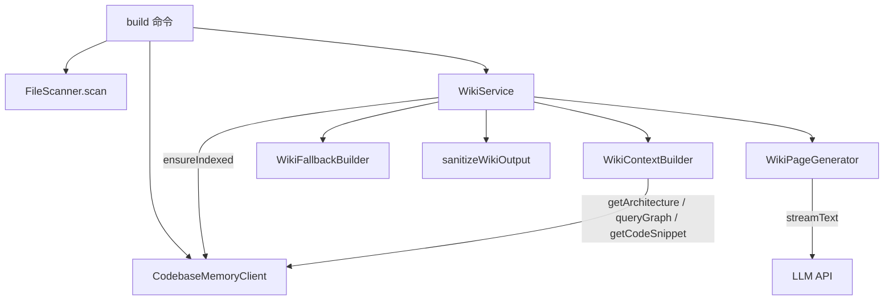

# 架构

## 分层结构（自上而下）

```text
bin.ts / cli/          可执行入口 + Commander 命令注册（薄封装）
        │
services/              编排层：ScanService（扫描）、WikiService（生成管线编排）
        │
knowledge/             Wiki 生成核心：页面注册表 / 上下文构建 / LLM 生成 / 规则回退 / 输出清理 / 配置探测
        │
mcp/                   codebase-memory-mcp 子进程客户端（唯一数据源）
        │
core/ + shared/        基础设施：FileScanner、领域类型、常量、工具函数
```

**依赖方向单向向下**：cli → services → knowledge → mcp；core/shared 被上层引用，不反向依赖。

## 模块间真实 import 依赖

以下边表来自源码 import 语句（R2：边表优于图渲染，Mermaid 图仅作概览）：

| 依赖方 | 被依赖方 | 关键依赖点 |
| --- | --- | --- |
| `bin.ts` | `cli/` | `createProgram()`（src/bin.ts:2） |
| `cli/index.ts` | `cli/commands/*` | `registerInitCommand` / `registerScanCommand` / `registerBuildCommand`（src/cli/index.ts:7-9） |
| `cli/commands/scan.ts` | `services/scan-service.ts` | `new ScanService(root).scan()` |
| `cli/commands/build.ts` | `core/scanner.ts`、`services/wiki-service.ts`、`mcp/codebase-memory-client.ts` | build 命令内联完成装配 |
| `services/wiki-service.ts` | `knowledge/*`（6 个模块） | 装配 contextBuilder / fallbackBuilder / pageGenerator / ConfigDetector |
| `knowledge/wiki-service` 调用链 | `mcp/` | 仅 `WikiContextBuilder` 直接持有 `CodebaseMemoryClient` |
| `core/scanner.ts` | `shared/` | `IGNORED_DIRS`、`SUPPORTED_EXTENSIONS`、`getFileLanguage` |
| `knowledge/types.ts` | `core/types.ts` | 复用 `SymbolType`、`RelationType` |

## 关键设计约束

1. **mcp/ 是唯一外部数据源** — 所有代码结构数据（符号、CALLS 边、复杂度、entry_points、hotspots）都来自 `CodebaseMemoryClient` 的 7 个方法；项目内**没有**任何自建索引（旧 SQLite/tree-sitter 管线已删除，见 [decisions#ADR-001](../04-design/decisions.md)）。
2. **knowledge/ 不含 I/O 装配** — `WikiService`（services 层）负责 new 出所有 builder 并串管线；knowledge 层类只声明依赖（构造注入）。
3. **页面派发三处对齐** — `WikiContextBuilder.buildByName` / `WikiPageGenerator.generateByName` / `WikiFallbackBuilder.buildByName` 三个 switch 按 page name 派发，与 `PAGE_REGISTRY` 的 18 个描述符保持契约一致（见 [page-registry](../04-design/page-registry.md)）。
4. **CLI 层薄** — 命令处理器只做参数解析 + 服务调用 + console 输出，无业务逻辑。

## build 命令的装配流（概览图）



数据在各阶段的具体变换见 [data-flow](data-flow.md)。

## Related

- Code: `src/services/wiki-service.ts` · `src/knowledge/wiki-context-builder.ts` · `src/mcp/codebase-memory-client.ts`
- Docs: [modules](modules.md) · [data-flow](data-flow.md) · [decisions](../04-design/decisions.md)
