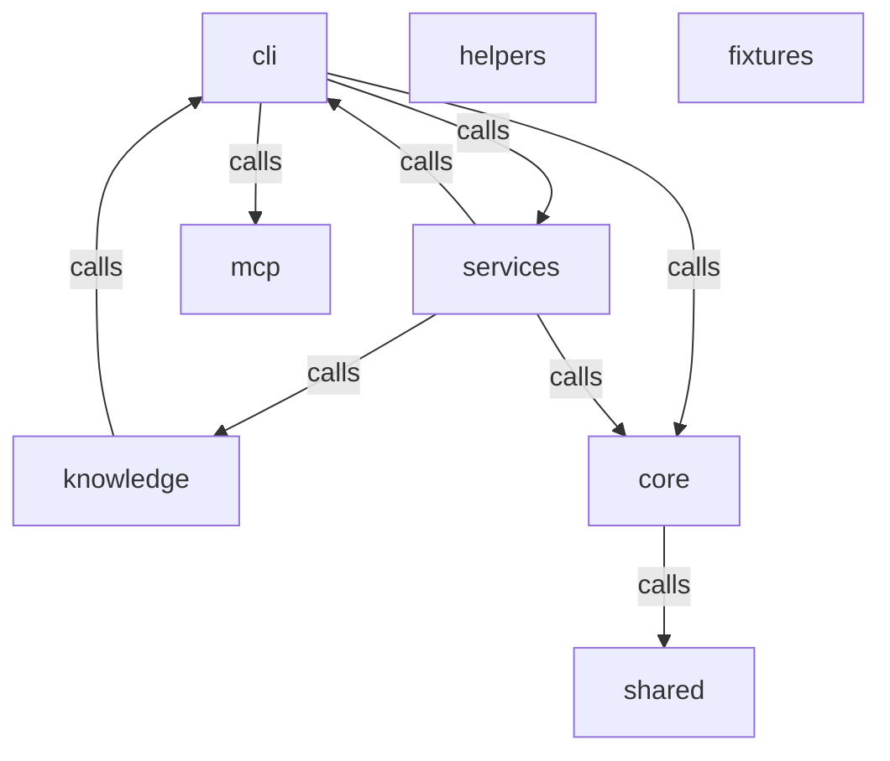

# 架构文档

<details>
<summary>Relevant source files</summary>

- src/core/scanner.ts
- src/knowledge/config-detector.ts
- src/mcp/codebase-memory-client.ts
- src/services/scan-service.ts
- tests/fixtures/nestjs-project/src/user.controller.ts
- tests/fixtures/nestjs-project/src/user.module.ts
- tests/fixtures/nestjs-project/src/user.service.ts
- tests/fixtures/sample-project/src/user.service.ts
</details>

> 本页基于模块与依赖数据，描述项目的模块划分、分层结构、核心符号与依赖关系。

## 整体架构设计思路

从模块数据的 `relations` 与 `boundaries` 看，本项目呈现一种**以 `cli` 为调度入口、`services` 为编排中心、`core` 为底层能力支撑、`knowledge` 为被高频复用产出层**的分层结构。`cli` 同时被 `services` 与 `knowledge` 调用（fan-in=2），又向外调用 `services`、`core`、`mcp`（fan-out=4，见 layers 中 cli 的 reason），说明 CLI 既是命令注册/程序装配的启动面，也是被其他模块回调的公共入口点。`services` 处于核心编排位置，fan-out 高达 19（layers：`services` internal，fan-out=19），其中对 `knowledge` 的调用次数达到 17（boundaries），表明服务层主要负责把知识内容写入/host 到知识产出模块。

`knowledge` 被 layers 归为 **core 层**，理由是 "high fan-in (17 in, 1 out)"——它是整个依赖网中入度最高、出度极低的模块，被 `services` 集中调用 17 次（boundaries: services→knowledge=17）。其导出的 6 个方法全部是 Markdown 片段写入原语（`addBulletList` / `addCodeBlock` / `addNewline` / `addParagraph` / `addSection` / `addSubSection`），本质上是一个**知识/文档内容组合的原子操作层**，被上层反复复用。

`core` 被 layers 归为 internal 层（fan-in=2, fan-out=2），仅暴露 `collectImportedPackages` 一个符号（docstring 说明其职责是扫描源文件、提取 import 包名并过滤死依赖），并通过 `core→shared` 调用 2 次（boundaries）。`shared` 与 `mcp` 都被 layers 标为 **leaf 层**（"only inbound calls, no outbound"），即只被调用、不再向外调用，属于依赖链末端的叶子。`mcp` 模块的 6 个符号以 `adaptArchitecture`、`adaptTrace`、`asObjects` 等**数据形态适配**函数为主，加上 `ensureIndexed`、`exec`、`getArchitecture` 这些图谱/架构访问方法，整体定位是对外数据源（列式表 / 旧版数组）到内部对象的适配层。`cli`、`core`、`helpers` 均被 layers 标为 internal 层（helpers 的 fan-in=0、fan-out=0，为孤立内部模块）。

`fixtures`、`helpers`、`shared` 三个模块在 `topSymbols` 中为空（symbolCount 分别为 0、0、0），且 fixtures 未出现在任何 relations 或 boundaries 中；`shared` 仅有 `core→shared` 的 2 次调用入边。整体架构风格是**分层 + 中心编排**：`cli` 负责入口装配，`services` 负责业务编排并按 17:1 的比例大量触达 `knowledge` 的内容写入原语，`core` 提供扫描/依赖收集能力并向下调用 `shared`，`mcp` 与 `shared` 作为叶子承接外部数据接入。

## 架构图



> 说明：`fixtures`、`helpers` 在 `relations` 中无任何边，图中以孤立节点呈现。节点名严格取自 `modules[].name`，边严格取自 `relations[]`。

## 核心模块详解

### cli

`cli` 模块在 `topSymbols` 中无导出符号（symbolCount=0），但在依赖结构中处于节点位置。layers 给出 `cli` 的 reason 为 "fan-in=2, fan-out=4"，即被 2 个模块调用、向外调用 4 个模块。从 boundaries 看，`cli→services`（2 次）、`cli→core`（1 次）、`cli→mcp`（1 次）均存在，同时 `services→cli`（1 次）与 `knowledge→cli`（1 次）又反向指回。结合 clusters 中 "src" 集群的 topNodes（如 `registerBuildCommand`、`createProgram`、`registerScanCommand`、`registerInitCommand`、`FileScanner`），`cli` 承担命令注册与程序装配的入口职责。其对外调用集中在编排（services）、核心扫描（core）与图谱适配（mcp）三处。

### services

`services` 是编排中心，fan-out=19（layers），其中对 `knowledge` 的调用占 17 次（boundaries: services→knowledge=17），另有 `services→core`（1）、`services→cli`（1）。其 `topSymbols` 为两个清理类方法：`cleanupLegacyFlatFiles` 与 `cleanupRetiredPages`。

- `cleanupLegacyFlatFiles(wikiDir: string, pages: string[])`：清理旧版扁平输出（wiki 根下的 `${page}.md`）。docstring 明确其仅删除本工具拥有的页面文件；并特别说明 `readme` 特例——旧 `readme.md` 让位于 `README.md`，且为避免大小写不敏感文件系统上 `existsSync('readme.md')` 误命中 `README.md` 导致每次构建误删并重写 README，改用目录条目精确比对文件名。
- `cleanupRetiredPages(wikiDir: string)`：清理已退休页面路径的残留文件，退休路径登记于 `RETIRED_WIKI_PATHS`。

这两个符号体现出服务层不仅做编排，还负责**产物目录的清理与版本迁移**。结合 clusters 中出现的 `buildByName`、`WikiBuilder`、`buildOverview`、`buildArchitecture`、`buildDataFlow`、`generateByName`、`generatePage` 等节点，service 层是 wiki 构建/生成流程的实际执行者。

### knowledge

`knowledge` 被 layers 归为 core 层（high fan-in），仅向外调用 `cli` 1 次（boundaries），是典型的被高频复用模块。6 个方法构成 Markdown 内容写入原语集合：

```ts
addSection(title: string, content: string)      // ## title\n\ncontent
addSubSection(title: string, content: string)   // ### title\n\ncontent
addParagraph(text: string)                      // 普通段落
addBulletList(items: string[])                  // 项目符号列表
addCodeBlock(language: string, code: string)    // 带语言提示的围栏代码块
addNewline()                                    // 空行
```

设计意图清晰：把文档结构（二级/三级标题、段落、列表、代码块、空行）封装为独立的原子操作，让上层（主要是 `services`，17 次调用）无需关心 Markdown 拼接细节，只需按序调用即可拼装页面。`addSection` 的 docstring 明确产出 `## title\n\ncontent`，`addSubSection` 产出 `### title\n\ncontent`，是文档层级结构的直接映射。

### core

`core` 为 internal 层（fan-in=2, fan-out=2），仅导出 1 个符号：

```ts
collectImportedPackages(files: ScannedFile[]): ?
```

docstring 说明其职责为：扫描源文件、提取所有 import 语句引用的包名，并**只保留被实际 import 的依赖、过滤死依赖（声明了但从未使用）**。这说明 `core` 承担依赖真实使用情况的采集能力。core 通过 `core→shared`（2 次）向下调用 `shared`。clusters 中包含 `walkDirectory`、`scan`、`detectTechStack`、`isIgnored`、`shouldSkipDir` 等节点，以及 supplementalSymbols 中 `src/core/scanner.ts` 的 `FileScanner` 类，表明 `core` 同时包含目录遍历 / 文件扫描 / 技术栈探测能力。

### mcp

`mcp` 为 leaf 层（只有入边、无出边），仅被 `cli` 调用 1 次（boundaries: cli→mcp=1）。它导出 6 个符号，可分为两类：

**数据形态适配函数**：
```ts
adaptArchitecture(raw: Record<string, any>)  // get_architecture 列式表 → ArchitectureData 对象数组
adaptTrace(raw: Record<string, any>)         // trace_path 分组列式表 → 扁平 TraceNode[]
asObjects(raw: Record<string, unknown>, key: string)  // 兼容旧版对象数组 / 新版列式表两种形态
```

**图谱/架构访问方法**：
```ts
ensureIndexed(mode: 'fast' | 'moderate' | 'full' = 'moderate')  // 确保图谱已索引（幂等）
exec(tool: string, args: Record<string, unknown>)                // 内部方法
getArchitecture()                                                // 架构概览
```

从 docstring 可见，`mcp` 承担从外部工具（`get_architecture`、`trace_path`）返回的**列式表 / 旧版数组**到内部对象（`ArchitectureData[]`、`TraceNode[]`）的适配职责，`asObjects` 专门兼容两种历史数据形态。`ensureIndexed` 的幂等语义表明索引建立可被重复安全调用。supplementalSymbols 中 `src/mcp/codebase-memory-client.ts` 的 `CodebaseMemoryClient` 类进一步印证其作为外部图谱/记忆服务的客户端定位。

### shared

`shared` 为 leaf 层（只有入边、无出边），topSymbols 为空，仅被 `core` 调用 2 次（boundaries: core→shared=2）。其具体导出符号数据不足，**待确认**：需要 `shared` 模块导出符号清单以描述其职责。

### helpers

`helpers` 为 internal 层，layers reason 为 "fan-in=0, fan-out=0"，即**在 relations 中无任何调用边**，也未出现在 topSymbols 数据中。**待确认**：需 `helpers` 的符号清单与调用点以说明其职责，当前数据不足以描述。

### fixtures

`fixtures` 的 symbolCount=0、topSymbols 为空，且未出现在 relations / boundaries 中。存在 supplementalSymbols 中位于 `tests/fixtures/...` 的类（`UserController`、`UserModule`、`UserService`），这些属于测试夹具代码，不等于项目功能模块。**待确认**：`fixtures` 作为模块的实际角色在数据中未体现。

## 模块依赖分析

基于 `boundaries` 数据，所有依赖边及其调用次数如下表：

| from | to | callCount | 说明 |
|------|-----|-----------|------|
| services | knowledge | 17 | 最重依赖，服务层密集调用知识内容写入原语 |
| core | shared | 2 | core 向下调用 shared |
| cli | services | 2 | CLI 调度服务编排 |
| services | core | 1 | 服务层调用核心扫描能力 |
| services | cli | 1 | 服务层反向调用 CLI |
| knowledge | cli | 1 | 知识层回调 CLI |
| cli | core | 1 | CLI 调用核心扫描 |
| cli | mcp | 1 | CLI 调用 MCP 适配层 |

**关键依赖路径分析**：

1. `services → knowledge`（17 次）是全项目最粗的依赖边，占全部 8 条边总调用次数（27 次）的约 63%，印证 `knowledge` 被 layers 标记为 "high fan-in (17 in, 1 out)" 的 core 层定位。服务层通过知识原语逐条拼装文档内容。

2. `cli` 是三向调度枢纽：向外 `cli→services`（2）、`cli→core`（1）、`cli→mcp`（1）；同时被 `services→cli`（1）与 `knowledge→cli`（1）反向调用。这种双向关系说明 `cli` 既提供入口装配，又被下游模块回调（例如共享的命令/上下文对象）。

3. `core → shared`（2 次）是 core 唯一的出边，`shared` 作为 leaf 被 core 独占调用，构成 `cli → core → shared` 与 `services → core → shared` 两条向下路径的末端。

4. `mcp` 仅有一条入边 `cli → mcp`（1 次），与 layers "only inbound calls, no outbound" 的 leaf 判定一致，是纯粹的被调用数据适配层。

5. `helpers`、`fixtures` 在 boundaries 中完全没有出现，与 layers 中 helpers "fan-in=0, fan-out=0" 一致，在当前调用数据中处于孤立状态。

## 横切关注点

> 严格基于提供的 JSON 数据，仅就数据中出现的相关信息描述；未出现的关注点不展开。

**数据形态兼容（可视为数据层横切）**：`mcp` 模块的 `asObjects(raw, key)` 的 docstring 明确为"兼容两种形态：旧版对象数组 / 新版列式表"，`adaptArchitecture`、`adaptTrace` 分别把列式表转为对象数组与扁平 `TraceNode[]`。这说明系统在数据接入层统一处理新旧两版数据格式的兼容问题。

**产物清理 / 页面生命周期管理（可视为文件系统横切）**：`services` 导出 `cleanupLegacyFlatFiles` 与 `cleanupRetiredPages` 两个清理方法，其中 `cleanupLegacyFlatFiles` 的 docstring 详述了跨平台细节——在大小写不敏感文件系统上避免 `existsSync('readme.md')` 误命中 `README.md`，改用目录条目精确比对文件名。`cleanupRetiredPages` 则通过 `RETIRED_WIKI_PATHS` 登记退休页面路径。这两者构成产物目录在版本迁移时的清理横切机制。

**索引/图谱访问的幂等保障**：`mcp` 的 `ensureIndexed(mode)` docstring 明确"确保图谱已索引（幂等）"，为外部图谱服务的访问提供幂等前提。

**错误处理、日志、配置管理**：提供的 JSON 数据中未包含错误处理、日志、配置管理相关的符号或证据。**待确认**：需补充相应模块的符号与调用点数据后方可描述。

> 关于 names 为空的 layer（`layer: "api"` 且 `name: ""`；以及 `name: "ts"` 属 api 层）——数据中未给出该占位层对应的实际模块名与来源文件，**待确认**：需补充该 api 层对应模块的标识与其 HTTP 路由定义证据。
## Related

- 同目录：[data-flow.md](data-flow.md) · [modules.md](modules.md)
- 总入口：[README](../README.md)
