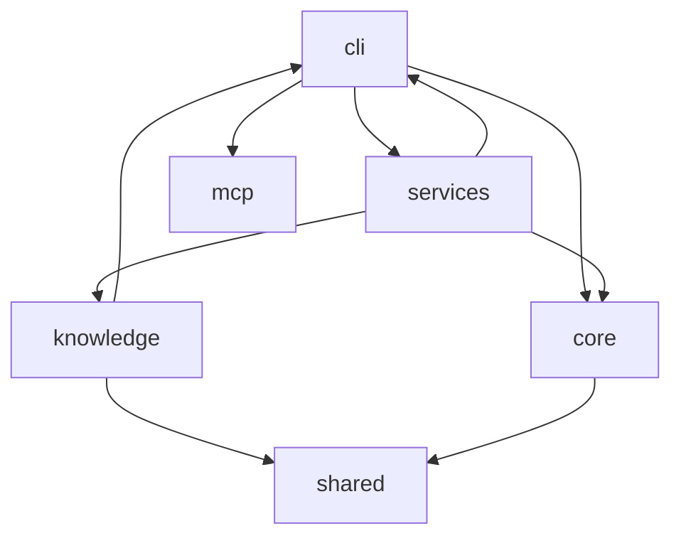

# 架构文档

<details>
<summary>Relevant source files</summary>

- src/core/scanner.ts
- src/knowledge/config-detector.ts
- src/knowledge/topic-discovery.ts
- src/mcp/codebase-memory-client.ts
- src/services/scan-service.ts
</details>

> 本页基于模块依赖与分层数据，描述项目的模块划分、依赖关系与架构风格。所有事实声明均附锚点（模块名 / file:line / qualified_name）。

## 整体架构设计思路

本项目是一个围绕 **代码库扫描、知识抽取与 Wiki 页面生成** 的 CLI 工具，其架构以 `src` 目录下的松散层为组织单位。从 `layers` 数据看，系统的层次并不是传统的"表现层-业务层-数据层"三段式，而是按**扇入扇出（fan-in/fan-out）权重**划分的职责层：`shared` 与 `knowledge` 被标记为 `core` 层（`shared` fan-in=15、fan-out=0；`knowledge` fan-in=22、fan-out=14），说明它们是被大量模块复用的底层能力；`services`、`core`、`cli` 被标记为 `internal` 层，承担业务流程编排与命令入口职责；`mcp` 被标记为 `leaf` 层（仅入站调用、无出站），是数据适配的末端；另有标注为 `api` 层的空白节点与 `ts` 节点，`reason` 为"has HTTP route definitions"，但模块名为空，具体归属信息不足。

各层的协作遵循**依赖向下、能力沉淀**的机制：最外层的 `cli` 同时调用 `services`、`core`、`mcp`（见 boundaries：cli→services、cli→core、cli→mcp），负责命令注册与调度；`services` 作为业务编排层，向下调用 `knowledge`（22 次，最重依赖）、`core`（1 次），并向上回指 `cli`（1 次）；`knowledge` 作为核心知识层，既被 `services` 大量调用，自身也调用 `shared`（13 次）并调用 `cli`（1 次）；`core` 则依赖 `shared`（2 次）。整体呈现出一个以 `services` 为编排中枢、`knowledge` 与 `shared` 为能力基座、`mcp` 为数据适配末端的架构形态。

从 `clusters` 数据看，`src` 内部进一步凝聚为多个功能簇，包括：32 成员的上下文调度簇（topNodes 含 `dispatchContext`、`buildOnboardingContext`、`buildApiContext`）、23 成员的 Wiki 构建簇（`buildWiki`、`findPageDescriptor`、`buildRelatedSection`）、21 成员的页面构建簇（`buildByName`、`WikiBuilder`、`buildOverview`、`buildArchitecture`、`buildDataFlow`）、20 成员的生成与输出净化簇（`generateByName`、`generatePage`、`sanitizeWikiOutput`）、13 成员的 MCP 客户端簇（`exec`、`adaptArchitecture`、`asObjects`、`adaptTrace`、`getArchitecture`）、10 成员的扫描簇（`walkDirectory`、`scan`、`detectTechStack`、`isIgnored`）等。这些簇揭示了"扫描→知识抽取→页面构建→生成净化→输出清理"的端到端流水线，而 `services` 中的清理符号（`cleanupLegacyFlatFiles`、`cleanupRetiredPages`、`cleanupStaleTopicPages`）正好对应流水线末端的产物治理环节。

架构风格上，本项目属于**面向 CLI 的管道式工具架构**：入口通过命令注册（`registerBuildCommand`、`registerScanCommand`、`registerInitCommand`、`createProgram`）暴露操作，业务逻辑由 `services` 编排，底层扫描 / 生成 / 适配能力分散在 `core`、`knowledge`、`mcp`，并统一沉淀到 `shared`。值得注意的是存在若干**双向依赖**（cli↔services、services→cli、knowledge→cli），说明当前分层并非严格单向，`cli` 被下层反向引用，构成一个待关注的架构耦合点。

## 架构图

下图展示模块间依赖方向（节点名为真实模块名，边方向即依赖方向）。



> 说明：`fixtures`、`shared`、`helpers` 在 `relations` 中无出/入边（`shared` 仅作为被调用方出现在 boundaries 中，见下表），故在图中以孤立或被指向节点呈现。`shared`、`helpers` 无顶层符号数据。

## 核心模块详解

### knowledge（core 层）

`knowledge` 是系统的核心知识层，符号数 6，被 `services` 高频调用（22 次），并向下依赖 `shared`（13 次，project 内最重的核心依赖之一）。其 `topSymbols` 全部为文档内容构建方法，围绕 Markdown 片段拼装展开：

| 符号 | 类型 | 签名 | 作用（引自 docstring） |
| --- | --- | --- | --- |
| `addBulletList` | method | `(items: string[])` | Add a bullet list. |
| `addCodeBlock` | method | `(language: string, code: string)` | Add a fenced code block with an optional language hint. |
| `addNewline` | method | `()` | Add an empty line. |
| `addParagraph` | method | `(text: string)` | Add a plain paragraph. |
| `addSection` | method | `(title: string, content: string)` | Add a second-level section：`## title` +（content 非空时）`\n\ncontent` |
| `addSubSection` | method | `(title: string, content: string)` | Add a third-level sub-section：`### title` +（content 非空时）`\n\ncontent` |

设计意图清晰：将 Markdown 文档的**原子结构**（段落、列表、代码块、二级/三级标题、空行）封装为独立方法，使上层页面构建逻辑可以像搭积木一样组装文档，避免在各处散落字符串拼接。该模块同时通过 `shared` 复用基础工具能力。

### mcp（leaf 层）

`mcp` 为依赖末端（leaf），只有入站调用、无出站依赖（layers: `mcp` reason = "only inbound calls, no outbound"），被 `cli` 调用 1 次。其职责是**数据形态适配**——把外部/上游工具返回的"列式表"结构转换为项目内部的对象模型。符号数 5：

| 符号 | 类型 | 签名 | 作用（引自 docstring） |
| --- | --- | --- | --- |
| `adaptArchitecture` | function | `(raw: Record<string, any>)` | get_architecture 列式表 → ArchitectureData 对象数组 |
| `adaptTrace` | function | `(raw: Record<string, any>)` | trace_path 分组列式表 → 扁平 TraceNode[] |
| `asObjects` | function | `(raw: Record<string, unknown>, key: string)` | 兼容两种形态：旧版对象数组 / 新版列式表 |
| `ensureIndexed` | method | `(mode: 'fast' \| 'moderate' \| 'full' = 'moderate')` | 确保图谱已索引（幂等） |
| `exec` | method | `(tool: string, args: Record<string, unknown>)` | 内部方法（tool 执行入口） |

其中 `asObjects` 体现**向后兼容**设计意图（同时支持旧版对象数组与新版列式表），`ensureIndexed` 的幂等语义保证了索引准备的重复调用安全，`exec` 作为内部统一工具调用入口。补充符号显示 `mcp` 目录下还有类 `CodebaseMemoryClient`（file: src/mcp/codebase-memory-client.ts），是 MCP 客户端主体的承载者。

### core（internal 层）

`core` 位于 internal 层，fan-in=2、fan-out=2，符号数 1。其唯一顶级符号 `collectImportedPackages` 承担**依赖真实性校验**职责：

```ts
collectImportedPackages(files: ScannedFile[]): ...
```

docstring 明确："扫描源文件，提取所有 import 语句引用的包名。只保留被实际 import 的依赖，过滤死依赖（声明了但从未使用）。" 设计意图是让依赖分析基于**真实引用**而非声明，从而输出可信的依赖清单。`core` 依赖 `shared`（2 次），并被 `cli`（1 次）与 `services`（1 次）调用。补充符号显示 `core` 目录下有类 `FileScanner`（file: src/core/scanner.ts），对应扫描簇中的 `walkDirectory`、`scan`、`detectTechStack`、`isIgnored`、`shouldSkipDir` 等符号。

### services（internal 层）

`services` 是业务编排层，fan-out 高达 24，符号数 3。其顶层符号全部为**构建产物清理**方法，对应 Wiki 生成流水线的末端治理：

| 符号 | 类型 | 签名 | 作用（引自 docstring） |
| --- | --- | --- | --- |
| `cleanupLegacyFlatFiles` | method | `(wikiDir: string, pages: string[])` | 清理旧版扁平输出（wiki 根下的 `${page}.md`），只删除本工具拥有的页面文件；readme 特例让位于 README.md；用目录条目精确比对文件名以规避大小写不敏感文件系统的误命中 |
| `cleanupRetiredPages` | method | `(wikiDir: string)` | 清理已退休页面路径的残留文件（改名/下线登记于 RETIRED_WIKI_PATHS） |
| `cleanupStaleTopicPages` | method | `(wikiDir: string, pages: string[])` | 清理 08-topics 下未列入本次计划的主题文件（目录为工具所有） |

`cleanupLegacyFlatFiles` 的 docstring 特别说明了**文件系统大小写不敏感**场景下的防御设计（用目录条目精确比对而非 `existsSync`），体现对跨平台行为的工程考量。`services` 依赖 `knowledge`（22 次）、`core`（1 次），并回指 `cli`（1 次）。补充符号显示 `services` 目录下有类 `ScanService`（file: src/services/scan-service.ts）。

### cli（internal 层）

`cli` 是命令入口层，fan-in=2、fan-out=4，被 `services` 与 `knowledge` 反向引用（各 1 次），并向下调用 `services`（2 次）、`core`（1 次）、`mcp`（1 次）。`cli` 无顶级符号数据，但其专属簇揭示了核心构成：`registerBuildCommand`、`createProgram`、`FileScanner`、`registerScanCommand`、`registerInitCommand`（9 成员簇）以及 `generateByName`、`generate`、`generatePage`、`sanitizeWikiOutput`、`onChunk`（20 成员簇），说明 `cli` 同时承担命令注册与生成执行入口两项职责。

### shared（core 层）

`shared` 被标记为核心层，fan-in=15、fan-out=0，是整个系统**被依赖最多、自身不依赖任何模块**的基础能力层。其在 `relations` 中无节点条目，但作为被调用方出现在 boundaries 中（被 `knowledge` 调用 13 次、被 `core` 调用 2 次）。`shared` 无顶级符号与补充符号数据，**具体承载的工具函数信息不足**，待确认。

### fixtures / helpers（无依赖数据）

`fixtures` 符号数为 0，无依赖关系；`helpers` 在 layers 中标记为 internal 层（fan-in=0、fan-out=0），同样无符号与依赖数据，二者**职责信息不足**，待确认。

## 模块依赖分析

下表列出 `boundaries` 中的全部依赖边及调用次数（边方向 = 调用方 → 被调用方）：

| 调用方 (from) | 被调用方 (to) | 调用次数 (callCount) | 说明 |
| --- | --- | --- | --- |
| `services` | `knowledge` | 22 | 系统内最重的依赖边，编排层高频消费知识层能力 |
| `knowledge` | `shared` | 13 | 核心知识层的底层工具依赖 |
| `core` | `shared` | 2 | 扫描核心对基础能力的依赖 |
| `cli` | `services` | 2 | 入口调用编排层 |
| `services` | `cli` | 1 | 编排层反向回指入口（双向依赖） |
| `services` | `core` | 1 | 编排层调用扫描核心 |
| `cli` | `core` | 1 | 入口调用扫描核心 |
| `cli` | `mcp` | 1 | 入口调用 MCP 适配层 |
| `knowledge` | `cli` | 1 | 知识层反向回指入口（双向依赖） |

**关键依赖路径分析：**

- **主通道**：`cli → services → knowledge → shared` 构成系统主干调用链。`cli` 先调用 `services`（2 次），`services` 再以 22 次调用 `knowledge`，`knowledge` 最终以 13 次调用 `shared`。这条路径承载了"命令 → 编排 → 知识构建 → 基础能力"的完整链路。
- **扫描副通道**：`cli → core → shared` 与 `services → core` 构成扫描能力链路，`core` 作为被 `cli` 与 `services` 双入口调用的节点（fan-in=2），将扫描结果统一依赖 `shared`。
- **末端适配**：`cli → mcp`（1 次）为唯一边指向 leaf 层 `mcp`，符合其"仅入站、无出站"的层定位。
- **双向耦合点**：存在 `cli → services`（2 次）与 `services → cli`（1 次）的环，以及 `knowledge → cli`（1 次）的向上回指，说明 `cli` 既是入口又被下层复用，是当前架构中最显著的循环依赖，**建议后续核查**（数据不足以判定其是否为有意设计）。

从扇入扇出看：`knowledge`（fan-in=22、fan-out=14）与 `shared`（fan-in=15、fan-out=0）是事实上的两个**核心枢纽**；`mcp` 是纯消费端 leaf；`services` 则以 fan-out=24 成为最活跃的发起者。

## 横切关注点

- **错误处理与幂等**：`mcp` 模块的 `ensureIndexed`（signature: `(mode = 'moderate')`，docstring "确保图谱已索引（幂等）"）体现了幂等性作为横切设计原则；`asObjects` 通过"兼容两种形态"处理数据结构版本差异，属于输入兼容性横切处理。
- **日志与进度回调**：`cli` 簇中出现 `onChunk` 符号（簇成员含 `generateByName`、`generatePage`、`sanitizeWikiOutput`），提示生成过程存在分片/回调式的进度与流式处理机制；**其完整语义信息不足，待确认**。
- **配置管理**：补充符号包含 `ConfigDetector`（file: src/knowledge/config-detector.ts），位于 `knowledge` 模块，说明配置探测被归入知识层；同一簇中出现 `extractEnvVars`、`detectConstraints`、`isCommentLine`、`walkCodeFiles` 等符号，指向对源码中环境变量与约束的抽取。**具体配置来源与优先级信息不足，待确认**。
- **产物与文件系统治理**：`services` 的三个清理方法（`cleanupLegacyFlatFiles`、`cleanupRetiredPages`、`cleanupStaleTopicPages`）构成产物生命周期横切机制，围绕 `wikiDir` 进行幂等清理，且显式处理了大小写不敏感文件系统、旧版路径迁移（`RETIRED_WIKI_PATHS`）、工具自有目录边界等横切问题。
- **输出净化**：`cli` 簇中的 `sanitizeWikiOutput` 表明生成内容存在统一净化环节（簇成员含 `generatePage`、`onChunk`）。

## 待确认事项

- `layers` 中名为空的 `api` 层与 `ts` 层（reason: "has HTTP route definitions"）缺少模块名，无法确认其归属与是否真实存在 HTTP 路由，**待确认**。
- `shared`、`helpers`、`fixtures`、`cli` 的顶级符号数据缺失（symbolCount 为 0），其内部具体能力仅能通过簇成员间接推断，**待确认**。
- `cli ↔ services`、`knowledge → cli` 形成的反向依赖是否为有意设计，数据不足以判断，**待确认**。
- 各模块的启动方式、运行时配置来源、外部依赖清单在提供的数据中未覆盖，**信息不足**。
## Related

- 同目录：[data-flow.md](data-flow.md) · [modules.md](modules.md)
- 总入口：[README](../README.md)
