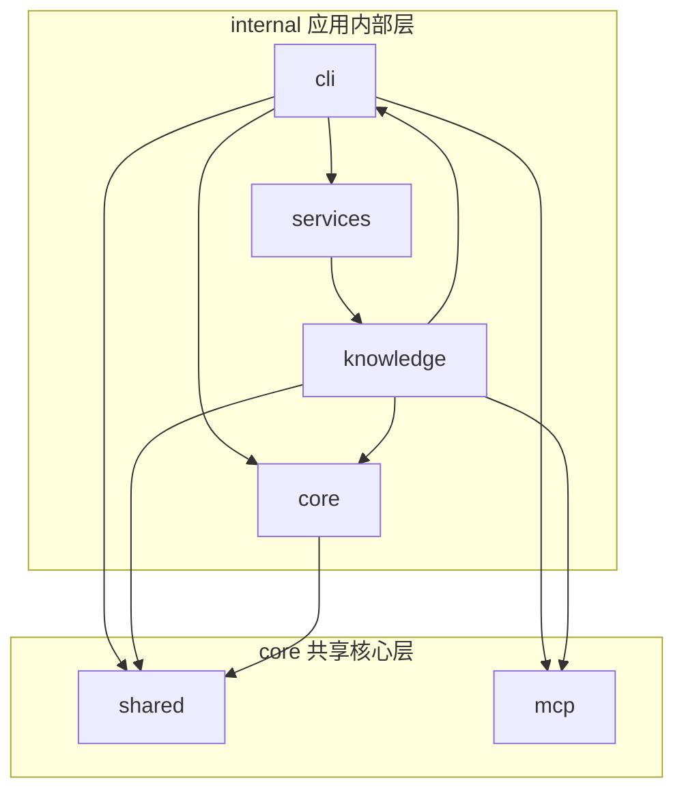
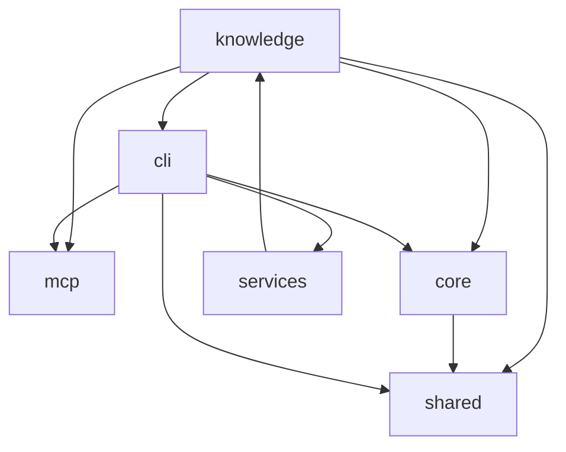
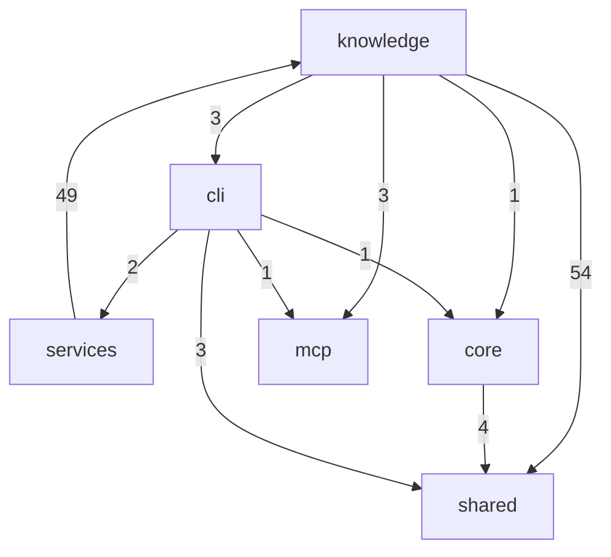

Relevant source files

- src/knowledge/context/calls.ts
- src/knowledge/context/data-flow.ts
- src/knowledge/context/db-schema.ts
- src/knowledge/context/workspaces.ts
- src/knowledge/fallback/index.ts
- src/knowledge/fallback/structure.ts
- src/mcp/codebase-memory-client.ts
- src/cli/commands/build.ts
- src/cli/commands/init.ts
- src/cli/commands/scan.ts
- src/cli/commands/types.ts
- src/cli/confirm-interaction.ts
- src/cli/index.ts
- src/core/scanner.ts
- src/core/types.ts

## 整体架构设计思路与架构图

本系统采用**两层制的分层架构**：数据给出的 `layers` 将 6 个模块划分为「core（核心/共享层）」与「internal（内部应用层）」两类，划分依据是模块的出度与入度特征。`shared`（fan-in=61, fan-out=0）与 `mcp`（fan-in=4, fan-out=0）被归入 core 层，两者的共同特征是 **fan-out 为 0**，即不发起任何对外调用，只被其他模块消费，属于纯被依赖的地基型模块。`cli`（fan-in=3, fan-out=7）、`core`（fan-in=2, fan-out=4）、`knowledge`（fan-in=49, fan-out=61）、`services`（fan-in=2, fan-out=49）被归入 internal 层，它们的共同特征是 fan-out > 0，即都主动向外发起调用，属于承担编排与逻辑职责的应用层。需要注意，**模块 `core` 与分层名「core」是两个不同概念**：前者是 internal 层中一个 fan-out=4 的模块，后者是 `shared` 与 `mcp` 所属的层级别名，阅读时不可混淆。

从模块规模与职责分布看，`knowledge` 是系统中体量最大的模块（99 个文件，`knowledge` 模块），并同时具备最高的 fan-in（49）与 fan-out（61），是典型的**中枢模块**：它既被 `services` 调用，又向下调用 `shared`、`mcp`、`core` 甚至 `cli`。`services`（12 个文件）fan-out=49 而 fan-in=2，是明显的**业务编排层**——它把大量调用压力传导给 `knowledge`，自身几乎不被外部依赖。`cli`（6 个文件，fan-out=7）是入口侧模块，向外触达 `services`、`shared`、`core`、`mcp`。`mcp` 虽仅有 2 个文件，却贡献了 4 个符号（`mcp` 模块），是被复用的核心能力单元；`shared`（4 个文件）与 `core`（2 个文件）体量最小，承担最底层的公共支撑。

层间协作的主干链路为 **`cli` → `services` → `knowledge` → {`shared`, `mcp`, `core`}**：入口层发起动作，编排层向下调度，中枢层汇聚业务逻辑并落到共享核心层。但各模块之间并非单向流，数据中的依赖边揭示出一条**回环路径 `cli` → `services` → `knowledge` → `cli`**（依赖边 `cli→services`、`services→knowledge`、`knowledge→cli`），同时 `knowledge` 还直接依赖 `core` 与 `mcp`。这说明系统属于**带反向引用的分层架构而非严格分层架构**：`knowledge` 在调用链上跨越了上下两层，既消费 core 层能力，又回调 `cli` 侧代码，架构上以「共享核心层保持零出度、应用内部层允许双向耦合」为约束边界。

下表汇总全部模块级调用关系（10 条），锚点为数据中的模块级依赖边（`relations`）：

| 调用方 | 被调用方 | 跨越层关系 | 证据 |
|---|---|---|---|
| `cli` | `services` | internal → internal | `relations: cli→services` |
| `cli` | `shared` | internal → core | `relations: cli→shared` |
| `cli` | `core` | internal → internal | `relations: cli→core` |
| `cli` | `mcp` | internal → core | `relations: cli→mcp` |
| `services` | `knowledge` | internal → internal | `relations: services→knowledge` |
| `knowledge` | `shared` | internal → core | `relations: knowledge→shared` |
| `knowledge` | `mcp` | internal → core | `relations: knowledge→mcp` |
| `knowledge` | `core` | internal → internal | `relations: knowledge→core` |
| `knowledge` | `cli` | internal → internal（反向） | `relations: knowledge→cli` |
| `core` | `shared` | internal → core | `relations: core→shared` |

从内部结构粒度看，代码实体被切分为 12 个高内聚集群（`clusters`，标签均为 `src`），内聚度从 0.676 到 0.980 不等：最高内聚的集群（cohesion=0.980，70 个成员）以 `WikiBuilder`、`buildByName`、`renderFactsAndUnknowns` 等符号为核心，次高者（cohesion=0.929，52 个成员）以 `generate`、`generateByName`、`intentToPrompt` 为核心。这说明模块划分之外还存在一层以功能链路（构建、生成、校验、上下文装配）为边界的聚集结构，是对上述分层结构的横向补充。

```mermaid
graph TD
  subgraph internal["internal 应用内部层"]
    cli
    services
    knowledge
    core
  end
  subgraph corelayer["core 共享核心层"]
    shared
    mcp
  end

  cli --> services
  cli --> shared
  cli --> core
  cli --> mcp
  services --> knowledge
  knowledge --> shared
  knowledge --> mcp
  knowledge --> core
  knowledge --> cli
  core --> shared
```

**待确认**：其一，本节所有依赖关系仅有模块级锚点（`relations` 中的 `source`/`target` 模块名），数据未提供具体的文件路径与行号级调用点，因此无法定位到具体调用语句；其二，`knowledge → cli` 这条反向依赖的成因（是分层设计有意为之，还是循环引用遗留）缺少注释、提交信息等 `intent` 类证据支撑，暂无法判定。

## 核心模块详解（第1批）

本节覆盖本批 6 个模块：`knowledge`、`services`、`mcp`、`shared`、`core`、`cli`。每个模块给出规模、依赖位次、职责自述证据（intent 原文 + 锚点）、核心符号清单与设计意图。模块级元数据（`fileCount` / `symbolCount` / `dependsOn` / `usedBy` / `fanIn` / `fanOut`）以模块名为锚点引自扫描数据；文件/符号级事实一律带 `file:line` 锚点。

### 模块总览

| 模块 | 文件数 | 符号数 | 语言 | dependsOn | usedBy | fanIn / fanOut |
|---|---|---|---|---|---|---|
| knowledge | 99 | 6 | ts | shared, mcp, cli, core | services | 0 / 0 |
| services | 12 | 0 | ts | knowledge | cli | 0 / 0 |
| mcp | 2 | 4 | ts | — | knowledge, cli | 0 / 0 |
| shared | 4 | 0 | ts | — | knowledge, core, cli | 0 / 0 |
| core | 2 | 0 | ts | shared | knowledge, cli | 0 / 0 |
| cli | 6 | 0 | ts | shared, services, core, mcp | knowledge | 0 / 0 |

模块间静态依赖（依据上表 `dependsOn` 字段，节点名取自真实模块名）：

```mermaid
graph TD
  knowledge --> shared
  knowledge --> mcp
  knowledge --> cli
  knowledge --> core
  services --> knowledge
  core --> shared
  cli --> shared
  cli --> services
  cli --> core
  cli --> mcp
```

依赖数据中存在环：`knowledge` → `cli`（`knowledge.dependsOn` 含 cli）、`cli` → `services`（`cli.dependsOn` 含 services）、`services` → `knowledge`（`services.dependsOn` 含 knowledge），三者互为闭环。此外 `knowledge.usedBy = [services]` 与 `cli.usedBy = [knowledge]` 说明 knowledge 同时被 services 使用、又反向依赖 cli。

所有模块的 `fanIn` / `fanOut` 均为 0，无法据此量化模块重要性（见文末待确认）。

---

### 1. knowledge

**规模与位置**：99 个 TypeScript 文件、6 个登记符号，是本批体量最大的模块；`dependsOn = [shared, mcp, cli, core]`，`usedBy = [services]`。

**职责与设计意图**：该模块的 intent 全部为文件头自述，且反复强调同一种定位——把 Wiki 生成链路中**可核验、可复现**的部分落成确定性实现，而不是交给 LLM 自由发挥。逐条证据：

> 「正文断言校验（DeepWiki-Open 文本断言交叉核验的确定性实现）。抽取 LLM 生成正文 inline 代码片段中的标识符声明，三级核验：图谱符号全集（简名 + qualified_name 后缀匹配，点链全串优先、逐级回退到末段）→ 扫描文件名干 → 词法证据探测（注入式回调，区分代码实据与纯注释/配置提及：仅 definition/usage 算功能实据）。查无实据或仅提及的声明改写为「待确认」标注（R5 风格，保留信息量），统计进构建报告（含仅提及与…）」
> —— src/knowledge/claim-verifier.ts:1

> 「页首证据锚定块（DeepWiki grounding 机制的确定性实现）。从页面 Context 递归提取真实源文件路径（过滤到扫描清单），按分层相关性排序（正文引用 > 符号定义 > 意图证据 > 入口/代表文件 > 配置/文档兜底），生成 `
` 折叠块注入页首。LLM 与规则路径统一由工具注入，LLM 无法伪造锚定块内容。」
> —— src/knowledge/wiki-evidence.ts:1

> 「WikiBuilder — fluent utility for constructing markdown wiki pages. Each method returns `this` so calls can be chained. Call `build()` at the end to get the final markdown string.」
> —— src/knowledge/wiki-builder.ts:1

> 「env 用途的确定性提取（R3：只采集可复核证据，不做语义推断）。」
> —— src/knowledge/config-detector/env-purpose.ts:1

> 「页面所属层级。 - structure：结构层——描述"代码是什么"（架构、模块、API、调用关系等），可机器生成 - operations：运行规约层——描述"怎么跑/必须遵守什么"（环境、规约、测试、约束），需人工提炼 - surface：表层——描述"对外入口是什么"，按项目类型替换（CLI/后端/前端各不同）」
> —— src/knowledge/page-registry.ts:1

> 「签名与类型形状推断（自 data-flow-shape.ts 拆出；纯搬移，零逻辑变化）。承载：文本级括号/字符串扫描工具、图谱签名解析、实参字面量保守推断、返回类型归一与 void 解释、name@file 键与语言域判定。」
> —— src/knowledge/dataflow/shapes.ts:1

由上述自述可归纳出模块内的四个功能域及证据：

| 功能域 | 代表文件（自述锚点） | 职责（取自文件头原文） |
|---|---|---|
| 正文断言核验 | src/knowledge/claim-verifier.ts:1 | 三级核验 inline 代码声明；无实据改写为「待确认」并计入构建报告 |
| 证据锚定 | src/knowledge/wiki-evidence.ts:1 | 递归提取真实源文件路径，按分层相关性排序生成页首 `
` 块 |
| 页面骨架与页面集 | src/knowledge/wiki-builder.ts:1、src/knowledge/page-registry.ts:1 | 链式 Markdown 构建器；页面层级枚举（structure / operations / surface） |
| 数据流与形状推断 | src/knowledge/dataflow/shapes.ts:1、src/knowledge/config-detector/env-purpose.ts:1 | 签名/类型形状推断；env 用途的确定性提取 |

**核心符号**（6 个 topSymbols，逐一说明）：

| 符号 | 类型 | 锚点 | 签名 | 用途（依据） |
|---|---|---|---|---|
| `buildByName` | method | src/knowledge/fallback/index.ts:55 | `(page: string, ctx: any)` | docstring 自述「按页面名派发规则生成（供 PageRegistry 调用）」——即 fallback 规则路径的按页名派发入口，调用方为 PageRegistry（见 src/knowledge/page-registry.ts:1 的层级定义） |
| `buildCallsContext` | function | src/knowledge/context/calls.ts:51 | `(deps: ContextDeps)` | 无 docstring，用途见下方「推断」 |
| `buildDbSchemaContext` | function | src/knowledge/context/db-schema.ts:118 | `(deps: ContextDeps)` | 无 docstring，用途见下方「推断」 |
| `buildDataFlowContext` | function | src/knowledge/context/data-flow.ts:29 | `(deps: ContextDeps)` | 无 docstring，用途见下方「推断」 |
| `buildEdges` | function | src/knowledge/context/workspaces.ts:106 | `(deps: ContextDeps, packages: PkgInfo[])` | docstring 自述「包间依赖边聚合（from → to: import 计数 + 是否声明）」——产出包级依赖边并区分「实际 import 次数」与「是否在声明中列出」 |
| `buildArchitecture` | function | src/knowledge/fallback/structure.ts:72 | `(ctx: ArchitectureContext)` | 无 docstring；位于 `fallback/structure.ts`，与 src/knowledge/fallback/index.ts:55 的 `buildByName` 同属 fallback 规则路径 |

> **推断**：`buildCallsContext` / `buildDbSchemaContext` / `buildDataFlowContext` 三者命名统一为 `build*Context`、统一入参 `(deps: ContextDeps)` 且集中在 `src/knowledge/context/` 目录（calls.ts / db-schema.ts / data-flow.ts），推断其职责是「按上下文域各自产出页面 Context 片段」，与 src/knowledge/wiki-evidence.ts:1 自述中提到「从页面 Context 递归提取真实源文件路径」的 Context 输入相衔接。依据：符号命名前缀、统一签名、目录归属，以及 wiki-evidence 自述对 Context 的引用；数据中未给出三者的 docstring 与调用点。

---

### 2. services

**规模与位置**：12 个 TypeScript 文件、0 个登记符号；`dependsOn = [knowledge]`，`usedBy = [cli]`——即 services 消费 knowledge 的确定性能力，再由 CLI 层驱动。

**职责与设计意图**：该模块的 6 条 intent 全部是文件头自述，且高度一致地围绕「两阶段构建」这一编排模型展开，其中「写盘」被明确设计为独立闸门阶段：

| 文件（锚点） | 自述原文 |
|---|---|
| src/services/wiki/service.ts:1 | 「WikiService：build 编排（两阶段构建：内存生成 → 裁决 → 闸门写盘）。」 |
| src/services/wiki/generate-phase.ts:1 | 「两阶段构建·阶段一：全部页面内存生成 + 断言校验（不写盘）。」 |
| src/services/wiki/write-phase.ts:1 | 「两阶段构建·阶段三：剥离 marker + 注入锚定块 + 写盘前闸门 + 写盘（update 模式在终稿上比较）。」 |
| src/services/wiki/verification.ts:1 | 「断言核验基础设施：图谱符号索引、源码行缓存、指纹条目、词法探测、outline 参考集。」 |
| src/services/wiki/cleanup.ts:1 | 「.wiki 目录治理（update 模式路径；full 模式整目录重建跳过）。」 |
| src/services/wiki-service.ts:1 | 「兼容壳：实现已拆分至 src/services/wiki/（service/cleanup/report/verification/阶段二·三）。」 |

从这些自述可得三条设计要点（均有锚点）：

1. **先内存生成、后统一写盘**：阶段一「全部页面内存生成 + 断言校验（不写盘）」（src/services/wiki/generate-phase.ts:1），写盘集中在阶段三「剥离 marker + 注入锚定块 + 写盘前闸门 + 写盘」（src/services/wiki/write-phase.ts:1）。这一布局与 cli 侧 intent 中「在全部页面生成后、写盘前调用一次」的交互时机描述互相吻合（见 src/cli/confirm-interaction.ts:1）。
2. **update / full 双模式差异**：update 模式做 .wiki 目录治理并在终稿上比较（src/services/wiki/cleanup.ts:1、src/services/wiki/write-phase.ts:1）；full 模式「整目录重建跳过」治理步骤（src/services/wiki/cleanup.ts:1）。
3. **模块已做拆分、保留兼容壳**：src/services/wiki-service.ts:1 自述为兼容壳，实现已迁至 `src/services/wiki/` 下的 service / cleanup / report / verification / 阶段二·三。

需要留意的表述差异（数据原样呈现）：src/services/wiki/service.ts:1 自述为「两阶段构建」，而其子文件分别自称「阶段一」（src/services/wiki/generate-phase.ts:1）与「阶段三」（src/services/wiki/write-phase.ts:1），且兼容壳自述提到「阶段二·三」（src/services/wiki-service.ts:1）。就现有自述文本看，阶段编号口径在文件头之间并不统一。

---

### 3. mcp

**规模与位置**：2 个 TypeScript 文件、4 个登记符号；`dependsOn = []`（无模块级出边），`usedBy = [knowledge, cli]`——是本批的底层适配层，被 knowledge 与 cli 共同使用。

**职责与设计意图**：本模块的意图由「文件头 + 首次提交」两条证据共同界定。src/mcp/types.ts:1 的文件头自述为「codebase-memory-mcp index_repository 返回」，说明该模块承载 codebase-memory-mcp 这一上游数据源返回结构的类型定义；首次提交 commit:9ef4fd6f (2026-06-24) 的提交信息为「refactor: 重构为基于 codebase-memory-mcp 知识图谱生成 wiki」，即整个项目曾在此次提交切到基于 codebase-memory-mcp 知识图谱的生成路线，mcp 模块是该路线的对接点。

**核心符号**（4 个 topSymbols 全部位于 src/mcp/codebase-memory-client.ts）：

| 符号 | 类型 | 锚点 | 签名 | 用途（依据） |
|---|---|---|---|---|
| `asObjects` | function | src/mcp/codebase-memory-client.ts:35 | `(raw: Record<string, unknown>, key: string)` | docstring 自述「兼容两种形态：旧版对象数组 / 新版列式表」——响应形态兼容入口，按 `key` 取列式/数组数据 |
| `adaptArchitecture` | function | src/mcp/codebase-memory-client.ts:45 | `(raw: Record<string, any>)` | docstring 自述「get_architecture 列式表 → ArchitectureData 对象数组」——把 get_architecture 的列式返回转换为对象数组 |
| `adaptTrace` | function | src/mcp/codebase-memory-client.ts:92 | `(raw: Record<string, any>)` | docstring 自述「trace_path 分组列式表 → 扁平 TraceNode[]」——把 trace_path 的分组列式表拍平为 `TraceNode[]` |
| `adaptSide` | function | src/mcp/codebase-memory-client.ts:93 | `(side: unknown)` | 无 docstring，用途见下方「推断」 |

> **推断**：`adaptSide` 紧邻 `adaptTrace`（src/mcp/codebase-memory-client.ts:92 与 :93 相邻），命名指向 trace 的「某一侧」，推断其为 trace 节点单侧（side）字段的适配器。依据：命名中的 `Side`、与 `adaptTrace` 相邻的位置、同一文件内集中于返回形态适配的命名族（`adapt*` / `asObjects`）；数据中未给出其 docstring 与调用点。

同一文件内 4 个符号的命名与 docstring 共同指向一种稳定的设计模式：所有 `adapt*` 函数接收 `raw` 原始响应、输出领域对象，并由 `asObjects` 统一兜住「旧版对象数组 / 新版列式表」的形态差异（src/mcp/codebase-memory-client.ts:35）。

---

### 4. shared

**规模与位置**：4 个 TypeScript 文件、0 个登记符号；`dependsOn = []`，`usedBy = [knowledge, core, cli]`——被本批三个模块共同引用，是位置最靠底的公共层。

**职责与设计意图**：intent 给出两条文件头自述 + 一条首提交记录。

> 「全局配置：~/.scx/wiki-agent/config.yaml（YAML）。优先级：CLI 参数 > 全局配置文件 > 内置默认。api_key 支持 `${ENV_VAR}` 环境变量引用（展开失败置空并告警，不把字面量发往 API）。配置缺失/解析失败一律降级为「无配置」并告警，绝不阻断构建。」
> —— src/shared/config.ts:1

> 「多语言源码模式层（Python / Go / JVM）：定义行、注释形态、限制常量。TS/Rust 的既有正则留在原模块（intent/shared、source-fallback）；本模块以「域 → 模式组」的方式补齐其余语言域，调用方按域分发。」
> —— src/shared/language-patterns.ts:1

首提交证据：commit:76565d14 (2026-06-02)，提交信息「feat: 功能基本可用」，与本批 core、cli 共享同一条首提交（见后两节）。

由上述证据可界定 shared 的两个职责域：

| 职责域 | 证据锚点 | 自述要点 |
|---|---|---|
| 全局配置加载 | src/shared/config.ts:1 | 配置路径 `~/.scx/wiki-agent/config.yaml`；三级优先级「CLI 参数 > 全局配置文件 > 内置默认」；`api_key` 支持 `${ENV_VAR}` 引用，展开失败置空并告警、不把字面量发往 API；缺失/解析失败降级为「无配置」并告警、不阻断构建 |
| 多语言源码模式 | src/shared/language-patterns.ts:1 | 以「域 → 模式组」方式补齐 Python / Go / JVM 的语言域（定义行、注释形态、限制常量）；TS/Rust 的既有正则明确**留在原模块**（intent/shared、source-fallback），调用方按域分发 |

两点值得注意的设计取舍（均取自自述原文）：

1. **配置失败不阻断构建**：src/shared/config.ts:1 明确「配置缺失/解析失败一律降级为「无配置」并告警，绝不阻断构建」，且环境变量展开失败时同样置空并告警，避免把 `${ENV_VAR}` 字面量当作密钥发往 API——这是一条以可用性与凭据安全为优先的降级策略。
2. **语言模式不做集中搬迁**：src/shared/language-patterns.ts:1 声明 TS/Rust 既有正则留在 intent/shared、source-fallback 原模块，本模块只补 Python / Go / JVM 域，因此语言模式在代码库中呈「按域分布 + 按域分发」的形态，而非单一中央模式库。

该模块无 topSymbols（扫描数据为空），因此其公开能力的具体函数签名在本批数据中无法展开。

---

### 5. core

**规模与位置**：2 个 TypeScript 文件、0 个登记符号；`dependsOn = [shared]`，`usedBy = [knowledge, cli]`——处于 shared 之上、被 knowledge 与 cli 复用的中间层。

**职责与设计意图**：本模块在数据中**没有文件头自述**（见文末待确认），唯一意图证据是首提交记录：commit:76565d14 (2026-06-02)，提交信息「feat: 功能基本可用」。该提交与 shared、cli 的首提交为同一哈希与同一日期，说明这三层在此次提交中一并落地。

> **推断**：core 名为「core」、出边仅指向 shared、被 knowledge 与 cli 共同引用（`usedBy = [knowledge, cli]`），推断其为不依赖上层业务、只依赖 shared 公共能力的核心基础层。依据：模块命名、`dependsOn = [shared]` 的单出边结构、`usedBy` 中同时出现知识层与命令行层；数据中未提供 core 的文件头自述、符号清单或调用点，故具体承载内容无法确证。

---

### 6. cli

**规模与位置**：6 个 TypeScript 文件、0 个登记符号；`dependsOn = [shared, services, core, mcp]`，`usedBy = [knowledge]`——出边覆盖本批四个模块，是本批依赖面最广的一层。

**职责与设计意图**：intent 包含一条文件头自述、一条首提交与一条高频提交主题。

> 「待确认项交互会话（@clack/prompts）。注入 WikiBuildOptions.confirmSession，在全部页面生成后、写盘前调用一次：逐项展示「疑问 + 上下文 + 选项」，用户裁决确认或保持。安全性：非 TTY（CI/管道/测试）直接返回空（全部保持待确认）；Ctrl-C 中断时保留已裁决项，其余按保持处理。」
> —— src/cli/confirm-interaction.ts:1

首提交：commit:76565d14 (2026-06-02)，「feat: 功能基本可用」；高频提交主题：commit:19eb6f9f (2026-09-29) 记录的「功能基本可用（×4）、修复 vue/tauri/bun 场景下的探测误报与图谱虚构边，补齐 llm 页面生成路径（×2）、支持全局配置（×2）」。

三条证据揭示的设计要点：

| 要点 | 证据锚点 | 说明 |
|---|---|---|
| 交互时机与注入点 | src/cli/confirm-interaction.ts:1 | 通过 `WikiBuildOptions.confirmSession` 注入，「在全部页面生成后、写盘前调用一次」——与 services 侧「阶段一不写盘 / 阶段三写盘」的划分严格对齐（src/services/wiki/generate-phase.ts:1、src/services/wiki/write-phase.ts:1） |
| 非 TTY 安全降级 | src/cli/confirm-interaction.ts:1 | CI / 管道 / 测试环境下直接返回空，即全部保持「待确认」，不阻塞自动化流程；Ctrl-C 中断时保留已裁决项、其余按保持处理 |
| 交互提示库 | src/cli/confirm-interaction.ts:1 | 使用 `@clack/prompts` |

高频提交主题进一步给出了该层近期演进的重心（commit:19eb6f9f, 2026-09-29）：一是「功能基本可用」累计 ×4 的打磨，二是针对 vue / tauri / bun 场景的**探测误报与图谱虚构边**修复，三是「补齐 llm 页面生成路径」，四是「支持全局配置」（后者与 src/shared/config.ts:1 自述的全局配置能力相呼应）。其中「图谱虚构边」修复与 src/knowledge/context/workspaces.ts:106 `buildEdges` 的「包间依赖边聚合」职责属同一问题域，说明依赖边正确性贯穿 cli 与 knowledge 两侧。

---

### 本批模块的横向观察

以下结论均基于本批数据中已存在的字段，不含推测：

| 观察项 | 依据 | 内容 |
|---|---|---|
| 确定性生成是主线 | src/knowledge/claim-verifier.ts:1、src/knowledge/wiki-evidence.ts:1、src/knowledge/config-detector/env-purpose.ts:1 | knowledge 反复以「确定性实现」「只采集可复核证据，不做语义推断」自我界定，核验与锚定均由工具完成，自述明确「LLM 无法伪造锚定块内容」 |
| 生成与写盘被刻意分离 | src/services/wiki/generate-phase.ts:1、src/services/wiki/write-phase.ts:1、src/cli/confirm-interaction.ts:1 | 阶段一「不写盘」、阶段三前置于写盘的「闸门」、CLI 在「全部页面生成后、写盘前调用一次」，三处自述共同构成「先全量生成、终局统一写盘」的编排 |
| 上游数据源为 codebase-memory-mcp | src/mcp/types.ts:1、commit:9ef4fd6f (2026-06-24)、src/mcp/codebase-memory-client.ts:35 | mcp 承载该数据源返回结构类型，且集中处理「旧版对象数组 / 新版列式表」两种响应形态的兼容 |
| 分层自底向上 | src/shared/config.ts:1、src/shared/language-patterns.ts:1、src/mcp/codebase-memory-client.ts:35 | shared 无模块级出边、提供配置与语言模式；mcp 无模块级出边、提供响应适配；二者之上是 core / knowledge / services / cli |
| 同批首提交 | commit:76565d14 (2026-06-02) | shared、core、cli 三个模块的首提交为同一哈希与日期，提交信息均为「feat: 功能基本可用」 |

---

### 待确认

| # | 缺口 | 缺什么证据 |
|---|---|---|
| 1 | `knowledge`、`services`、`mcp`、`shared`、`core`、`cli` 六个模块的 `fanIn` / `fanOut` 全部为 0 | 扫描数据中该字段值均为 0，无法据此判断模块被依赖/依赖他人的实际强度；本批只能改用 `dependsOn` / `usedBy` 作定序 |
| 2 | `core` 模块的职责 | 数据中 core 无文件头自述、无 topSymbols、无文件清单，仅有 `dependsOn = [shared]`、`usedBy = [knowledge, cli]` 与首提交 commit:76565d14 (2026-06-02) |
| 3 | `shared`、`services`、`core`、`cli` 的公开符号 | 这四个模块 `symbolCount` 为 0（services 12 文件、cli 6 文件、shared 4 文件、core 2 文件），无签名可引用 |
| 4 | `knowledge` 中 `buildCallsContext`（src/knowledge/context/calls.ts:51）、`buildDbSchemaContext`（src/knowledge/context/db-schema.ts:118）、`buildDataFlowContext`（src/knowledge/context/data-flow.ts:29）、`buildArchitecture`（src/knowledge/fallback/structure.ts:72）、`adaptSide`（src/mcp/codebase-memory-client.ts:93）的用途 | 这 5 个符号 docstring 为空，数据中亦未提供调用边，用途只能以命名与目录归属推断，无法确证 |
| 5 | 依赖环的成因 | `knowledge → cli`、`cli → services`、`services → knowledge` 构成闭环（依据各模块 `dependsOn` 字段），数据中无调用边可判断该环是兼容壳/类型引用所致还是真实运行时依赖 |

## 模块依赖分析与横切关注点

### 模块依赖分析

本节基于数据中的 `boundaries`（模块间调用边及调用次数）与 `modules`（依赖/被依赖关系）展开；数据粒度止于模块级，未提供文件路径与行号。

#### 依赖边全量清单（按调用次数降序）

| 调用方 | 被调用方 | 调用次数 | 关系类型 |
|---|---|---|---|
| knowledge | shared | 54 | calls |
| services | knowledge | 49 | calls |
| core | shared | 4 | calls |
| cli | shared | 3 | calls |
| knowledge | mcp | 3 | calls |
| knowledge | cli | 3 | calls |
| cli | services | 2 | calls |
| knowledge | core | 1 | calls |
| cli | core | 1 | calls |
| cli | mcp | 1 | calls |
| **合计** | | **121** | |

#### 模块出入度一览

| 模块 | dependsOn（出边目标） | usedBy（入边来源） |
|---|---|---|
| knowledge | shared, mcp, cli, core | services |
| services | knowledge | cli |
| cli | shared, services, core, mcp | knowledge |
| core | shared | knowledge, cli |
| shared | （无） | knowledge, core, cli |
| mcp | （无） | knowledge, cli |

#### 模块依赖图

```mermaid
graph TD
  knowledge -->|54| shared
  services -->|49| knowledge
  core -->|4| shared
  cli -->|3| shared
  knowledge -->|3| mcp
  knowledge -->|3| cli
  cli -->|2| services
  knowledge -->|1| core
  cli -->|1| core
  cli -->|1| mcp
```

#### 关键依赖路径

- **主干路径 P1：`services → knowledge → shared`**。两条边分别占 49 次与 54 次，合计 103 次，占全部 121 次调用的约 85.1%。这是数据中权重最高的可达链，说明系统的主体调用流量沿此链下沉到 `shared`。
- **入口汇入段：`cli → services`**（2 次）。`cli` 是唯一指向 `services` 的模块，而 `services` 的 `usedBy` 也只有 `cli`，因此完整入口链为 `cli → services → knowledge → shared`。该段调用次数很低（2 次），但它是通往 P1 的唯一通道。
- **共享底座路径**：`shared` 无任何出边（`dependsOn` 为空），入边来自 `knowledge`(54)、`core`(4)、`cli`(3)，合计 61 次调用，占总量约 50.4%，是被依赖最广的模块。`mcp` 同样无出边，但仅被 `knowledge`(3) 与 `cli`(1) 调用共 4 次，位于依赖图的叶端。
- **环路**：数据中存在 `knowledge → cli`（3 次）与 `cli → services`（2 次）→ `services → knowledge`（49 次）构成的闭环，即 `knowledge` 与 `cli` 互为上下游（直接边 1 条为 3 次，间接经 `services` 回流）。此外 `knowledge ⇄ core` 方向不成立——`core` 的出边只有 `shared`，`core` 仅作为被调方出现。
- **`core` 的定位**：入度 2（knowledge 1、cli 1），出度 1（shared 4），位于 P1 之外的一条短链 `{knowledge, cli} → core → shared` 上，是除主干外唯一再向 `shared` 收敛的中间层。

### 横切关注点

数据仅包含模块级 `calls` 边，不含文件路径、符号名、调用点或任何标注类信息，因此对横切机制只能给出可确认的边界信息与明确的证据缺口。

| 横切关注点 | 数据中可确认的证据 | 结论 |
|---|---|---|
| 错误处理 | 无任何与错误处理相关的边、模块或符号 | 待确认（数据未提供） |
| 日志 | 无日志相关模块或调用边 | 待确认（数据未提供） |
| 配置管理 | 无配置模块，也无模块指向外部配置源的边 | 待确认（数据未提供） |
| 共享能力收敛点 | 10 条边中，`shared` 被 `knowledge`(54)、`core`(4)、`cli`(3) 三个模块调用，入度最高（3）且无下游依赖 | 见下 |

- 关于 `shared`：**推断**——依据是它在 `modules` 中 `dependsOn` 为空（无下游依赖）而 `usedBy` 覆盖 `knowledge`/`core`/`cli` 三个模块，且承接了全部调用量的约 50.4%，结构特征符合"公共能力集中层"的形态。但数据未提供该模块内任何符号或文件，其具体承载内容无法确认。
- 关于 `mcp`：同为无出边的叶子模块，但入度仅 2、总调用 4 次，规模远小于 `shared`，不足以与 `shared` 并列判断为横切层。

**待确认清单**

1. **锚点层级缺口**：本节所有事实均锚定于模块级关系（`boundaries`/`modules`），数据未提供 `file:line` 或 `qualified_name`，无法将任一依赖边下钻到具体文件与调用点。
2. **错误处理机制**：缺错误类型、错误传播路径或异常捕获点的任何证据。
3. **日志机制**：缺日志模块、日志级别配置或日志调用边的任何证据。
4. **配置管理**：缺配置读取入口、配置文件路径或配置注入方式的任何证据。

以上 4 项均需补充源码级数据（文件路径、符号、调用点）后方可描述，本节不作推测。
## Related

- 同目录：[modules.md](modules.md)
- 互补职责：[modules.md](../02-architecture/modules.md)
- 共享 5 个源文件、共享 14 个符号：[topic:topic-9.md](../08-topics/topic-9.md)
- 共享 4 个源文件、共享 9 个符号：[constraints.md](../06-constraints/constraints.md)
- 共享 4 个源文件、共享 9 个符号：[glossary.md](../07-reference/glossary.md)
- 总入口：[README](../README.md)
