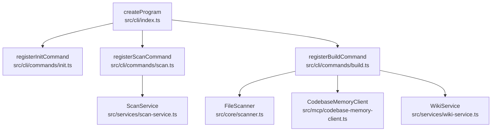

# 核心数据流

Relevant source files

- src/cli/commands/build.ts
- src/cli/commands/init.ts
- src/cli/commands/scan.ts
- src/cli/index.ts
- src/core/scanner.ts
- src/mcp/codebase-memory-client.ts
- src/services/scan-service.ts
- src/services/wiki-service.ts

> 本页基于执行序列数据描述项目从 CLI 入口到各服务的调用与数据流转路径。所有事实声明均带 `file:line` 锚点；调用关系以表格形式呈现（遵循 R2），不使用时序图。

## 数据流概览

项目的执行起点是 CLI 程序工厂函数 `createProgram`（`src/cli/index.ts`），它负责把各个 CLI 子命令注册到命令行程序中。`createProgram` 分别调用 `registerInitCommand`（`src/cli/commands/init.ts:6`）、`registerScanCommand`（`src/cli/commands/scan.ts:4`）与 `registerBuildCommand`（`src/cli/commands/build.ts:9`），从而完成命令层的组装。

命令注册后，各子命令在运行时实例化并调用其依赖的服务与核心组件。`registerBuildCommand`（`src/cli/commands/build.ts`）在构建流程中分别触达 `FileScanner`（`src/core/scanner.ts:37`）、`CodebaseMemoryClient`（`src/mcp/codebase-memory-client.ts:119`）与 `WikiService`（`src/services/wiki-service.ts:28`）；`registerScanCommand`（`src/cli/commands/scan.ts`）则触达 `ScanService`（`src/services/scan-service.ts:3`）。

数据在模块间的流转体现为：CLI 命令层接收用户输入 → 调用核心/服务组件（扫描、内存客户端、Wiki 服务、扫描服务）→ 由这些组件执行具体的数据处理。以下阶段表按调用序列中出现的转换步骤进行归纳。

## 数据阶段表

下表按数据流经过的处理阶段列出：输入类型、输出类型、关键函数与源文件锚点。由于提供的数据仅包含调用点位（未包含参数与返回值定义），输入/输出类型标注为「待确认」并说明缺证内容。

| 阶段 | 输入类型 | 输出类型 | 关键函数 | 源文件:行号 |
|------|----------|----------|----------|-------------|
| 程序组装与命令注册 | 待确认（缺 CLI context/argv 定义） | 待确认（缺 program 返回类型定义） | `createProgram` | `src/cli/index.ts` |
| 注册 init 命令 | 待确认 | 待确认 | `registerInitCommand` | `src/cli/commands/init.ts:6` |
| 注册 scan 命令 | 待确认 | 待确认 | `registerScanCommand` | `src/cli/commands/scan.ts:4` |
| 注册 build 命令 | 待确认 | 待确认 | `registerBuildCommand` | `src/cli/commands/build.ts:9` |
| 扫描构建输入（build 路径） | 待确认 | 待确认 | `FileScanner` | `src/core/scanner.ts:37` |
| 与代码库内存客户端交互（build 路径） | 待确认 | 待确认 | `CodebaseMemoryClient` | `src/mcp/codebase-memory-client.ts:119` |
| Wiki 生成/处理（build 路径） | 待确认 | 待确认 | `WikiService` | `src/services/wiki-service.ts:28` |
| 扫描服务执行（scan 路径） | 待确认 | 待确认 | `ScanService` | `src/services/scan-service.ts:3` |

> 说明：数据提供了调用点位（构造函数或调用的 `file:line`），但未提供各函数的参数签名与返回类型，因此无法安全推断每个阶段的输入/输出数据类型，统一标注「待确认」。

## 调用关系边表

以下边表列出该数据集中所有可静态确认的调用/引用关系（替代时序图表达静态可达性）。每条边均来自 `sequences` 数据中的 `messages`。

| 调用方 | 被调用方 | 位置 |
|--------|----------|------|
| `createProgram` | `registerInitCommand` | `src/cli/commands/init.ts:6` |
| `createProgram` | `registerScanCommand` | `src/cli/commands/scan.ts:4` |
| `createProgram` | `registerBuildCommand` | `src/cli/commands/build.ts:9` |
| `registerBuildCommand` | `FileScanner` | `src/core/scanner.ts:37` |
| `registerBuildCommand` | `CodebaseMemoryClient` | `src/mcp/codebase-memory-client.ts:119` |
| `registerBuildCommand` | `WikiService` | `src/services/wiki-service.ts:28` |
| `registerScanCommand` | `ScanService` | `src/services/scan-service.ts:3` |

> 注：`registerBuildCommand` → `FileScanner` / `CodebaseMemoryClient` / `WikiService` 与 `registerScanCommand` → `ScanService` 等边，其 `location` 指向被调用方的类定义起始行。由于数据未给出确切调用表达式所在行，此处以 `messages[].location` 原文为准，不做推断。

## 模块依赖图

下图节点均取自数据中的真实模块文件路径与符号名，边表示数据中记录的调用/注册关系。

## 错误路径

本数据集（`sequences` 与 `supplementalSymbols`）中**未包含任何错误处理、异常抛出或报错分支的调用信息**。因此：

- 无法描述任何错误路径调用链，标注为「待确认」。
- 待确认项：各命令/服务的异常捕获、错误传播及失败回退逻辑所在代码位置，需补充源码中的 `try/catch`、`throw`、错误回调等证据。

## 待确认与信息缺口

- **函数签名与数据类型**：数据仅含调用点位，未提供参数与返回类型，所有阶段的输入/输出类型均待确认。
- **数据承载内容**：`FileScanner`、`CodebaseMemoryClient`、`WikiService`、`ScanService` 之间是否存在进一步的数据传递（如扫描结果→客户端索引→Wiki 生成）在本数据中无证据，故不作推断。
- **初始化命令链路**：`registerInitCommand`（`src/cli/commands/init.ts`）在数据中作为被 `createProgram` 调用的节点出现，但未记录其进一步的调用边，无法描述其数据流。
- **入口之外的调用方**：`registerBuildCommand` / `registerScanCommand` 是否被 `createProgram` 之外的路径调用，数据中无记录。

## 数据来源说明

本页全部结论基于执行序列数据（`sequences`）中的 `participants` 与 `messages`，以及各节点附带的 `file` / `location` 字段。未纳入 `tests/` 下任何代码作为功能描述依据；数据中亦未出现相关测试节点。
## Related

- 同目录：[architecture.md](architecture.md) · [modules.md](modules.md)
- 总入口：[README](../README.md)
