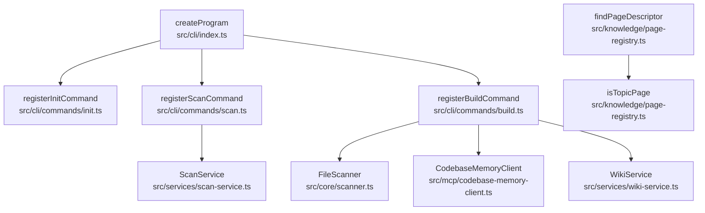

# 数据流文档

Relevant source files

- src/cli/commands/build.ts
- src/cli/commands/init.ts
- src/cli/commands/scan.ts
- src/cli/index.ts
- src/core/scanner.ts
- src/knowledge/page-registry.ts
- src/mcp/codebase-memory-client.ts
- src/services/scan-service.ts
- src/services/wiki-service.ts

> 本页基于执行序列数据描述项目的核心数据流走向、各处理阶段的数据变换，以及错误路径。所有事实声明均带 `file:line` 或符号名锚点。

## 核心数据流概览

本项目存在两条主要数据流。**其一为 CLI 命令注册流**：程序入口 `createProgram`（`src/cli/index.ts`）作为顶层装配点，依次挂载初始化、扫描、构建三类命令的注册函数——`registerInitCommand`（`src/cli/commands/init.ts:6`）、`registerScanCommand`（`src/cli/commands/scan.ts:4`）、`registerBuildCommand`（`src/cli/commands/build.ts:9`）。该流在启动阶段完成命令到服务依赖的绑定，尚未进入实际数据处理。

**其二为构建（build）与扫描（scan）业务流**。构建命令 `registerBuildCommand`（`src/cli/commands/build.ts`）在注册过程中绑定三类能力组件：文件扫描器 `FileScanner`（`src/core/scanner.ts:37`）、代码库记忆客户端 `CodebaseMemoryClient`（`src/mcp/codebase-memory-client.ts:119`）与知识库服务 `WikiService`（`src/services/wiki-service.ts:30`）；扫描命令 `registerScanCommand` 绑定 `ScanService`（`src/services/scan-service.ts:3`）。这些绑定关系表明数据由文件系统经由扫描/记忆客户端进入服务层加工。知识库侧，`findPageDescriptor`（`src/knowledge/page-registry.ts`）对页面类型进行判别，调用 `isTopicPage`（`src/knowledge/page-registry.ts:125`）以区分主题页与其他页面。

> 说明：从提供的数据中无法获得各服务内部的输入/出数据类型与转换逻辑（signature/参数类型未提供），故不对内部数据格式做推断。

## 数据阶段表

下表按执行序列推导各阶段的数据处理步骤。"输入类型/输出类型"一栏：数据中未提供签名或参数类型信息，凡无法锚定的均标注为「待确认」。

| 阶段 | 输入类型 | 输出类型 | 关键函数 | 源文件:行号 |
|------|----------|----------|----------|-------------|
| 程序装配 | 待确认（无签名数据） | CLI 程序对象（推断） | `createProgram` | `src/cli/index.ts` |
| 命令注册：初始化 | 待确认 | 待确认 | `registerInitCommand` | `src/cli/commands/init.ts:6` |
| 命令注册：扫描 | 待确认 | 待确认 | `registerScanCommand` | `src/cli/commands/scan.ts:4` |
| 命令注册：构建 | 待确认 | 待确认 | `registerBuildCommand` | `src/cli/commands/build.ts:9` |
| 构建依赖绑定：扫描器 | 待确认 | 待确认 | `FileScanner` | `src/core/scanner.ts:37` |
| 构建依赖绑定：记忆客户端 | 待确认 | 待确认 | `CodebaseMemoryClient` | `src/mcp/codebase-memory-client.ts:119` |
| 构建依赖绑定：知识库服务 | 待确认 | 待确认 | `WikiService` | `src/services/wiki-service.ts:30` |
| 扫描依赖绑定 | 待确认 | 待确认 | `ScanService` | `src/services/scan-service.ts:3` |
| 页面描述符查找 | 待确认 | 待确认 | `findPageDescriptor` | `src/knowledge/page-registry.ts` |
| 主题页判别 | 页面描述符（推断） | 布尔判定（推断） | `isTopicPage` | `src/knowledge/page-registry.ts:125` |

> 注：表中"输入/输出类型"多数标注为「待确认」，因提供的数据仅含调用点位置（`location`）与符号名，未包含函数签名或参数类型。需要签名或类型证据方可填充。

## 阶段推进关系（静态可达性）

以下用有向图表达模块/符号之间的静态可达路径（节点名均来自数据中的真实符号与文件路径）。

## 调用关系边表

按 R2 要求，调用关系以表格（而非时序图）列出。每条边的调用方、被调用方与锚点位置如下（与 calls.md 相关，可交叉参考）。

| 调用方 | 被调用方 | 锚点（file:line） |
|--------|----------|-------------------|
| `createProgram` | `registerInitCommand` | `src/cli/commands/init.ts:6` |
| `createProgram` | `registerScanCommand` | `src/cli/commands/scan.ts:4` |
| `createProgram` | `registerBuildCommand` | `src/cli/commands/build.ts:9` |
| `registerBuildCommand` | `FileScanner` | `src/core/scanner.ts:37` |
| `registerBuildCommand` | `CodebaseMemoryClient` | `src/mcp/codebase-memory-client.ts:119` |
| `registerBuildCommand` | `WikiService` | `src/services/wiki-service.ts:30` |
| `registerScanCommand` | `ScanService` | `src/services/scan-service.ts:3` |
| `findPageDescriptor` | `isTopicPage` | `src/knowledge/page-registry.ts:125` |

## 错误路径

提供的数据中**未包含任何错误分支、异常抛出或错误处理调用点**（无 try/catch、无 error 相关消息/标签）。因此：

- 无法描述报错触发的调用路径。
- 「待确认」：缺少错误处理相关的调用点或异常符号数据。需补充错误处理代码路径（如 catch 分支、错误抛出位置）后方可描述。

> 为避免编造（R3/R5），此处不作任何错误流程的推测性描述。

## 数据缺口说明（R5）

以下方面因数据不足，统一标注「待确认」：

| 方面 | 状态 | 缺什么证据 |
|------|------|------------|
| 各阶段输入/输出数据类型 | 待确认 | 函数/方法签名与参数类型未提供 |
| 数据实际流转内容（文件→索引→页面） | 待确认 | 仅含调用点，无运行期数据变换逻辑 |
| 错误路径与异常处理 | 待确认 | 无错误处理相关调用点 |
| 状态机/状态枚举 | 待确认 | 无状态枚举与转换证据（R6） |
| 类继承关系 | 待确认 | 无继承数据，故未绘制 classDiagram |

---

**数据来源**：本页所有锚点均取自执行序列 `sequences` 中的 `location` 字段与函数/类符号名；未使用 `tests/` 目录内容。
## Related

- 同目录：[architecture.md](architecture.md) · [modules.md](modules.md)
- 总入口：[README](../README.md)
