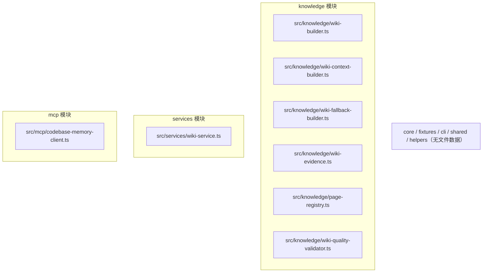

# 模块文档

<details>
<summary>Relevant source files</summary>

- src/knowledge/page-registry.ts
- src/knowledge/wiki-builder.ts
- src/knowledge/wiki-context-builder.ts
- src/knowledge/wiki-evidence.ts
- src/knowledge/wiki-fallback-builder.ts
- src/knowledge/wiki-quality-validator.ts
- src/mcp/codebase-memory-client.ts
- src/services/wiki-service.ts
</details>

本项目的模块划分集中在 `src/` 目录下，按职责划分为知识库构建（`knowledge`）、MCP 客户端适配（`mcp`）、服务编排（`services`）等模块。从数据来看，`knowledge` 模块的文件覆盖最完整（6 个文件），是文档生成的核心；`services/wiki-service.ts` 承担对外入口编排；`mcp/codebase-memory-client.ts` 负责对上游列式数据的适配。部分模块（`core`、`fixtures`、`cli`、`shared`、`helpers`）在提供的数据中没有任何文件或符号，将在对应章节标注「信息不足」。

> 说明：以下所有事实声明均给出 `file` 或符号锚点。数据中 `dependsOn` 与 `usedBy` 全部为空数组，因此**模块间协作关系无法从数据推定**，相关方面统一标注为「待确认」。

---

## 1. knowledge 模块

### 职责

该模块承担 Wiki 页面内容构建的全部职责，可细分为四类工作：

- **Markdown 片段拼装**：`src/knowledge/wiki-builder.ts` 提供 `addSection`、`addSubSection`、`addParagraph`、`addBulletList`、`addCodeBlock`、`addNewline` 等粒度化的内容追加方法。
- **上下文构建**：`src/knowledge/wiki-context-builder.ts` 提供 `buildApiContext`、`buildArchitectureContext`、`buildCallsContext`、`buildCallChainFromEdges`、`buildByName` 等，用于为不同页面主题（API、架构、调用链、按名索引）组装上下文。
- **兜底构建**：`src/knowledge/wiki-fallback-builder.ts` 提供 `buildApi`、`buildArchitecture`、`buildCalls`、`buildClasses`、`buildByName`，作为上下文缺失时的降级产出路径。
- **证据与关联**：`src/knowledge/wiki-evidence.ts` 的 `buildEvidenceBlock`（function）生成证据块；`src/knowledge/page-registry.ts` 的 `buildRelatedSection`（function）生成「相关页面」区块。
- **质量校验**：`src/knowledge/wiki-quality-validator.ts` 提供 `checkAnchors`、`checkDeadLinks`、`checkEmptyShell`、`checkMermaid` 四项校验。

### 设计意图

从符号命名推断，该模块采用「**上下文构建 → 兜底降级 → 质量校验**」三层结构（`wiki-context-builder` / `wiki-fallback-builder` / `wiki-quality-validator`）。`wiki-builder` 作为底层写入原语被上层上下文构建器复用，从而把「内容语义构造」与「Markdown 语法细节」解耦。

> 「设计意图」在数据中无显式 docstring 支撑，以上为基于文件与符号命名的结构性归纳；如需确认请补充 README 或模块级注释。

### 交互方式

**待确认**：数据中 `knowledge` 模块的 `dependsOn` 与 `usedBy` 均为空数组，无法从数据判定其与其他模块的调用方向。可确定的是模块内部存在 `wiki-context-builder` 与 `wiki-fallback-builder` 使用同一批方法名 `buildByName` 的重合点，但二者是否互相调用无证据。

### 文件结构

| 文件名 | 关键符号 | 职责 |
| --- | --- | --- |
| `src/knowledge/wiki-builder.ts` | `addSection`、`addSubSection`、`addParagraph`、`addBulletList`、`addCodeBlock`、`addNewline` | Markdown 片段追加原语 |
| `src/knowledge/wiki-fallback-builder.ts` | `buildApi`、`buildArchitecture`、`buildByName`、`buildCalls`、`buildClasses` | 各页面主题的兜底构建 |
| `src/knowledge/wiki-context-builder.ts` | `buildApiContext`、`buildArchitectureContext`、`buildByName`、`buildCallChainFromEdges`、`buildCallsContext` | 各页面主题的上下文构建 |
| `src/knowledge/wiki-evidence.ts` | `buildEvidenceBlock(function)` | 生成证据块 |
| `src/knowledge/page-registry.ts` | `buildRelatedSection(function)` | 生成相关页面区块 |
| `src/knowledge/wiki-quality-validator.ts` | `checkAnchors`、`checkDeadLinks`、`checkEmptyShell`、`checkMermaid` | 页面质量四项校验 |

### 核心符号

**wiki-builder.ts**

```ts
addSection(title: string, content: string)
```
添加二级章节：`## title` +（content 非空时）`\n\ncontent`。

```ts
addSubSection(title: string, content: string)
```
添加三级子章节：`### title` +（content 非空时）`\n\ncontent`。

```ts
addParagraph(text: string)
```
添加普通段落。

```ts
addBulletList(items: string[])
```
添加无序列表。

```ts
addCodeBlock(language: string, code: string)
```
添加带可选语言标注的围栏代码块。

```ts
addNewline()
```
添加空行。

**wiki-context-builder.ts**

- `buildApiContext`：构建 API 页面上下文。
- `buildArchitectureContext`：构建架构页面上下文。
- `buildCallsContext`：构建调用页面上下文。
- `buildCallChainFromEdges`：由边数据构建调用链。
- `buildByName`：按名称构建上下文。

**wiki-fallback-builder.ts**

- `buildApi` / `buildArchitecture` / `buildCalls` / `buildClasses` / `buildByName`：各页面主题的兜底构建入口。

**wiki-evidence.ts**

```ts
buildEvidenceBlock(...)
```
生成证据块。

**page-registry.ts**

```ts
buildRelatedSection(...)
```
生成相关页面区块。

**wiki-quality-validator.ts**

- `checkAnchors`：校验锚点。
- `checkDeadLinks`：校验死链。
- `checkEmptyShell`：校验空壳页面。
- `checkMermaid`：校验 Mermaid 图。

---

## 2. services 模块

### 职责

`src/services/wiki-service.ts` 是 Wiki 生成的对外入口，对外暴露 `buildWiki` 方法；同时定义两个产出描述符号：接口 `PageProduced`（单页产出结果：最终内容 + 走的生成路径）与 `PageStatus`（页面写盘结果状态）。

### 设计意图

从 `buildWiki(wikiDir, options?)` 的签名以及 `PageProduced` 的 docstring 可判断：该服务负责「一次 Wiki 构建」的整体编排，并把每一页「走了哪条生成路径」显式记录在返回结果中——这与 `knowledge` 模块中「上下文构建 / 兜底构建」双路径的结构相呼应。

### 交互方式

**待确认**：`services` 模块的 `dependsOn` 与 `usedBy` 均为空数组，无法从数据判定其与 `knowledge`、`mcp` 或其他模块之间的调用关系。

### 文件结构

| 文件名 | 关键符号 | 职责 |
| --- | --- | --- |
| `src/services/wiki-service.ts` | `PageProduced`、`PageStatus`、`buildWiki` | Wiki 构建服务入口与产出描述 |

### 核心符号

```ts
buildWiki(wikiDir: string, options?: WikiBuildOptions)
```
以 `wikiDir` 为目标目录、可选 `WikiBuildOptions` 参数执行 Wiki 构建。

```ts
interface PageProduced
```
单页产出结果：最终内容 + 走的生成路径（依据 docstring）。

```ts
PageStatus
```
页面写盘结果状态（依据 docstring）。

---

## 3. mcp 模块

### 职责

`src/mcp/codebase-memory-client.ts` 负责把 codebase-memory 侧的列式返回适配为消费侧的数据结构，包含三个明确的适配函数与一个通用兼容函数。

### 设计意图

从 `asObjects` 的 docstring「兼容两种形态：旧版对象数组 / 新版列式表」可知，该模块的核心设计目标是**兼容上游数据格式的版本变化**，将「列式表」与「对象数组」统一为对象数组供下游使用。`adaptArchitecture` 与 `adaptTrace` 分别针对 `get_architecture` 与 `trace_path` 两类特定返回做列式到对象的转换。

### 交互方式

**待确认**：`mcp` 模块的 `dependsOn` 与 `usedBy` 均为空数组，无法从数据判定与 `knowledge`、`services` 的调用关系。

### 文件结构

| 文件名 | 关键符号 | 职责 |
| --- | --- | --- |
| `src/mcp/codebase-memory-client.ts` | `adaptArchitecture`、`adaptSide`、`adaptTrace`、`asObjects` | 列式/对象数组形态适配 |

### 核心符号

```ts
adaptArchitecture(raw: Record<string, any>)
```
`get_architecture` 列式表 → `ArchitectureData` 对象数组。

```ts
adaptTrace(raw: Record<string, any>)
```
`trace_path` 分组列式表 → 扁平 `TraceNode[]`。

```ts
asObjects(raw: Record<string, unknown>, key: string)
```
兼容两种形态：旧版对象数组 / 新版列式表。

```ts
adaptSide(side: unknown)
```
无 docstring，**待确认**其输入/输出的具体语义（数据未提供说明）。

---

## 4. 无文件模块

以下模块在提供的数据中 `files`、`topSymbols`、`fileSymbols` 均为空：

| 模块 | 状态 |
| --- | --- |
| `core` | 信息不足：无文件、无符号 |
| `fixtures` | 信息不足：无文件、无符号 |
| `cli` | 信息不足：无文件、无符号 |
| `shared` | 信息不足：无文件、无符号 |
| `helpers` | 信息不足：无文件、无符号 |

这些模块的存在仅体现在模块清单中，**其职责、文件与符号均无数据支撑**，不做任何推测。若需补全，请提供这些模块下的文件清单与符号导出信息。

---

## 附：整体结构与待确认事项



（上图仅展示各模块对应的真实文件路径；由于 `dependsOn`/`usedBy` 均为空，未绘制任何跨模块连线。）

**待确认清单（数据不足以描述的方面）**

1. 各模块之间的调用/依赖关系：所有模块 `dependsOn` 与 `usedBy` 均为空数组。
2. `knowledge` 内部文件间的调用关系：无调用点证据，无法确定 `wiki-context-builder` 与 `wiki-fallback-builder` 的协作方式。
3. `mcp` 模块 `adaptSide` 的语义：无 docstring。
4. `BuildWikiOptions`、`ArchitectureData`、`TraceNode` 等类型的定义位置与字段：数据中未提供。
5. `core`、`fixtures`、`cli`、`shared`、`helpers` 五个模块的全部内容：文件中无任何符号数据。
## Related

- 同目录：[architecture.md](architecture.md) · [data-flow.md](data-flow.md)
- 总入口：[README](../README.md)
