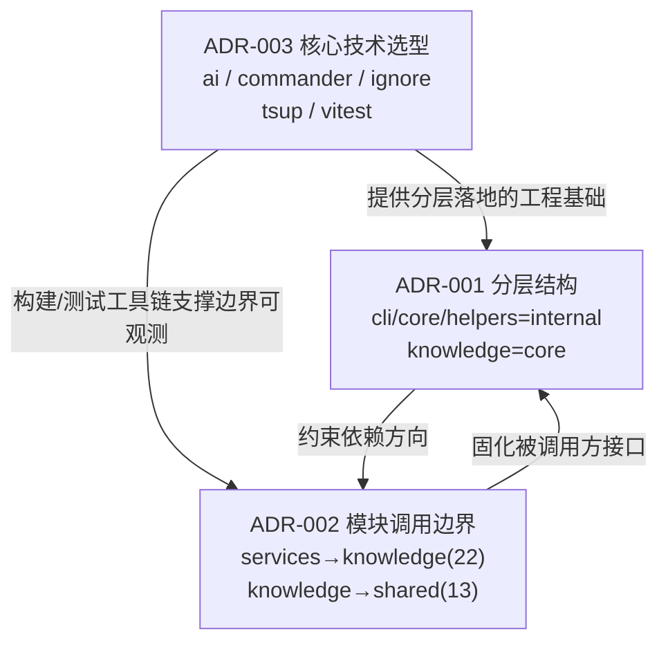

# 架构决策记录（ADR）

Relevant source files

- src/cli/commands/build.ts
- src/cli/commands/init.ts
- src/cli/commands/scan.ts

> 本页定位：记录影响本项目架构走向的关键决策及其代价。每条 ADR 聚焦"为什么这样定"以及"这一定义换来了什么约束"，帮助读者理解模块边界的来源、稳定性要求的落点，以及技术选型如何固化为架构级不可随意变更的约定。
>
> **数据来源说明（重要）**：本页所有 ADR 均来自自动推导（`fromMcp: false`），**未经人工评审确认**。所有条目的状态均原样保留为 `proposed`，请勿将其视为已生效的既定架构约定。`fromMcp: false` 意味着这些条目是工具基于依赖/调用统计推导出的结果，其"决策"措辞是推导表述，而非人工签署的正式决策。任何据此做出的架构约束，需先经人工确认。

---

## 总览

| 编号 | 标题 | 状态 | 相关文件数 |
|------|------|------|-----------|
| ADR-001 | 分层结构：=api、cli=internal、core=internal、helpers=internal、knowledge=core | proposed | 3 |
| ADR-002 | 模块调用边界（调用次数 top 5） | proposed | 0 |
| ADR-003 | 核心技术选型：@ai-sdk/openai、ai、commander、ignore、tsup、vitest | proposed | 0 |

---

## ADR-001 分层结构：=api、cli=internal、core=internal、helpers=internal、knowledge=core

| 字段 | 内容 |
|------|------|
| 状态 | proposed（自动推导，未经人工评审） |
| 背景 | 知识图谱分层分析：→ api（has HTTP route definitions）；cli → internal（fan-in=2, fan-out=4）；core → internal（fan-in=2, fan-out=2）；helpers → internal（fan-in=0, fan-out=0）；knowledge → core（high fan-in (22 in, 14 out)）。 |
| 决策 | 采用上述分层，依赖方向从外层指向内层，核心层不反向依赖调用方。 |
| 后果 | 新增代码应归入对应层；反向跨层依赖会在模块边界统计中暴露。 |
| 相关文件 | `src/cli/commands/build.ts`、`src/cli/commands/init.ts`、`src/cli/commands/scan.ts` |

**动机解读**：该分层来自对模块扇入/扇出（fan-in / fan-out）的观测。`knowledge` 呈现高扇入（22 进、14 出），被定位为核心层；`cli`、`core`、`helpers` 被归入 internal 层，其中 cli 扇出为 4，说明它是主要的调用发起方。核心观察是：`api` 层包含 HTTP 路由定义，属于典型的外层暴露面，因此依赖方向应"由外向内"——外层可以调用内层，内层不得反向依赖调用方。数据中 `helpers` 的扇入/扇出均为 0，说明它在当前调用统计中尚未被任何模块引用，其分层定位缺乏调用证据支撑，**待确认**：helpers 是否真的参与依赖链，还是当前未被接入。

**代价**：一旦分层被视为约束，新增代码必须归入对应层，跨层调用将不再"随便写"。反向跨层依赖会被模块边界统计直接暴露，这意味着架构违规具有可观测性，但也意味着开发者需要在编码前先判断"这段代码属于哪一层"，增加了归属决策成本。相关文件均为 `src/cli/commands/` 下的命令入口，它们位于 cli 层，是分层的调用发起侧代表。

---

## ADR-002 模块调用边界（调用次数 top 5）

| 字段 | 内容 |
|------|------|
| 状态 | proposed（自动推导，未经人工评审） |
| 背景 | 跨包调用统计：services→knowledge（22 次）、knowledge→shared（13 次）、core→shared（2 次）、cli→services（2 次）、services→cli（1 次）。 |
| 决策 | 维持现有模块依赖方向，高频边界两端保持稳定接口。 |
| 后果 | 边界两端模块形成耦合点，修改被调用方需评估所有调用方。 |
| 相关文件 | （数据中为空，无文件锚点） |

**动机解读**：该决策由跨包调用次数的分布驱动。`services→knowledge`（22 次）与 `knowledge→shared`（13 次）是两条最高频的边界，集中了绝大部分跨模块交互。决策的核心逻辑是：调用次数越高，说明该边界越处于关键路径上，接口一旦变动，波及面越大。因此推导结论是"维持方向、稳定接口"。值得注意的一个反向信号是 `services→cli`（仅 1 次），它是一条从 services 指向 cli 的低频调用，与 ADR-001 中"依赖由外向内"的分层方向存在潜在张力——**待确认**：这条 `services→cli` 调用是否构成分层上的反向依赖，数据未提供其具体调用点，无法判定其为合规的边界调用还是分层例外。

**代价**：高频边界（services→knowledge、knowledge→shared）会成为强耦合点。修改被调用方（knowledge / shared）时，必须逐一评估所有调用方，回归成本随调用次数线性增长。这是"稳定接口"承诺换来的代价：接口稳定降低了跨模块变更风险，但也把变更成本集中转移到了被调用方的维护者身上。

---

## ADR-003 核心技术选型：@ai-sdk/openai、ai、commander、ignore、tsup、vitest

| 字段 | 内容 |
|------|------|
| 状态 | proposed（自动推导，未经人工评审） |
| 背景 | 以下依赖在源码中被实际 import（声明未用依赖已被过滤）：@ai-sdk/openai、ai、commander、ignore、tsup、vitest。 |
| 决策 | 以 @ai-sdk/openai、ai、commander、ignore、tsup、vitest 构成核心技术栈。 |
| 后果 | 升级或替换这些依赖属于架构级变更，需回归核心调用链。 |
| 相关文件 | （数据中为空，无文件锚点） |

**动机解读**：该决策的筛选标准明确——只纳入"在源码中被实际 import"的依赖，声明但未使用的依赖已被过滤掉，因此这份清单反映的是真实的运行时/构建时依赖面，而非 package.json 的声明面。这六个依赖覆盖了若干能力维度：`@ai-sdk/openai` 与 `ai` 指向 LLM/AI 能力集成，`commander` 指向 CLI 命令解析，`ignore` 指向 ignore 规则处理，`tsup` 与 `vitest` 指向构建与测试工具链。将它们定义为"核心技术栈"，意味着它们不再是可随手替换的实现细节，而是架构级组件。

**代价**：升级或替换其中任一依赖被定性为"架构级变更"，必须回归核心调用链。这把依赖维护从"改个版本号"提升为"需要走架构评估的变更"，提高了变更门槛，会延缓依赖升级节奏；换来的收益是避免在 AI 集成、CLI 解析、构建与测试这些关键路径上因盲目升级引入回归。数据未提供各依赖的具体调用点，因此各依赖的精确"用途"边界缺乏源码调用锚点佐证，**待确认**：此处仅确认它们"被实际 import"，未逐一定位使用位置。

---

## 决策脉络

三条 ADR 之间并非孤立，而是构成一条"结构 → 边界 → 技术底座"的递进约束链：

**关联分析**：

1. **ADR-001 定义方向，ADR-002 量化强度**：ADR-001 给出"依赖由外向内"的定性方向，ADR-002 用调用次数给出定量的边界强度。`services→knowledge`（22 次）正是 ADR-001 中 `knowledge → core` 这一高扇入（22 in）在调用层的具体体现——两者互相印证：knowledge 既在分层上被定位为核心，又在调用统计上是最高频的被调用方。

2. **分层与技术栈共同固化边界**：ADR-003 中的 `tsup` / `vitest` 是构建与测试工具链，它们为 ADR-002 所要求的"边界两端保持稳定接口"提供可回归的工程基础——接口变动能否被快速验证，取决于测试工具链是否到位。而 `commander` 对应 ADR-001 中 cli 层（`src/cli/commands/` 下的命令文件），说明 cli 层是命令解析的实际载体。

3. **潜在冲突点需人工确认**：ADR-002 中的 `services→cli`（1 次）与 ADR-001 的向内依赖方向存在张力。该调用是否为合规边界，数据未提供调用点，无法用现有锚点判定，列为**待确认**。

4. **共同的诚实前提**：三条 ADR 状态均为 `proposed`，且 `fromMcp: false`，全部为自动推导结果。它们更适合被当作"待评审的架构假设"而非"已生效的架构契约"；本节所有关联分析均基于推导数据，实际生效与否需人工评审后方可确认。

---

## 待确认清单

| 事项 | 缺失证据 |
|------|---------|
| helpers 层定位 | fan-in=0、fan-out=0，无任何调用锚点，无法确认其是否真正参与依赖链 |
| `services→cli` 调用性质 | 仅知调用 1 次，无具体调用点 file:line，无法判定是否违反 ADR-001 分层方向 |
| ADR-002 / ADR-003 相关文件 | 两条 ADR 的 `files` 均为空，无文件锚点，无法定位边界与依赖的具体落点 |
| 各技术栈依赖的精确用途 | 仅知"被实际 import"，无逐项调用点，无法逐一定位使用位置 |
| 全部 ADR 的效力 | `fromMcp: false`，状态 `proposed`，均未经人工评审确认 |
## Related

- 总入口：[README](../README.md)
