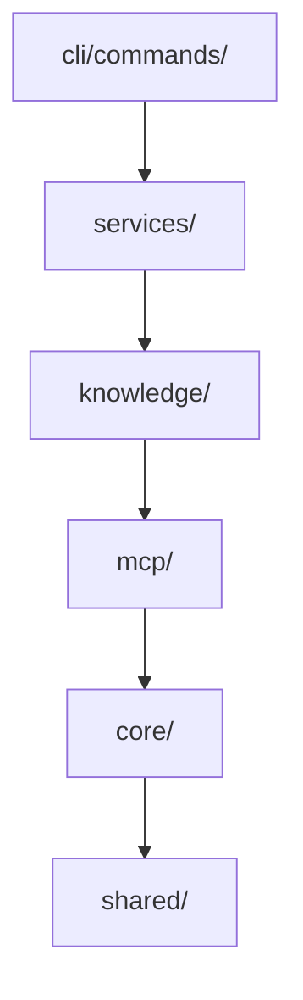

# 项目规约（Conventions & AI 协作规约）

<details>
<summary>Relevant source files</summary>

- AGENTS.md
- package.json
- src/shared/config.ts
</details>

本页汇总本仓库可确证的工程规约：工具链配置现状、面向 AI 协作的硬约束（提炼自 `AGENTS.md`），以及由 `AGENTS.md` 与工具链现状共同确定的分层与命名结构。所有条目均标注来源锚点，未经数据支持的内容不写入。

---

## 1. 工具链规约

### 1.1 配置状态总览

| 项 | 探测结果 | 配置文件 | 说明 |
| --- | --- | --- | --- |
| 独立 Linter 配置 | 未检出（`hasLinter=false`） | 无（`linterConfig=null`） | 仓库未提供独立 linter 配置文件 |
| EditorConfig | 未检出（`hasEditorConfig=false`） | 无（`editorConfig=null`） | 无 `.editorconfig` |
| 类型检查入口 | 存在，作为 `lint` 脚本 | 由 `package.json` 脚本定义 | `pnpm lint` 等价于 `tsc --noEmit`，锚点：`AGENTS.md#Commands` |
| 测试框架 | vitest | 由 `package.json` 脚本定义 | `pnpm test` = `vitest run`，锚点：`AGENTS.md#Commands` |
| 构建工具 | tsup | 由 `package.json` 脚本定义 | `pnpm build` → `dist/`，锚点：`AGENTS.md#Commands` |
| 包管理器 | pnpm | — | 所有脚本以 `pnpm` 调用，锚点：`AGENTS.md#Commands` |

> 结论：本项目的"静态检查"由 TypeScript 编译器（`tsc --noEmit`）承担，不存在额外的 lint 规则文件；格式/缩进层面无 `.editorconfig` 约束。

### 1.2 EditorConfig 原文

```text
editorConfig: null
（数据中未提供 .editorconfig 内容，无原文可展示）
```

---

## 2. 命令与工作流规约（AI 可执行清单）

| 命令 | 用途 | 锚点 |
| --- | --- | --- |
| `pnpm build` | tsup 构建输出到 `dist/` | `AGENTS.md#Commands` |
| `pnpm dev` | watch 模式构建 | `AGENTS.md#Commands` |
| `pnpm test` | 运行全部测试（`vitest run`） | `AGENTS.md#Commands` |
| `pnpm test:watch` | watch 模式测试 | `AGENTS.md#Commands` |
| `pnpm lint` | 类型检查（`tsc --noEmit`） | `AGENTS.md#Commands` |
| `npx vitest run tests/knowledge/wiki-quality-validator.test.ts` | 运行单个测试文件 | `AGENTS.md#Commands` |
| `npx vitest run -t "evidence"` | 按名称模式过滤测试 | `AGENTS.md#Commands` |

要点：改动代码后的验证路径为 `pnpm lint`（类型）+ `pnpm test`（行为），两者均在 `AGENTS.md#Commands` 中显式给出。

---

## 3. 数据管线规约（三命令模型）

| 阶段 | 命令 | 关键组件 / 行为 | 锚点 |
| --- | --- | --- | --- |
| Init | `scx-wiki-agent init` | 幂等创建 `.wiki/` 与 `.scx-wiki-agent/cache/` | `AGENTS.md#Data Pipeline` |
| Scan | `scx-wiki-agent scan` | `FileScanner` 遍历项目（gitignore 感知）；检测技术栈（含死依赖过滤；导入提取覆盖 `.ts/.js/.vue` 与 CSS `@import`）与项目类型 | `AGENTS.md#Data Pipeline` |
| Build | `scx-wiki-agent build` | `WikiService` 编排全流程 | `AGENTS.md#Data Pipeline` |

`build` 内部编排顺序（依据 `AGENTS.md#Data Pipeline`）：

| 步骤 | 组件 | 职责 |
| --- | --- | --- |
| 1 | `CodebaseMemoryClient.ensureIndexed` | 以子进程方式调用 `codebase-memory-mcp` |
| 2 | `IntentEvidenceProvider` | 确定性"为什么"证据（注释 / git commit / 文档小节 / 测试标题），fail-open；git 挖掘缓存于 `.scx-wiki-agent/cache/intent.json`（以 HEAD 为键） |
| 3 | `WikiContextBuilder` | 由图查询（getArchitecture / queryGraph / getCodeSnippet）构造每页上下文；对证据稀薄页做 hotspot 增强并接入意图证据 |
| 4 | `WikiPageGenerator` / `WikiFallbackBuilder` | LLM 路径经 Vercel AI SDK `streamText`；回退路径为纯规则（同时渲染意图证据表） |
| 5 | `wiki-evidence.ts` | 生成确定性的页面头部证据块；页面底部生成 Related 段 |
| 6 | `validatePageContent` | 质量门禁：error 规则阻断写入，warn 规则进入构建报告 |
| 7 | decisions precheck | git/文档证据完全缺失时丢弃该页并记录原因（与 data-flow 同模式） |

Stale-output 治理规约（`AGENTS.md#Data Pipeline`）：

- `.wiki` 是工具独占目录；全量构建整目录清除重建（不残留旧路径、不残留外部目录、不产生告警）。
- update 模式保留既有文件以支持 unchanged-skip，并清理非计划的工具文件、外部编号目录（静默）、空的自有目录。

---

## 4. 分层与依赖方向规约

自顶向下的层级顺序（依据 `AGENTS.md#Layer Dependencies`）：

| 层 | 路径 | 职责 |
| --- | --- | --- |
| 1 | `cli/commands/` | Commander.js handlers，薄封装 |
| 2 | `services/` | 业务逻辑编排（`ScanService`、`WikiService`） |
| 3 | `knowledge/` | Wiki 生成：页面注册表、上下文构建、LLM 生成、回退、证据、质量门禁 |
| 4 | `mcp/` | `codebase-memory-mcp` 子进程客户端（唯一数据源） |
| 5 | `core/` | `FileScanner` + 领域类型 |
| 6 | `shared/` | 常量与工具 |



> 图示为 `AGENTS.md#Layer Dependencies` 声明的"top → bottom"分层顺序；`shared/` 为最底层依赖方向终点。

---

## 5. AI 协作规约（AGENTS.md 提炼）

### 5.1 前置与外部依赖

| 主题 | 规约 | 锚点 |
| --- | --- | --- |
| 动手前 | 任何代码改动前先阅读 `.wiki/` 目录，理解当前项目状态与架构；该目录由生成文档反映真实代码库 | `AGENTS.md#Prerequisites` |
| 外部二进制 | `build` 命令依赖外部 `codebase-memory-mcp` 二进制（知识图谱数据源） | `AGENTS.md#Prerequisites` |
| 解析方式 | 通过 `CODEBASE_MEMORY_MCP_BINARY` 或 PATH 解析该二进制 | `AGENTS.md#Prerequisites` |

### 5.2 全局配置约定

| 主题 | 规约 | 锚点 |
| --- | --- | --- |
| 配置路径 | `~/.scx/wiki-agent/config.yaml`（YAML；由 `init` 生成带注释模板） | `AGENTS.md#Global Config` |
| 优先级 | CLI flags > config file > built-in defaults | `AGENTS.md#Global Config` |
| 解析实现 | `src/shared/config.ts`（纯解析器 + IO 外壳） | `AGENTS.md#Global Config` |
| 失败策略 | fail-open——缺失或损坏的配置永不阻断 build | `AGENTS.md#Global Config` |
| `provider` 段 | `name` / `model` / `api_key` / `base_url` / `timeout`；`api_key` 支持 `${ENV_VAR}` 引用 | `AGENTS.md#Global Config` |
| `base_url` 默认 | 按 provider 名映射，覆盖 openai / deepseek / glm / anthropic / ollama | `AGENTS.md#Global Config` |
| `timeout` 语义 | 转为每请求的 `AbortSignal.timeout` | `AGENTS.md#Global Config` |
| `build` 段 | `mode` / `max_output_tokens` / `no_llm`；`max_output_tokens` 取代每页硬编码的 8000 预算 | `AGENTS.md#Global Config` |

### 5.3 生成与质量门禁约定

| 主题 | 规约 | 锚点 |
| --- | --- | --- |
| 双路径生成 | 每页优先 LLM；在 `--no-llm` / 无模型 / 空输出 / 报错 / 门禁失败时按页回退到规则模板 | `AGENTS.md#Key Design Decisions` |
| builder 完备性 | 每个注册页面必须具备三种 builder case（context / generator / fallback）；缺失 generator case 会静默强制走回退路径 | `AGENTS.md#Key Design Decisions` |
| 页面注册表 | `PageRegistry` 为 18+8 页、三级（structure / operations / surface）；目录结构确定性（编号目录），**不由 LLM 生成** | `AGENTS.md#Key Design Decisions` |
| 证据优先 | 页面证据为零时返回 null context 并跳过，同时在构建报告中给出原因（与 data-flow 同模式） | `AGENTS.md#Key Design Decisions` |
| Tier-2 页面 | 8 个动态页面全量实现：`routes` / `db-schema`（backend）、`components` / `state` / `routing`（frontend）、`public-api`（library）、`workspaces` / `package-boundaries`（monorepo）；检测为 regex 级确定性并带 file:line 锚点 | `AGENTS.md#Key Design Decisions` |
| 项目类型判定 | `library` 类型由 package.json 形态判定（有 `exports`，或 `main`+`types` 且无 `bin`，且无框架指示命中） | `AGENTS.md#Key Design Decisions` |

### 5.4 禁止项 / 硬约束

| 禁止项 | 依据 | 锚点 |
| --- | --- | --- |
| 不得重新引入本地解析 / 索引（旧的 tree-sitter + SQLite/FTS5 管线已移除） | ADR-001，2026-06；所有代码结构数据须来自 codebase-memory-mcp 子进程调用 | `AGENTS.md#Key Design Decisions` |
| `decisions` 页面不得自动编造 ADR | 仅渲染真实锚定证据（逐条 commit/文档锚点）；两个通道均为空时跳过该页并给出构建报告原因 | `AGENTS.md#Key Design Decisions` |
| 不得依赖图上游未过滤的 CALLS 边 | 消费侧必须过滤跨语言边（ts↔rust）、非代码被调方（json/toml）、同名碰撞（BFS 以 `name@file` 为键）、无词法证据的边（被调名未出现在调用方源码中） | `AGENTS.md#Key Design Decisions` |

---

## 6. 命名与结构规约

仅列 `AGENTS.md` 与工具链现状可确定的部分：

| 方面 | 规约 | 锚点 |
| --- | --- | --- |
| 语言与模块制式 | 仅 ESM 的 TypeScript，目标 ES2022；产物为 CLI 工具 | `AGENTS.md#Architecture` |
| 顶层分层目录名 | `cli/commands/`、`services/`、`knowledge/`、`mcp/`、`core/`、`shared/` | `AGENTS.md#Layer Dependencies` |
| 按家族聚合的模块文件 | `context/` 下 `public-api.ts` / `routes.ts` / `frontend.ts` / `workspaces.ts` / `db-schema.ts`；`generator/tier2.ts`；`fallback/tier2.ts` | `AGENTS.md#Key Design Decisions` |
| 目录编号 | 输出目录结构为确定性的编号目录，非 LLM 生成 | `AGENTS.md#Key Design Decisions` |
| 运行时目录 | `.wiki/`（工具独占产物目录）、`.scx-wiki-agent/cache/`（缓存根）、`.scx-wiki-agent/cache/intent.json`（HEAD 为键的 git 挖掘缓存） | `AGENTS.md#Data Pipeline` |
| 全局配置路径 | `~/.scx/wiki-agent/config.yaml` | `AGENTS.md#Global Config` |
| 纯解析器/IO 外壳分离 | 配置解析位于 `src/shared/config.ts`，解析与 IO 分层 | `AGENTS.md#Global Config` |
| 测试文件位置与命名 | 位于 `tests/` 下，按领域目录 + 语义化文件名，例如 `tests/knowledge/wiki-quality-validator.test.ts` | `AGENTS.md#Commands` |

---

## 7. 待确认

1. 提供的 `AGENTS.md` 文本在 "Graph-edge defense-in-depth（`wiki-context-builder.ts`）" 条目中途截断（末句为 "backfills with fan-"），该条目后续约定及文档后续章节（如进一步的分层禁令、提交规范等）内容缺失，无法据实描述——待补充完整 `AGENTS.md` 原文。
## Related

- 同目录：[constraints.md](constraints.md)
- 共享 1 个源文件、共享 13 个符号：[troubleshooting.md](../05-guides/troubleshooting.md)
- 共享 1 个源文件、共享 12 个符号：[onboarding.md](../05-guides/onboarding.md)
- 共享 1 个源文件、共享 11 个符号：[environment.md](../01-overview/environment.md)
- 总入口：[README](../README.md)
