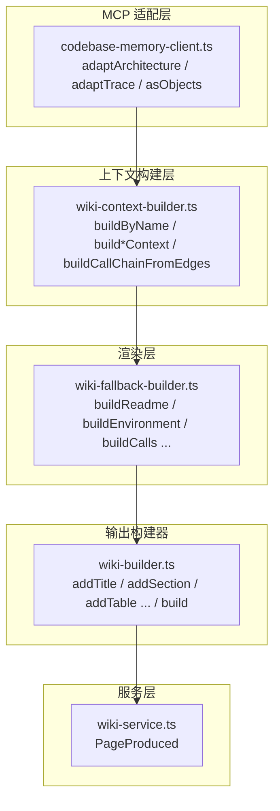

# 关键概念参考

Relevant source files

- src/knowledge/wiki-builder.ts
- src/knowledge/wiki-context-builder.ts
- src/knowledge/wiki-fallback-builder.ts
- src/mcp/codebase-memory-client.ts
- src/services/wiki-service.ts

本页面汇总了项目的核心类型、函数与方法，按功能职责分组呈现。它们分别归属于 **MCP 客户端适配层**、**知识/维基构建层**（含上下文构建、降级构建与文档构建器）以及 **服务层**，是理解项目如何从代码图谱数据生成结构化文档的关键入口。

每个符号均标注了其类型、签名、说明与所属文件。说明列优先取自源码 docstring；当 docstring 缺失时基于符号名与类型推断并标注「（推断）」。本页面严禁编造，所有条目均来自提供的符号数据。

---

## 一、服务层：单页产出模型

该组仅含一个接口，用于描述维基系统中"单页产出"的结果形态，是生成流程的返回契约。

| 名称 | 类型 | 签名 | 说明 | 所属文件 |
| --- | --- | --- | --- | --- |
| `PageProduced` | interface | — | 单页产出结果：最终内容 + 走的生成路径 | src/services/wiki-service.ts |

> 说明：`PageProduced` 是服务层对外暴露的产出结构，封装了"最终内容"与"所走过的生成路径"，可用于区分某页面是经由正常路径还是降级路径生成。其具体字段构成在当前数据中未给出，**待确认**（缺少接口成员定义证据）。

---

## 二、MCP 客户端：图谱数据适配层

`src/mcp/codebase-memory-client.ts` 中的函数承担"将 MCP（codebase memory）返回的原始数据适配为项目内部对象结构"的职责。由于后端数据结构存在新旧两种形态（旧版对象数组 / 新版列式表），这些适配函数是保证上层构建逻辑稳定的关键。

| 名称 | 类型 | 签名 | 说明 | 所属文件 |
| --- | --- | --- | --- | --- |
| `adaptArchitecture` | function | `(raw: Record<string, any>)` | get_architecture 列式表 → ArchitectureData 对象数组 | src/mcp/codebase-memory-client.ts |
| `adaptTrace` | function | `(raw: Record<string, any>)` | trace_path 分组列式表 → 扁平 TraceNode[] | src/mcp/codebase-memory-client.ts |
| `asObjects` | function | `(raw: Record<string, unknown>, key: string)` | 兼容两种形态：旧版对象数组 / 新版列式表 | src/mcp/codebase-memory-client.ts |

> 说明：`asObjects` 是兼容层基础函数，供其它适配函数复用；`adaptArchitecture` 将架构查询结果规范化为对象数组；`adaptTrace` 将 trace_path 的分组列式表展平为 `TraceNode[]`。`adaptTrace` 复杂度为 4，是三者中最高的一个，说明其展平/分组逻辑相对复杂。

---

## 三、维基文档构建器：Markdown 构件方法

`src/knowledge/wiki-builder.ts` 中的方法提供了一组建构 Markdown 文档的原子操作，属于链式/累加式构建器。所有方法复杂度均为 0，实现简洁直接，是上层各 `build*` 方法的底层支撑。

| 名称 | 类型 | 签名 | 说明 | 所属文件 |
| --- | --- | --- | --- | --- |
| `addTitle` | method | `(title: string)` | Add a top-level title: `# title` | src/knowledge/wiki-builder.ts |
| `addSection` | method | `(title: string, content: string)` | Add a second-level section: `## title\n\ncontent` | src/knowledge/wiki-builder.ts |
| `addSubSection` | method | `(title: string, content: string)` | Add a third-level sub-section: `### title\n\ncontent` | src/knowledge/wiki-builder.ts |
| `addParagraph` | method | `(text: string)` | Add a plain paragraph | src/knowledge/wiki-builder.ts |
| `addBulletList` | method | `(items: string[])` | Add a bullet list | src/knowledge/wiki-builder.ts |
| `addTable` | method | `(headers: string[], rows: string[][])` | Add a markdown table from headers and rows | src/knowledge/wiki-builder.ts |
| `addCodeBlock` | method | `(language: string, code: string)` | Add a fenced code block with an optional language hint | src/knowledge/wiki-builder.ts |
| `addNewline` | method | `()` | Add an empty line | src/knowledge/wiki-builder.ts |
| `build` | method | `()` | Join all sections with newlines and return the final document | src/knowledge/wiki-builder.ts |

> 说明：该组方法覆盖标题、章节（二/三级）、段落、列表、表格、代码块与空行，最后通过 `build()` 拼接所有片段返回完整文档。这是生成各种 `*.md` 页面的统一输出层。

---

## 四、上下文构建器：数据源聚合

`src/knowledge/wiki-context-builder.ts` 负责把来自 MCP 图谱与源码扫描的原始数据，按页面类型聚合为相应的上下文对象（`*Context`），再交由降级构建器渲染。`buildByName` 是统一派发入口。

| 名称 | 类型 | 签名 | 说明 | 所属文件 |
| --- | --- | --- | --- | --- |
| `buildByName` | method | `(page: string, plannedPages?: string[])` | 按页面名派发上下文构建（供 PageRegistry 调用）。plannedPages 用于 readme 索引只列本次产出的页面 | src/knowledge/wiki-context-builder.ts |
| `buildCallChainFromEdges` | method | `(entryName: string, entryFile: string)` | 基于 CALLS 边 BFS 构建真实调用链（修复伪线性化问题）。trace_path 返回扁平的 callee 列表（只有 hop 层级，无 caller→callee 边），直接线性化会把并行分支误画成串行序列。这里改用 Cypher 查精确的 CALLS 边，按 BFS 层级还原真实的 caller→callee 关系 | src/knowledge/wiki-context-builder.ts |
| `buildCallsContext` | method | `()` | calls.md 数据源：调用边表（R2 边表优于时序图）。用 Cypher 查 (a:Method\|Function)-[:CALLS]->(b)，按入口分组。trace_path 不可靠（对 Method 返回空、无 file/line），改用 Cypher CALLS 边 | src/knowledge/wiki-context-builder.ts |
| `buildClassesContext` | method | `()` | classes.md 数据源：类清单 + 每类方法表（降级适配）。MCP 无 INHERITS 边、Class 无 parent_class/is_abstract，故只做扁平类表。方向是 (c:Class)-[:DEFINES_METHOD]->(m:Method) | src/knowledge/wiki-context-builder.ts |
| `buildCliContext` | method | `()` | cli.md 数据源：命令注册（MCP entry_points + getCodeSnippet 解析 commander options）+ 退出码（源码扫 process.exit(N)）。entry_points 即 CLI 命令入口；getCodeSnippet 读 register*Command 源码，从 .option() 调用提取参数定义 | src/knowledge/wiki-context-builder.ts |
| `buildConstraintsContext` | method | `()` | constraints.md 数据源：限制常量（ConfigDetector 源码扫描）+ 高复杂度函数（MCP）。关键：MCP 的 complexity 仅在 Method/Function 节点可靠（Class/Interface 恒 0），故 Cypher 显式限定 label IN ['Method', 'Function']，避免拉入噪声 | src/knowledge/wiki-context-builder.ts |
| `buildConventionsContext` | method | `()` | conventions.md 数据源：规约信息（来自 ConfigDetector）。Linter/EditorConfig/AGENTS.md 探测结果，诚实标注缺失项 | src/knowledge/wiki-context-builder.ts |
| `buildDecisionsContext` | method | `()` | decisions.md 数据源：ADR 架构决策记录。MCP manage_adr 当前无持久化 ADR，降级为从图谱真实证据（分层/边界/技术栈）自动推导 | src/knowledge/wiki-context-builder.ts |
| `buildEnvironmentContext` | method | `()` | environment.md 数据源：运行态信息（来自 ConfigDetector）。包名/版本/运行时/Node 版本/包管理器/脚本命令/env 变量 | src/knowledge/wiki-context-builder.ts |

> 说明：该组方法分别对应 `calls.md`、`classes.md`、`cli.md`、`constraints.md`、`conventions.md`、`decisions.md`、`environment.md` 等页面的数据源构建。其中 `buildCallChainFromEdges`（复杂度 8）与 `buildCallsContext`（复杂度 8）为较复杂的成员，原因是其需要基于真实 `CALLS` 边做 BFS 还原，避免 `trace_path` 扁平化导致的伪线性化问题。`buildByName` 为派发入口，供 `PageRegistry` 调用。

---

## 五、降级构建器：页面渲染

`src/knowledge/wiki-fallback-builder.ts` 提供各页面的规则化渲染方法。它们接收上文构建的 `*Context`，按固定模板生成 Markdown 内容，属于降级/兜底路径（不依赖大模型推理，纯规则生成）。

| 名称 | 类型 | 签名 | 说明 | 所属文件 |
| --- | --- | --- | --- | --- |
| `buildReadme` | method | `(ctx: ReadmeContext)` | README.md：导航索引（wiki 总入口）。按编号目录分组索引（project-wiki「总入口：使用方式/阅读路径/核心导航」），索引表只列本次产出的文档，链接相对 wiki 根 | src/knowledge/wiki-fallback-builder.ts |
| `buildEnvironment` | method | `(ctx: EnvironmentContext)` | environment.md：运行态信息（包名/版本/运行时/脚本/env 变量）。纯规则生成，数据来自 ConfigDetector 探测的实际配置文件 | src/knowledge/wiki-fallback-builder.ts |
| `buildConstraints` | method | `(ctx: ConstraintsContext)` | constraints.md：项目边界与代价。限制常量（源码 MAX/LIMIT/TIMEOUT）+ 高复杂度函数表（complexity > 3） | src/knowledge/wiki-fallback-builder.ts |
| `buildConventions` | method | `(ctx: ConventionsContext)` | conventions.md：规约文档（AI 头号参考）。诚实标注工具链检测结果：有 lint 则列规则，无则明确提示需人工补充。从 AGENTS.md 提取关键规约段落 | src/knowledge/wiki-fallback-builder.ts |
| `buildDecisions` | method | `(ctx: DecisionsContext)` | decisions.md：ADR 架构决策记录。每条 ADR：编号+状态+背景+决策+后果+相关文件（R1 锚点、R4 结构化） | src/knowledge/wiki-fallback-builder.ts |
| `buildCli` | method | `(ctx: CliContext)` | cli.md：CLI 命令参考。命令表（含 file:line）+ 每命令参数表（commander .option 解析）+ 退出码表 | src/knowledge/wiki-fallback-builder.ts |
| `buildClasses` | method | `(ctx: ClassesContext)` | classes.md：类层次与多态（降级适配）。MCP 无 INHERITS 边，只做"类清单 + 每类方法表"，诚实标注数据局限 | src/knowledge/wiki-fallback-builder.ts |
| `buildCalls` | method | `(ctx: CallsContext)` | calls.md：调用边表（R2 边表优于时序图）。纯规则生成，不使用 sequenceDiagram | src/knowledge/wiki-fallback-builder.ts |

> 说明：该组方法是各页面的最终渲染实现，均为「纯规则生成」，接收对应上下文对象。`buildReadme`（复杂度 5）与 `buildClasses`（复杂度 5）相对复杂，前者需组织导航索引、后者需组织类清单与方法表。注意这些方法在文档中明确遵循 R1（锚点）、R2（边表优于时序图）、R4（结构化）等约束。

---

## 六、调用关系速查（静态可达性）

以下表格汇总数据中可明确识别的调用/派发关系。由于提供的符号数据仅含少量方法体内线索，此处仅列出有直接证据的项，其余 **待确认**。

| 调用方 | 被调用方 | 证据（file:line / 所属文件） |
| --- | --- | --- |
| `buildByName` | 各页面 `build*Context`（按页名派发） | src/knowledge/wiki-context-builder.ts（docstring 明示"按页面名派发上下文构建"） |
| `buildCallsContext` | （Cypher 查询 CALLS 边） | src/knowledge/wiki-context-builder.ts（docstring 明示改用 Cypher CALLS 边） |
| `buildCallChainFromEdges` | （Cypher 查询精确 CALLS 边 + BFS） | src/knowledge/wiki-context-builder.ts（docstring 明示"改用 Cypher 查精确的 CALLS 边，按 BFS 层级还原"） |

> 说明：`wiki-builder.ts` 中的 `add*`/`build` 方法与各 `build*`（降级构建器）之间的具体调用点，在提供的数据中未给出 file:line 证据，**待确认**。但结合命名与 docstring 上下文，可合理推断构建器方法由降级构建器使用（此为推断，需源码行号佐证）。

---

## 七、组合关系示意

下图仅依据数据中出现的真实文件名与模块名绘制，展示文档生成链路的模块层级（不含未经证实的继承关系）。

> 说明：图中的节点均来自数据中的真实文件路径与符号名；箭头方向依据各模块 docstring 描述的数据流向推断，**具体调用点行号待确认**。

---

## 待确认事项汇总

- `PageProduced` 接口的成员字段：数据中无成员定义。
- `wiki-builder.ts` 各 `add*`/`build` 方法的具体调用点（file:line）：数据中未提供。
- 各 `adapt*`/`asObjects` 函数的调用点：数据中未提供。
- `wiki-context-builder.ts` 与 `wiki-fallback-builder.ts`、`wiki-builder.ts`、`wiki-service.ts` 之间的精确调用行号：数据中未提供。
- 项目启动方式、配置来源、外部依赖、技术栈等：本页数据未覆盖，**信息不足**，应查阅其它页面。
## Related

- 同目录：[calls.md](calls.md) · [classes.md](classes.md)
- 总入口：[README](../README.md)
