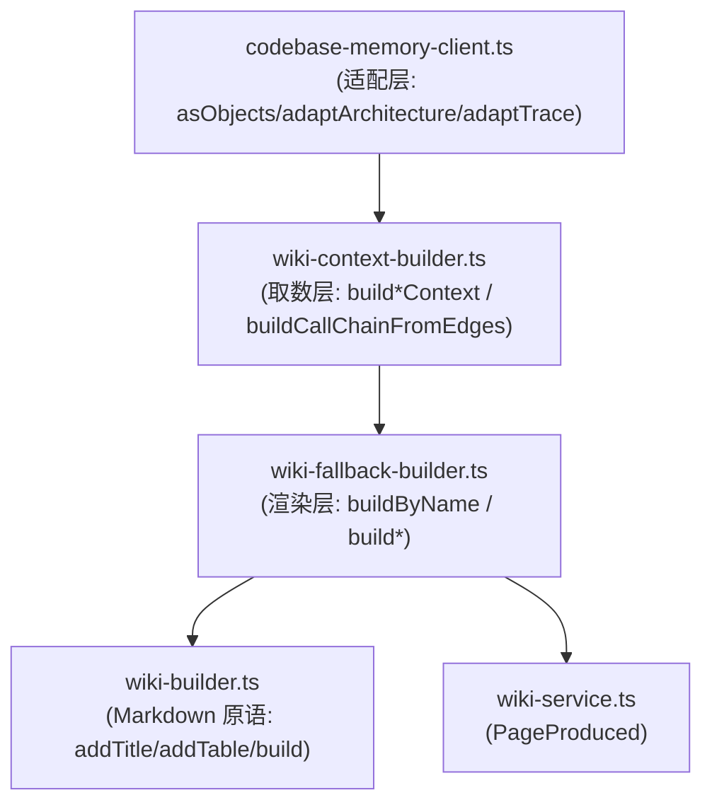

# 关键概念参考

Relevant source files

- src/knowledge/wiki-builder.ts
- src/knowledge/wiki-context-builder.ts
- src/knowledge/wiki-fallback-builder.ts
- src/mcp/codebase-memory-client.ts
- src/services/wiki-service.ts

本页列出项目核心的**类型定义、构建函数与 MCP 适配工具**，覆盖知识库（wiki）生成流水线、页面内容构建器（wiki-builder）、降级规则构建器（wiki-fallback-builder）、上下文数据源构建器（wiki-context-builder），以及 MCP 客户端数据适配层。这些符号构成了"从代码图谱数据到结构化 Markdown 文档"的核心链路。

读者可据此快速定位：数据结构长什么样（如 `PageProduced`）、Markdown 如何被拼装（`WikiBuilder` 系列方法）、各类页面（calls/classes/cli/decisions 等）由哪个方法产出、以及 MCP 返回列式表到对象数组的适配逻辑。所有条目均附 `file:line` 锚点，可直接跳转源码。

> 说明：本页仅覆盖所提供的符号数据。测试目录内容未纳入，缺失信息以「待确认」标注。

---

## 一、核心服务与数据模型

该组定义 wiki 生成流程的核心产出结构与生成路径，是连接"生成器"与"最终文档"的关键类型。

| 名称 | 类型 | 签名 | 说明 | 所属文件 |
|------|------|------|------|----------|
| `PageProduced` | interface | —（无签名数据） | 单页产出结果：最终内容 + 走的生成路径（来源：docstring） | `src/services/wiki-service.ts:22` |

> **待确认**：`PageProduced` 的字段明细（如 content、path 等具体属性名与类型）在提供的数据中缺失，仅有接口级 docstring。

---

## 二、MCP 客户端数据适配函数

该组位于 `src/mcp/codebase-memory-client.ts`，职责是将 MCP 返回的**列式表（columnar）**结构转换为项目内部使用的**对象数组**，并处理新旧两种数据形态的兼容。这是整个数据链路的入口适配层。

| 名称 | 类型 | 签名 | 说明 | 所属文件 |
|------|------|------|------|----------|
| `asObjects` | function | `(raw: Record<string, unknown>, key: string)` | 兼容两种形态：旧版对象数组 / 新版列式表（来源：docstring） | `src/mcp/codebase-memory-client.ts:35` |
| `adaptArchitecture` | function | `(raw: Record<string, any>)` | 将 `get_architecture` 列式表转换为 `ArchitectureData` 对象数组（来源：docstring） | `src/mcp/codebase-memory-client.ts:45` |
| `adaptTrace` | function | `(raw: Record<string, any>)` | 将 `trace_path` 分组列式表转换为扁平的 `TraceNode[]`（来源：docstring；复杂度 4） | `src/mcp/codebase-memory-client.ts:92` |

**整体职责**：这三个函数构成 MCP 客户端的数据规范化层。`asObjects` 是底层通用转换原语（处理新旧结构差异），`adaptArchitecture` 与 `adaptTrace` 是面向具体 MCP 接口（`get_architecture`、`trace_path`）的上层适配器。

---

## 三、WikiBuilder — Markdown 文档构建器

该类位于 `src/knowledge/wiki-builder.ts`，提供一套**流式（链式）Markdown 拼装 API**，从标题、段落、代码块、表格到最终 `build()` 输出，是生成结构化文档的底层原语集合。以下均标注为 `method`。

**整体职责**：把零散的 Markdown 片段（标题层级、段落、表格、代码块、列表）渐进式追加到内部缓冲区，最终 `build()` 合并为完整文档。适用于需要程序化、结构化地生成 Markdown 的任意场景。

| 名称 | 类型 | 签名 | 说明 | 所属文件 |
|------|------|------|------|----------|
| `addTitle` | method | `(title: string)` | 添加顶级标题：`# title`（来源：docstring） | `src/knowledge/wiki-builder.ts:11` |
| `addSection` | method | `(title: string, content: string)` | 添加二级章节 `## title`，content 非空时追加 `\n\ncontent`（来源：docstring） | `src/knowledge/wiki-builder.ts:17` |
| `addSubSection` | method | `(title: string, content: string)` | 添加三级子章节 `### title`，content 非空时追加 `\n\ncontent`（来源：docstring） | `src/knowledge/wiki-builder.ts:23` |
| `addParagraph` | method | `(text: string)` | 添加普通段落（来源：docstring） | `src/knowledge/wiki-builder.ts:29` |
| `addCodeBlock` | method | `(language: string, code: string)` | 添加带可选语言提示的围栏代码块（来源：docstring） | `src/knowledge/wiki-builder.ts:35` |
| `addTable` | method | `(headers: string[], rows: string[][])` | 根据表头与行数据添加 Markdown 表格（来源：docstring） | `src/knowledge/wiki-builder.ts:41` |
| `addBulletList` | method | `(items: string[])` | 添加无序列表（来源：docstring） | `src/knowledge/wiki-builder.ts:50` |
| `addNewline` | method | `()` | 添加一个空行（来源：docstring） | `src/knowledge/wiki-builder.ts:56` |
| `build` | method | `()` | 以换行拼接所有 section，返回最终文档（来源：docstring） | `src/knowledge/wiki-builder.ts:62` |

---

## 四、页面上下文数据构建器（wiki-context-builder）

该类文件（`src/knowledge/wiki-context-builder.ts`）负责为每个页面**准备数据源（Context）**，通过 Cypher 查询代码图谱（CALLS/INHERITS/DEFINES_METHOD 等边）组装出各页面所需的结构化上下文。它是"取数层"，与下一节的"渲染层"配套。

**整体职责**：针对 calls / classes / cli / constraints / conventions / environment / decisions 等页面，分别用 Cypher 查询图谱中的真实证据，输出对应的 `*Context` 对象。多处 docstring 明确指出数据局限并做了降级适配（如 MCP 无 INHERITS 边、complexity 仅在 Method/Function 可靠）。

| 名称 | 类型 | 签名 | 说明 | 所属文件 |
|------|------|------|------|----------|
| `buildCallChainFromEdges` | method | `(entryName: string, entryFile: string)` | 基于 CALLS 边 BFS 构建真实调用链；修 trace_path 扁平化导致的伪线性化问题，用 Cypher 查精确 CALLS 边按 BFS 层级还原 caller→callee（来源：docstring；复杂度 8） | `src/knowledge/wiki-context-builder.ts:261` |
| `buildCallsContext` | method | `()` | calls.md 数据源：调用边表，用 Cypher 查 `(a:Method\|Function)-[:CALLS]->(b)` 按入口分组（来源：docstring；复杂度 10） | `src/knowledge/wiki-context-builder.ts:571` |
| `buildClassesContext` | method | `()` | classes.md 数据源：类清单 + 每类方法表；MCP 无 INHERITS 边、Class 无 parent_class，故只做扁平表，方向 `(c:Class)-[:DEFINES_METHOD]->(m:Method)`（来源：docstring） | `src/knowledge/wiki-context-builder.ts:650` |
| `buildEnvironmentContext` | method | `()` | environment.md 数据源：包名/版本/运行时/Node 版本/包管理器/脚本命令/env 变量（来自 ConfigDetector）（来源：docstring） | `src/knowledge/wiki-context-builder.ts:797` |
| `buildConventionsContext` | method | `()` | conventions.md 数据源：规约信息（Linter/EditorConfig/AGENTS.md 探测结果，来自 ConfigDetector），诚实标注缺失项（来源：docstring） | `src/knowledge/wiki-context-builder.ts:817` |
| `buildConstraintsContext` | method | `()` | constraints.md 数据源：限制常量（源码扫描）+ 高复杂度函数（MCP）；Cypher 显式限定 `label IN ['Method','Function']` 以避噪声（来源：docstring） | `src/knowledge/wiki-context-builder.ts:827` |
| `buildCliContext` | method | `()` | cli.md 数据源：命令注册（MCP entry_points + getCodeSnippet 解析 commander options）+ 退出码（源码扫 `process.exit(N)`）（来源：docstring） | `src/knowledge/wiki-context-builder.ts:853` |
| `buildDecisionsContext` | method | `()` | decisions.md 数据源：ADR；MCP manage_adr 当前无持久化 ADR，降级为从图谱证据（分层/边界/技术栈）自动推导（来源：docstring） | `src/knowledge/wiki-context-builder.ts:1017` |

---

## 五、页面渲染构建器（wiki-fallback-builder）

该类文件（`src/knowledge/wiki-fallback-builder.ts`）是**纯规则的渲染层**，接收上一节产出的 `*Context`，生成对应页面的 Markdown 内容。顶部有 `buildByName` 作为按页面名派发的入口（供 `PageRegistry` 调用）。

**整体职责**：每个 `build*` 方法对应一类页面（readme/calls/classes/environment/conventions/constraints/cli/decisions），遵循项目既定规则（如 R1 锚点、R2 边表优于时序图、R4 结构化）生成 Markdown。多处 docstring 强调"纯规则生成""降级适配""诚实标注数据局限"。

| 名称 | 类型 | 签名 | 说明 | 所属文件 |
|------|------|------|------|----------|
| `buildByName` | method | `(page: string, ctx: any)` | 按页面名派发规则生成（供 PageRegistry 调用）（来源：docstring；复杂度 21，为本表最高） | `src/knowledge/wiki-fallback-builder.ts:32` |
| `buildCalls` | method | `(ctx: CallsContext)` | calls.md：调用边表（R2 边表优于时序图），纯规则生成，不使用 sequenceDiagram（来源：docstring） | `src/knowledge/wiki-fallback-builder.ts:369` |
| `buildClasses` | method | `(ctx: ClassesContext)` | classes.md：类层次与多态（降级适配）；MCP 无 INHERITS 边，只做"类清单 + 每类方法表"，诚实标注数据局限（来源：docstring） | `src/knowledge/wiki-fallback-builder.ts:408` |
| `buildEnvironment` | method | `(ctx: EnvironmentContext)` | environment.md：运行态信息（包名/版本/运行时/脚本/env 变量），纯规则生成（来源：docstring） | `src/knowledge/wiki-fallback-builder.ts:504` |
| `buildConventions` | method | `(ctx: ConventionsContext)` | conventions.md：规约文档（AI 头号参考）；诚实标注工具链检测结果，从 AGENTS.md 提取关键规约段落（来源：docstring） | `src/knowledge/wiki-fallback-builder.ts:564` |
| `buildConstraints` | method | `(ctx: ConstraintsContext)` | constraints.md：项目边界与代价；限制常量（MAX/LIMIT/TIMEOUT）+ 高复杂度函数表（complexity > 3）（来源：docstring） | `src/knowledge/wiki-fallback-builder.ts:607` |
| `buildCli` | method | `(ctx: CliContext)` | cli.md：CLI 命令参考；命令表（含 file:line）+ 每命令参数表（commander `.option` 解析）+ 退出码表（来源：docstring） | `src/knowledge/wiki-fallback-builder.ts:639` |
| `buildDecisions` | method | `(ctx: DecisionsContext)` | decisions.md：ADR 架构决策记录；每条含编号+状态+背景+决策+后果+相关文件（R1 锚点、R4 结构化）（来源：docstring） | `src/knowledge/wiki-fallback-builder.ts:784` |

> 说明：提供的数据中 `buildReadme`（`src/knowledge/wiki-fallback-builder.ts:454`）出现在原始符号列表，但被截断于本组末尾之外，其 docstring 为"README.md：导航索引（wiki 总入口），按编号目录分组索引，索引表只列本次产出文档，链接相对 wiki 根"。此处一并补录：

| 名称 | 类型 | 签名 | 说明 | 所属文件 |
|------|------|------|------|----------|
| `buildReadme` | method | `(ctx: ReadmeContext)` | README.md：导航索引（wiki 总入口），按编号目录分组索引，索引表只列本次产出文档（来源：docstring；复杂度 5） | `src/knowledge/wiki-fallback-builder.ts:454` |

---

## 六、分层调用关系（取数 → 渲染）

下表描述 `wiki-context-builder`（取数）与 `wiki-fallback-builder`（渲染）之间的**静态配对关系**（同页面上下文与渲染方法一一对应），基于两侧符号命名与 docstring 对齐得出。

| 页面 | 上下文构建方法（取数） | 渲染方法（渲染） | 取数锚点 | 渲染锚点 |
|------|------------------------|------------------|----------|----------|
| calls.md | `buildCallsContext` | `buildCalls` | `src/knowledge/wiki-context-builder.ts:571` | `src/knowledge/wiki-fallback-builder.ts:369` |
| classes.md | `buildClassesContext` | `buildClasses` | `src/knowledge/wiki-context-builder.ts:650` | `src/knowledge/wiki-fallback-builder.ts:408` |
| environment.md | `buildEnvironmentContext` | `buildEnvironment` | `src/knowledge/wiki-context-builder.ts:797` | `src/knowledge/wiki-fallback-builder.ts:504` |
| conventions.md | `buildConventionsContext` | `buildConventions` | `src/knowledge/wiki-context-builder.ts:817` | `src/knowledge/wiki-fallback-builder.ts:564` |
| constraints.md | `buildConstraintsContext` | `buildConstraints` | `src/knowledge/wiki-context-builder.ts:827` | `src/knowledge/wiki-fallback-builder.ts:607` |
| cli.md | `buildCliContext` | `buildCli` | `src/knowledge/wiki-context-builder.ts:853` | `src/knowledge/wiki-fallback-builder.ts:639` |
| decisions.md | `buildDecisionsContext` | `buildDecisions` | `src/knowledge/wiki-context-builder.ts:1017` | `src/knowledge/wiki-fallback-builder.ts:784` |
| README.md | （对应 Context 未在本数据中列出） | `buildReadme` | 待确认 | `src/knowledge/wiki-fallback-builder.ts:454` |

**分层示意**（节点均为数据中的真实文件名）：

> **说明（R2）**：上述 `graph TD` 仅表达基于文件路径的模块级依赖方向，节点标签为真实文件路径与符号名。文件中未提供逐条 import/call 的具体行号边，故不展开为更细粒度的调用表；如需精确调用边，证据不足，**待确认**。

---

## 七、概念速览与数据局限（源自 docstring，非推断）

以下局限均由源码 docstring 显式声明，非本页推测：

| 局限 | 出处说明 | 锚点 |
|------|----------|------|
| MCP 无 INHERITS 边，Class 无 parent_class/is_abstract，故类页仅做扁平表 | classes 降级适配 | `src/knowledge/wiki-context-builder.ts:650`、`src/knowledge/wiki-fallback-builder.ts:408` |
| MCP `complexity` 仅在 Method/Function 节点可靠，Class/Interface 恒 0 | constraints 数据源 | `src/knowledge/wiki-context-builder.ts:827` |
| `trace_path` 不可靠（对 Method 返回空、无 file/line），calls 页改用 Cypher CALLS 边 | calls 数据源 | `src/knowledge/wiki-context-builder.ts:571` |
| `trace_path` 返回扁平 callee 列表，直接线性化会把并行分支误画为串行 | 调用链修复 | `src/knowledge/wiki-context-builder.ts:261` |
| MCP `manage_adr` 当前无持久化 ADR，decisions 页降级为从图谱证据推导 | decisions 数据源 | `src/knowledge/wiki-context-builder.ts:1017` |

---

**待确认汇总**：
1. `PageProduced` 的字段结构（缺属性级数据）。
2. `buildReadme` 所对应的 `ReadmeContext` 构建方法未在本数据中出现。
3. 各模块间的精确 import / 调用边（现有数据仅有文件级符号，无逐条调用锚点）。
## Related

- 同目录：[calls.md](calls.md) · [classes.md](classes.md)
- 总入口：[README](../README.md)
