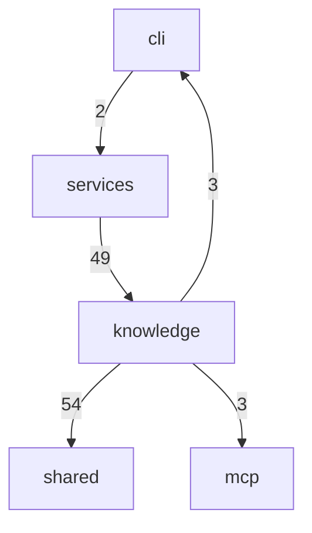

# generateByName 协作面

<details>
<summary>Relevant source files</summary>

- src/knowledge/wiki-output-sanitizer.ts
- src/knowledge/wiki-page-generator.ts
- src/services/wiki-service.ts
</details>

> 本页是仓库特有的「跨模块协作面」主题页：主题标题指向 `generateByName`，但数据中 `symbols` 与 `edges` 均为空数组，因此本页只能基于**文件级 intent 证据**（–）与**模块级边界计数**（–）来刻画这一协作面，凡是数据无法支撑的部分一律显式标注「信息不足」或「待确认」，不做补写。
>
> 本主题横跨三个文件：`src/knowledge/wiki-page-generator.ts`、`src/services/wiki-service.ts`、`src/knowledge/wiki-output-sanitizer.ts`，分别落在 `knowledge` 与 `services` 两个模块。它值得单独成页的原因在于：这三个文件并不承载实现本身，而是**生成能力的对外兼容壳与输出质量闸门**——两条兼容壳负责让既有 import 路径继续可用 ，一个 sanitizer 负责对 LLM 输出做确定性清理 ；三者之间的配合关系正好位于 `knowledge` 与 `services` 两个模块的高频耦合边界上（`services→knowledge` 49 次、`knowledge→shared` 54 次）。

---

## 一、职责与范围

### 1.1 文件清单与分工

| 文件 | 定位（数据中的自述） | 在本主题中的角色 | 证据 |
| --- | --- | --- | --- |
| `src/knowledge/wiki-page-generator.ts` | 「Re-export 壳：实现已拆分到 ./generator/（shared / structure / data-pages / surface / index）。本文件仅保持既有 import 路径兼容，勿在此新增实现。」`src/knowledge/wiki-page-generator.ts:1` | 生成侧的**导入路径兼容层**，本身不应再新增实现 |  |
| `src/services/wiki-service.ts` | 「兼容壳：实现已拆分至 src/services/wiki/（service/cleanup/report/verification/阶段二·三）。」`src/services/wiki-service.ts:1` | 服务侧的**兼容壳**，实现已下沉到子目录 |  |
| `src/knowledge/wiki-output-sanitizer.ts` | 「LLM 生成 wiki 输出的轻量后处理。思考模型/部分 provider 会在正文前混入对话残骸……或用 ```markdown 围栏包裹整个输出。本模块做确定性清理，不调用 LLM。fallback 路径（规则生成）无需过此 sanitizer。」`src/knowledge/wiki-output-sanitizer.ts:1` | 生成结果的**确定性输出清理闸门** |  |

### 1.2 范围边界说明

- 前两个文件是**壳**：`src/knowledge/wiki-page-generator.ts:1` 明确写明实现已拆分到 `./generator/`（含 `shared / structure / data-pages / surface / index`）；`src/services/wiki-service.ts:1` 写明实现已拆分至 `src/services/wiki/`（含 `service/cleanup/report/verification/阶段二·三`）。这两个子目录**不在本主题的 files 清单中**，其内部结构在本页无法描述。
- `src/knowledge/wiki-output-sanitizer.ts` 是本主题唯一带实际处理逻辑自述的文件：它做「轻量后处理」、「确定性清理」、「不调用 LLM」，并且**明确声明 fallback 路径（规则生成）不经过该 sanitizer** 。这条声明界定了 sanitizer 的适用范围：它只作用于 LLM 生成路径的输出。

---

## 二、关键符号

> 数据未提供本主题任何符号的完整签名（参数表、返回类型、可见性），以下仅基于 `intent` 中携带 `file:line` 锚点的符号注释描述其角色。`generateByName` 本身在数据中没有任何符号锚点（见「待确认」）。

| 符号 | 锚点 | 数据中给出的描述 | 证据 |
| --- | --- | --- | --- |
| `PREAMBLE_PATTERNS` | `src/knowledge/wiki-output-sanitizer.ts:11` | 「常见的对话残骸/寒暄前导语开头特征」 |  |
| `sanitizeWikiOutput` | `src/knowledge/wiki-output-sanitizer.ts:24` | 「@param pageName 页面名，用于 R2 sequenceDiagram 违规告警（仅 calls 页允许时序图）」 |  |
| `stripCodeFences` | `src/knowledge/wiki-output-sanitizer.ts:38` | 「去除整个内容被 ```markdown ... ``` 包裹的情况。仅当首行是 ``` 开头且末行是 ``` 时处理。」 |  |

### 2.1 `PREAMBLE_PATTERNS`（`src/knowledge/wiki-output-sanitizer.ts:11`）

该符号是清理流程的**识别依据**：注释将其定义为「常见的对话残骸/寒暄前导语开头特征」。它与文件头注释所述的问题场景直接对应——思考模型/部分 provider 会在正文前混入「好的，作为…」「根据您提供的JSON数据…」这类残骸 。数据只给出它是「开头特征」的集合，未给出具体条目内容与匹配方式（信息不足）。

### 2.2 `sanitizeWikiOutput`（`src/knowledge/wiki-output-sanitizer.ts:24`）

从注释看，这是清理器的主入口：其入参包含 `pageName`，且 `pageName` 的用途被明确限定为「用于 R2 sequenceDiagram 违规告警（仅 calls 页允许时序图）」。这说明该函数不只是一次纯文本清理，还承担了一项**与页面名相关的结构规则校验职责**——即根据当前页面是不是 `calls` 页，判定输出中出现的时序图是否违规 。函数体如何实现该告警、告警如何返回给调用方，数据中无锚点（信息不足）。

### 2.3 `stripCodeFences`（`src/knowledge/wiki-output-sanitizer.ts:38`）

该符号负责去除整段内容被 ``` markdown 围栏包裹的情况，且其作用条件是**严格前置的**：仅当首行是 ``` 开头且末行是 ``` 时处理 。这与文件头所述的第二类问题——「用 ```markdown 围栏包裹整个输出」——一一对应 。该「首行/末行」双条件限定了它只处理整体包裹，不做围栏的局部剥离（依据注释原文 ）。

---

## 三、协作方式

### 3.1 调用边：数据缺失说明

本主题的 `edges` 为**空数组**，因此本页**无法给出「调用方 → 被调用方 → file:line」的调用边表**。按 R2 的要求，此处不使用时序图替代静态可达性表达；文件间具体的调用方向与数据流属于**信息不足**，不做推测。

### 3.2 可用的协作证据：模块级边界计数

数据中唯一可用的协作证据是模块级 `boundaries`（–）：

| 调用方向 | 调用次数 | 证据 |
| --- | --- | --- |
| `knowledge → shared` | 54 |  |
| `services → knowledge` | 49 |  |
| `knowledge → mcp` | 3 |  |
| `knowledge → cli` | 3 |  |
| `cli → services` | 2 |  |



> 图中节点与边上数字均取自 `boundaries` 数据（–），节点名为数据中真实的模块名，未引入任何未出现的模块或符号。

从计数结构可以读到的事实是：`services` 与 `knowledge` 之间存在**双向、且以 `services → knowledge` 为主方向**的调用关系（49 次），同时 `knowledge` 自身对 `shared` 有最重的依赖（54 次）。本主题的三个文件恰好分布在 `knowledge` 与 `services` 两侧，因此这一协作面落在两者最粗的一条依赖线上 。

### 3.3 数据流（数据不足以支撑）

三个文件之间在生成流程中的先后顺序、`sanitizeWikiOutput` 的调用点、以及清理失败时的回退行为，数据中均无锚点。**信息不足**，不做阶段描述。

---

## 四、跨模块边界

### 4.1 耦合点清单

| 边界 | 方向 | 调用次数 | 证据 | 与本主题的关系 |
| --- | --- | --- | --- | --- |
| `services → knowledge` | services 调 knowledge | 49 |  | 本主题中 `src/services/wiki-service.ts`（services 侧壳）与 `src/knowledge/*`（knowledge 侧）之间的主依赖方向 |
| `knowledge → shared` | knowledge 调 shared | 54 |  | 本主题 knowledge 侧文件（含 sanitizer）向外部的最大依赖出口 |
| `knowledge → mcp` | knowledge 调 mcp | 3 |  | knowledge 侧的次要出口 |
| `knowledge → cli` | knowledge 调 cli | 3 |  | knowledge 侧对 cli 的反向出口 |
| `cli → services` | cli 调 services | 2 |  | services 侧壳的上游入口之一 |

### 4.2 修改代价（含推断）

- 在 `src/services/wiki-service.ts:1` 标注「兼容壳」、`src/knowledge/wiki-page-generator.ts:1` 标注「Re-export 壳」 的前提下，修改这两个文件本身的实现代价应当很低；但**删除或改名**会破坏「既有 import 路径」，这一点由两处注释直接声明 。
- **（推断）** 调用计数高的边界改动影响面更大：`knowledge → shared` 54 次  与 `services → knowledge` 49 次  意味着这两条边上的接口变动会波及最多的调用点。此判断的依据是调用计数的相对量级 ，数据未提供具体被调用符号与调用点文件，故只能作为推断，需进一步确认。
- `src/knowledge/wiki-output-sanitizer.ts:1` 声明「不调用 LLM」且「fallback 路径无需过此 sanitizer」，这意味着 sanitizer 的改动只影响 LLM 生成路径，规则生成路径不受其影响——该范围界定由注释原文支撑 ，非推断。

---

## 五、设计动机

以下动机均引用数据中 `intent` 的原文并携带锚点（R7）。

### 5.1 为什么两个文件是「壳」

> 「Re-export 壳：实现已拆分到 ./generator/（shared / structure / data-pages / surface / index）。本文件仅保持既有 import 路径兼容，勿在此新增实现。」
> —— `src/knowledge/wiki-page-generator.ts:1` 

> 「兼容壳：实现已拆分至 src/services/wiki/（service/cleanup/report/verification/阶段二·三）。」
> —— `src/services/wiki-service.ts:1` 

两处自述给出一致的动机：**实现被按职责拆分到子目录，同时必须保持既有 import 路径兼容**，因此外层文件退化为 re-export / 兼容壳，并在注释中明令「勿在此新增实现」。`src/services/wiki-service.ts:1` 还额外列出了拆分后的职责划分维度：`service / cleanup / report / verification / 阶段二·三` 。

### 5.2 为什么需要输出清理器

> 「LLM 生成 wiki 输出的轻量后处理。思考模型/部分 provider 会在正文前混入对话残骸（"好的，作为…"/"根据您提供的JSON数据…"），或用 ```markdown 围栏包裹整个输出。本模块做确定性清理，不调用 LLM。fallback 路径（规则生成）无需过此 sanitizer。」
> —— `src/knowledge/wiki-output-sanitizer.ts:1` 

这条注释同时交代了三件事：**触发问题的两类噪声**（前导语残骸、整体围栏包裹）、**设计约束**（确定性、不调用 LLM）、**适用边界**（fallback 规则生成路径不经过它）。后两条与符号注释相互印证：`stripCodeFences` 只处理首行/末行的整体围栏 ，`PREAMBLE_PATTERNS` 收集的正是「前导语开头特征」。

### 5.3 引入时机

- `src/knowledge/wiki-page-generator.ts` 首次提交：`commit:76565d14 (2026-06-02)`，提交信息「feat: 功能基本可用」。
- `src/knowledge/wiki-output-sanitizer.ts` 首次提交：`commit:6fa4fc44 (2026-06-24)`，提交信息「fix: 修复 wiki 生成质量问题并新增输出清理器」。

**（推断）** sanitizer 的引入时间（2026-06-24 ）晚于 generator 首次提交（2026-06-02 ），且其提交信息把「新增输出清理器」与「修复 wiki 生成质量问题」绑定 ，因此可以推断：输出质量问题是在生成能力落地之后才暴露、并以独立清理模块的方式补齐的。该推断依据是两次首提交的时间先后  与提交信息用词，数据未提供对应的 issue/评审记录。

---

## 六、待确认

| # | 缺口 | 缺什么证据 |
| --- | --- | --- |
| 1 | **`generateByName` 本身** | 主题标题指向 `generateByName`，但 `symbols` 为空、`edges` 为空，数据中没有任何该符号的签名、实现位置或调用锚点，本页无法描述其职责与协作方式。 |
| 2 | **文件间调用关系与数据流** | `edges` 为空数组，无法给出「调用方 → 被调用方 → file:line」边表，也无法描述生成流程的阶段顺序。 |
| 3 | **拆分后的实现目录** | `./generator/`（）与 `src/services/wiki/`（）均不在本主题 files 清单中，其内部文件与符号无法描述。 |
| 4 | **边界到文件的下钻** | `boundaries` 仅提供模块级计数（–），未提供构成这些调用的具体文件与调用点。 |
| 5 | **三个符号的完整签名** | `PREAMBLE_PATTERNS` / `sanitizeWikiOutput` / `stripCodeFences`（`src/knowledge/wiki-output-sanitizer.ts:11`、`:24`、`:38`）仅有注释描述 ，参数表、返回类型与调用点未提供。 |
## Related

- 同目录：[topic-9.md](topic-9.md)
- 共享 13 个符号：[architecture.md](../02-architecture/architecture.md)
- 共享 8 个符号：[modules.md](../02-architecture/modules.md)
- 共享 1 个源文件、共享 3 个符号：[decisions.md](../04-design/decisions.md)
- 总入口：[README](../README.md)
