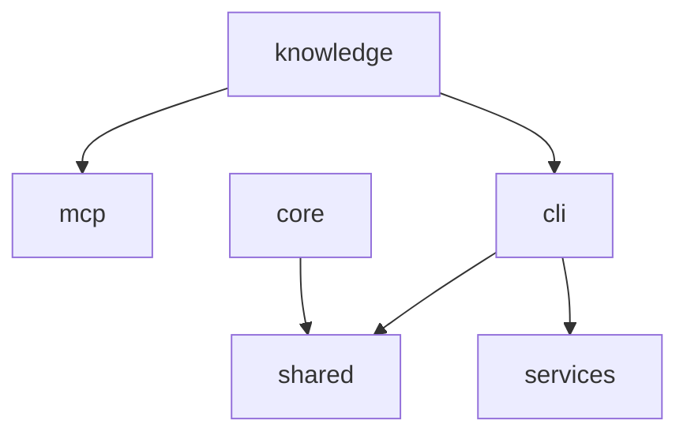

# registerBuildCommand 协作面

<details>
<summary>Relevant source files</summary>

- package.json
- src/cli/commands/build.ts
- src/cli/commands/scan.ts
- src/cli/index.ts
- src/core/scanner.ts
- src/mcp/codebase-memory-client.ts
</details>

本页聚焦一条横跨 CLI、core 与 mcp 三个模块的协作链路：CLI 入口 `createProgram` 注册 `registerBuildCommand` / `registerScanCommand`（`src/cli/index.ts:9`、`src/cli/commands/build.ts:11`、`src/cli/commands/scan.ts:4`），core 层的扫描器负责技术栈与项目类型识别（`src/core/scanner.ts:238`、`:54`、`:298`、`:311`），mcp 层客户端负责知识图谱的工具调用与返回结构适配（`src/mcp/codebase-memory-client.ts:250`、`:140`、`:166`、`:35`、`:45`、`:92`）。它之所以值得单独成页，是因为固定文档通常按目录切分，而这条链路的协作点分散在「命令注册 → 项目扫描 → 图谱工具调用 → 列式表适配」四个环节，跨越 cli / core / mcp 三个模块边界（`core→shared` 4 次、`cli→shared` 3 次、`knowledge→mcp` 3 次、`knowledge→cli` 3 次、`cli→services` 2 次），单看任一文件都无法理解其配合方式。

---

## 职责与范围

本主题覆盖 5 个文件，按目录前缀分别归属 cli / core / mcp 三个模块（归属依据：文件路径前缀与 `boundaries` 中的模块名一致）。

| 文件 | 模块 | 本主题内的分工 | 本文有锚点的关键符号 |
| --- | --- | --- | --- |
| `src/cli/index.ts` | cli | 命令注册入口，负责把各子命令注册进 CLI 程序并读取 CLI 版本 | `createProgram`→`getCliVersion`（`src/cli/index.ts:9`） |
| `src/cli/commands/build.ts` | cli | build 子命令注册点 | `registerBuildCommand`（`src/cli/commands/build.ts:11`） |
| `src/cli/commands/scan.ts` | cli | scan 子命令注册点 | `registerScanCommand`（`src/cli/commands/scan.ts:4`） |
| `src/core/scanner.ts` | core | 项目扫描：技术栈识别、项目类型判定、gitignore 加载、原生 import 提取 | `collectImportedPackages`（`src/core/scanner.ts:238`）、`detectNativeImports`（`:54`） |
| `src/mcp/codebase-memory-client.ts` | mcp | 知识图谱 MCP 客户端：工具执行、索引确保、架构/片段查询、返回结构适配 | `exec`（`:250`）、`getArchitecture`（`:140`）、`getCodeSnippet`（`:166`）、`asObjects`（`:35`）、`adaptArchitecture`（`:45`）、`adaptTrace`（`:92`）、`ensureIndexed`（`:131`） |

模块依赖关系（节点均为 `boundaries` 中出现的真实模块名）：



---

## 关键符号

### `exec`（`src/mcp/codebase-memory-client.ts:250`）

签名：

```ts
(tool: string, args: Record<string, unknown>)
```

该方法是 mcp 客户端的内部统一执行入口，docstring 为 `// --- 内部方法 ---`，说明其位于「内部方法」分区之下 。它与本主题中三个上层查询方法直接相连：`ensureIndexed`→`exec`、`getArchitecture`→`exec`、`getCodeSnippet`→`exec`，三处调用锚点均落在 `src/mcp/codebase-memory-client.ts:250` ；`exec` 自身再调用 `parseJsonOutput`（`src/mcp/codebase-memory-client.ts:273`）完成输出解析 。因此所有图谱读取路径都先汇聚到该方法，再流向 JSON 解析。

### `getArchitecture`（`src/mcp/codebase-memory-client.ts:140`）

签名：

```ts
()
```

docstring 为「架构概览」，复杂度标注为 0 。它是适配层的起点：先通过 `exec`（`src/mcp/codebase-memory-client.ts:250`）取回原始结果 ，再交给 `adaptArchitecture`（`src/mcp/codebase-memory-client.ts:45`）转换成业务对象 。它是本主题中唯一同时连接「执行层」与「适配层」的符号，可作为理解两层分界的观察点。

### `getCodeSnippet`（`src/mcp/codebase-memory-client.ts:166`）

签名：

```ts
(qualifiedName: string)
```

docstring 为「代码片段+元数据」，入参是 `qualifiedName` 。它只调用 `exec`（`src/mcp/codebase-memory-client.ts:250`），数据中未出现其对应的适配函数调用边，因此其返回值形态在本主题证据范围内不可见（见「待确认」）。

### `ensureIndexed`（`src/mcp/codebase-memory-client.ts:131`）

签名：

```ts
(mode: 'fast' | 'moderate' | 'full' = 'moderate')
```

docstring 为「确保图谱已索引（幂等）」，默认模式为 `moderate` 。它通过 `exec`（`src/mcp/codebase-memory-client.ts:250`）下发索引动作 。该符号是链路中唯一显式声明「幂等」语义的入口，说明图谱读取前存在一个可重复调用的准备阶段。

### `adaptArchitecture`（`src/mcp/codebase-memory-client.ts:45`）

签名：

```ts
(raw: Record<string, any>)
```

docstring 为「get_architecture 列式表 → ArchitectureData 对象数组」。它由 `getArchitecture` 调用（`src/mcp/codebase-memory-client.ts:45`），内部继续调用 `asObjects`（`src/mcp/codebase-memory-client.ts:35`）与 `lastSegment`（`src/mcp/codebase-memory-client.ts:42`）。因此它的职责是把「列式表」这一原始形态转成结构化对象数组，并在转换中对 qualified_name 做末段简化。

### `asObjects`（`src/mcp/codebase-memory-client.ts:35`）

签名：

```ts
(raw: Record<string, unknown>, key: string)
```

docstring 为「兼容两种形态：旧版对象数组 / 新版列式表」。它被 `adaptArchitecture` 调用（`src/mcp/codebase-memory-client.ts:35`），并进一步调用 `tableToObjects`（`src/mcp/codebase-memory-client.ts:27`）。该符号是版本兼容的关键节点：同一返回值需同时接受旧版对象数组与新版列式表两种结构。

### `adaptTrace`（`src/mcp/codebase-memory-client.ts:92`）

签名：

```ts
(raw: Record<string, any>)
```

docstring 为「trace_path 分组列式表 → 扁平 TraceNode[]」，复杂度标注为 4，是本主题适配函数中复杂度最高者 。它调用 `adaptSide`（`src/mcp/codebase-memory-client.ts:93`）。数据中未出现任何调用方指向 `adaptTrace` 的边，即它在当前证据下是一个「有待接入」的适配器（见「待确认」）。

### `collectImportedPackages`（`src/core/scanner.ts:238`）

签名：

```ts
(files: ScannedFile[])
```

docstring 说明：扫描源文件，提取所有 import 语句引用的包名；只保留被实际 import 的依赖，过滤死依赖（声明了但从未使用）；覆盖 ES import / require / 动态 import，以及 CSS `@import "pkg"`（tailwind 插件类依赖的常见引入方式，如 tw-animate-css）。它被 `detectTechStack` 调用（`src/core/scanner.ts:238`）。这段注释同时给出了「过滤死依赖」和「覆盖 CSS @import」两条明确的行为承诺，是本主题中语义最完整的符号。

### `detectNativeImports`（`src/core/scanner.ts:54`）

签名：

```ts
(files: ScannedFile[])
```

docstring 为「Python/Go 源文件 import 提取 → 规范技术栈名（去重排序；上限控成本）」，复杂度标注为 10，为本主题复杂度最高的符号 。它面向没有 `package.json` 的仓库场景，用 import 语句本身作为技术栈证据（依据 `src/core/scanner.ts:46` 处 `NATIVE_IMPORT_MAP` 的注释）。数据中未出现指向它的调用边，其调用方在本主题证据范围内不可见（见「待确认」）。

---

## 协作方式

### CLI 命令注册链

| 调用方 | 被调用方 | 锚点 | 证据 |
| --- | --- | --- | --- |
| `createProgram` | `getCliVersion` | `src/cli/index.ts:9` |  |
| `createProgram` | `registerScanCommand` | `src/cli/commands/scan.ts:4` |  |
| `createProgram` | `registerBuildCommand` | `src/cli/commands/build.ts:11` |  |

三个被调用方的锚点分布在三个不同文件，说明 `createProgram` 是本主题中唯一的跨文件聚合点：它同时依赖版本读取与两个子命令注册模块。

### MCP 客户端内部执行链

| 调用方 | 被调用方 | 锚点 | 证据 |
| --- | --- | --- | --- |
| `ensureIndexed` | `exec` | `src/mcp/codebase-memory-client.ts:250` |  |
| `getArchitecture` | `exec` | `src/mcp/codebase-memory-client.ts:250` |  |
| `getCodeSnippet` | `exec` | `src/mcp/codebase-memory-client.ts:250` |  |
| `exec` | `parseJsonOutput` | `src/mcp/codebase-memory-client.ts:273` |  |
| `getArchitecture` | `adaptArchitecture` | `src/mcp/codebase-memory-client.ts:45` |  |
| `adaptArchitecture` | `asObjects` | `src/mcp/codebase-memory-client.ts:35` |  |
| `adaptArchitecture` | `lastSegment` | `src/mcp/codebase-memory-client.ts:42` |  |
| `asObjects` | `tableToObjects` | `src/mcp/codebase-memory-client.ts:27` |  |
| `adaptTrace` | `adaptSide` | `src/mcp/codebase-memory-client.ts:93` |  |

该链路呈两段式：上半段是「查询方法 → `exec` → `parseJsonOutput`」的执行与解析段；下半段是「`getArchitecture` → `adaptArchitecture` → `asObjects` → `tableToObjects`」的结构适配段，其中 `adaptArchitecture` 还旁路调用 `lastSegment` 做名称简化 。

### 扫描器内部判定链

| 调用方 | 被调用方 | 锚点 | 证据 |
| --- | --- | --- | --- |
| `detectTechStack` | `collectImportedPackages` | `src/core/scanner.ts:238` |  |
| `detectProjectType` | `looksLikeLibrary` | `src/core/scanner.ts:298` |  |
| `detectProjectType` | `workspaceHasPackages` | `src/core/scanner.ts:311` |  |
| `constructor` | `loadGitignore` | `src/core/scanner.ts:93` |  |

技术栈识别与项目类型判定是两条并行分支：前者向下调用 `collectImportedPackages` ，后者分别调用 `looksLikeLibrary` 与 `workspaceHasPackages` ；此外还存在一条 `constructor`→`loadGitignore` 的初始化边 。

### 客户端构造期依赖

| 调用方 | 被调用方 | 锚点 | 证据 |
| --- | --- | --- | --- |
| `constructor` | `toProjectName` | `src/mcp/codebase-memory-client.ts:289` |  |
| `constructor` | `findBinary` | `src/mcp/codebase-memory-client.ts:293` |  |

`constructor` 在 mcp 客户端内部分别调用 `toProjectName` 与 `findBinary`，即客户端在实例化阶段就完成项目名推导与二进制定位 。注意：数据中存在两个不同的 `constructor` 调用边（一个指向 core 的 `loadGitignore`，一个指向 mcp 的 `toProjectName` / `findBinary`），其归属判定依据是各自锚点所在的文件路径 。

---

## 跨模块边界

| 方向 | 调用次数 | 证据 | 对本主题的含义 |
| --- | --- | --- | --- |
| `core` → `shared` | 4 |  | core 层扫描逻辑对外依赖最集中的方向，`src/core/scanner.ts` 的改动可能牵动最多下游 |
| `cli` → `shared` | 3 |  | CLI 注册与命令实现共享同一基础层 |
| `knowledge` → `mcp` | 3 |  | 知识/生成侧依赖 mcp 客户端，与 `src/mcp/codebase-memory-client.ts` 的公开查询方法（`getArchitecture` `:140`、`getCodeSnippet` `:166`） 构成耦合面 |
| `knowledge` → `cli` | 3 |  | 知识/生成侧反向依赖 cli 层，说明 cli 不只是入口，也可能被复用 |
| `cli` → `services` | 2 |  | 命令层对 services 的依赖，次数最少 |

修改代价评估：从调用次数看，`core→shared`（4 次）是本主题涉及的最重边界 ，改动 `src/core/scanner.ts` 中的导出可能影响面最大；`knowledge` 同时向 `mcp` 与 `cli` 各发起 3 次调用 ，意味着 mcp 客户端与 cli 的对外接口一旦变动，知识/生成侧需同步调整。此外，`src/mcp/codebase-memory-client.ts` 内部的 `exec` 是所有查询的汇聚点（3 条入边 、1 条出边 ），它的签名 `(tool, args: Record<string, unknown>)`  是事实上的协议边界。

---

## 设计动机

数据中提供的 `intent` 证据全部为符号注释与首提交信息，以下引用保留原文与锚点。

**（1）列式表适配的动机：** `tableToObjects` 的注释为「列式表 {cols, rows} → 对象数组（v0.10.x format=json 的结构）」（`src/mcp/codebase-memory-client.ts:27`）；`asObjects` 的注释为「兼容两种形态：旧版对象数组 / 新版列式表」（`src/mcp/codebase-memory-client.ts:35`）。两者合并说明：适配层的存在是为了同时兼容新版列式表与旧版对象数组两种返回结构，其中列式表被明确标注为 v0.10.x 的格式 。

**（2）名称简化的动机：** `lastSegment` 的注释为「qualified_name 末段 → 简名（列式表里 entry_points/hotspots 只提供 qn）」（`src/mcp/codebase-memory-client.ts:42`）。该注释直接给出了必要性来源：列式表的 entry_points / hotspots 字段只提供 qualified_name，因此需要在前端呈现前补出简名。

**（3）原生 import 作为技术栈证据的动机：** `NATIVE_IMPORT_MAP` 的注释为「原生 import → 技术栈规范名（无 package.json 的 Python/Go/JVM 仓库：import 即证据）」（`src/core/scanner.ts:46`）；`detectNativeImports` 的注释为「Python/Go 源文件 import 提取 → 规范技术栈名（去重排序；上限控成本）」（`src/core/scanner.ts:54`）。两者共同说明：在缺少 `package.json` 的 Python/Go/JVM 仓库中，import 语句本身被当作技术栈的判定证据，并对结果做去重排序与数量上限控制以约束成本 。

**（4）演进痕迹：** 首提交信息显示 `src/core/scanner.ts` 的首次提交为「feat: 功能基本可用」（commit:76565d14，2026-06-02）；`src/mcp/codebase-memory-client.ts` 的首次提交为「refactor: 重构为基于 codebase-memory-mcp 知识图谱生成 wiki」（commit:9ef4fd6f，2026-06-24）。两条提交信息相隔约三周，且后者为 refactor 类型，可佐证 mcp 客户端是后续围绕知识图谱生成能力引入的重构产物。

---

## 待确认

1. **`registerBuildCommand` 的内部实现未知。** 数据中该符号仅以调用边形式出现（`src/cli/commands/build.ts:11`），缺少签名、选项定义与内部调用边，无法说明 build 命令在注册后如何触发扫描或图谱构建。缺什么证据：`src/cli/commands/build.ts` 的符号级签名与其向 core / mcp 的调用边。
2. **`adaptTrace` 的调用方缺失。** 该适配器有出边（`adaptTrace`→`adaptSide`，`src/mcp/codebase-memory-client.ts:93`） 但无入边，其是否已被 `trace_path` 查询路径接入无法确认。缺什么证据：指向 `adaptTrace` 的调用边。
3. **`detectNativeImports` 的调用方缺失。** 该符号具有完整注释与签名（`src/core/scanner.ts:54`），但数据中无调用边指向它，无法确认它由哪个上层流程触发。缺什么证据：`detectNativeImports` 的入边。
4. **辅助符号无签名：** `tableToObjects`、`lastSegment`、`adaptSide`、`parseJsonOutput`、`findBinary`、`toProjectName`、`loadGitignore` 仅以调用边锚点出现（`src/mcp/codebase-memory-client.ts:27`、`:42`、`:93`、`:273`、`:289`、`:293`，`src/core/scanner.ts:93`），无签名与 docstring，其参数与返回结构不可描述。

---

## 证据索引对照

| 证据 ID | 类型 | 锚点 |
| --- | --- | --- |
| E1 | symbol | `src/core/scanner.ts:238`（`collectImportedPackages`） |
| E2 | symbol | `src/core/scanner.ts:54`（`detectNativeImports`） |
| E3 | symbol | `src/mcp/codebase-memory-client.ts:131`（`ensureIndexed`） |
| E4 | symbol | `src/mcp/codebase-memory-client.ts:140`（`getArchitecture`） |
| E5 | symbol | `src/mcp/codebase-memory-client.ts:166`（`getCodeSnippet`） |
| E6 | symbol | `src/mcp/codebase-memory-client.ts:250`（`exec`） |
| E7 | symbol | `src/mcp/codebase-memory-client.ts:35`（`asObjects`） |
| E8 | symbol | `src/mcp/codebase-memory-client.ts:45`（`adaptArchitecture`） |
| E9 | symbol | `src/mcp/codebase-memory-client.ts:92`（`adaptTrace`） |
| E20 / E24 | edge | `asObjects`→`tableToObjects`；`adaptArchitecture`→`asObjects` |
| E27 | edge | `adaptTrace`→`adaptSide`（`src/mcp/codebase-memory-client.ts:93`） |
| E28–E32 | boundary | `cli→services`、`cli→shared`、`core→shared`、`knowledge→cli`、`knowledge→mcp` |
| E33 / E34 | intent | commit:76565d14 (2026-06-02)；commit:9ef4fd6f (2026-06-24) |
| E35–E39 | intent | `src/core/scanner.ts:46`、`:54`；`src/mcp/codebase-memory-client.ts:27`、`:35`、`:42` |
## Related

- 同目录：[topic-6.md](topic-6.md)
- 共享 4 个源文件、共享 19 个符号：[modules.md](../02-architecture/modules.md)
- 共享 5 个源文件、共享 14 个符号：[architecture.md](../02-architecture/architecture.md)
- 共享 5 个源文件、共享 8 个符号：[troubleshooting.md](../05-guides/troubleshooting.md)
- 总入口：[README](../README.md)
