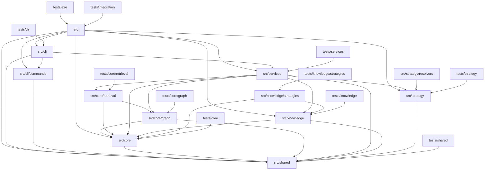

# 系统架构文档

## 架构设计概述

本系统采用经典的分层架构设计，整体划分为表现层、业务逻辑层和数据访问层三个核心层次。表现层由 CLI 模块承担，负责接收和解析用户输入的命令，并将其转化为内部可执行的指令。业务逻辑层则包含策略解析、知识构建和服务编排等模块，实现了从代码扫描、依赖分析到知识图谱构建和检索的完整业务闭环。数据访问层基于 SQLite 的图数据库和全文检索能力，为上层提供持久化和查询服务。

各层之间通过明确的接口进行协作。CLI 模块作为系统入口，接收用户命令后调用服务层的相关功能。服务层整合了策略解析器和知识构建器，前者负责识别项目的框架类型和依赖关系，后者则将分析结果转化为结构化的知识表示。核心模块提供了图存储和检索的底层支持，共享模块则为各层提供了哈希计算、ID 生成等通用工具。这种分层设计使得每一层都可以独立演进和测试，同时保持了清晰的依赖方向——上层依赖下层，下层不感知上层。

## 架构图

## 核心模块

**src** 模块是系统的顶层入口，负责初始化并启动整体程序，创建命令行解析器并注册所有子命令。

**src/cli** 模块承担命令行接口的职责，它解析用户输入的命令和选项，进行参数校验和路径查找，然后调用相应的底层服务完成具体操作。

**src/cli/commands** 模块定义了所有支持的子命令及其选项，包括命令构建、缓存目录管理和数据库文件路径设置等，为 CLI 模块提供命令注册的基础设施。

**src/core** 模块是系统的数据访问核心，封装了 BetterSqlite3 数据库的连接管理、代码块的元数据定义以及文件扩展名的配置，为上层的图存储和检索提供基础支持。

**src/core/graph** 模块实现了图数据结构的持久化，管理图节点和图边的存储与查询，支持路径搜索和图遍历等操作，是知识图谱存储的底层引擎。

**src/core/retrieval** 模块提供全文检索和结构化查询能力，基于 FTS5 实现了分类查询和混合排序，能够高效地从知识库中检索相关信息。

**src/services** 模块是业务编排层，它整合了解析、索引和检索等核心功能，对外提供统一的索引服务和问答服务接口，协调各子模块的协作流程。

**src/shared** 模块提供跨模块共享的通用工具函数和常量，包括哈希计算、唯一 ID 生成、文件语言识别等基础能力，被所有其他模块复用。

**src/strategy** 模块实现框架解析策略模式，定义了项目节点、依赖关系和解析器注册等核心抽象，能够灵活地识别不同类型的项目框架。

**src/strategy/resolvers** 模块包含针对特定框架的具体解析器实现，如 Commander、LangGraph 和 Mastra 等框架的依赖分析和结构识别。

**src/knowledge** 模块负责知识图谱的构建与管理，定义上下文类型和构建器接口，将代码分析结果转化为结构化的知识表示。

**src/knowledge/strategies** 模块实现了针对不同应用场景的知识构建策略，包括 Agent 和 Backend 等领域的专用知识提取与组织逻辑。

## 模块依赖

核心依赖关系主要体现在以下几条关键路径上。服务层是整个业务编排的中心，它同时依赖于策略层进行框架识别、依赖于知识层进行知识构建、依赖于核心层进行数据持久化和检索。这种设计使得服务层能够统领全局，而无需关心各子模块的内部实现细节。

图存储和检索模块都依赖于共享模块提供的工具函数，但两者之间也存在依赖关系——检索模块需要依赖图模块的存储结构来完成混合查询。知识层的策略实现依赖于核心数据库模块来持久化知识结果，同时也依赖于共享模块的通用能力。测试模块则直接反向依赖对应的源代码模块，形成完整的测试覆盖体系。