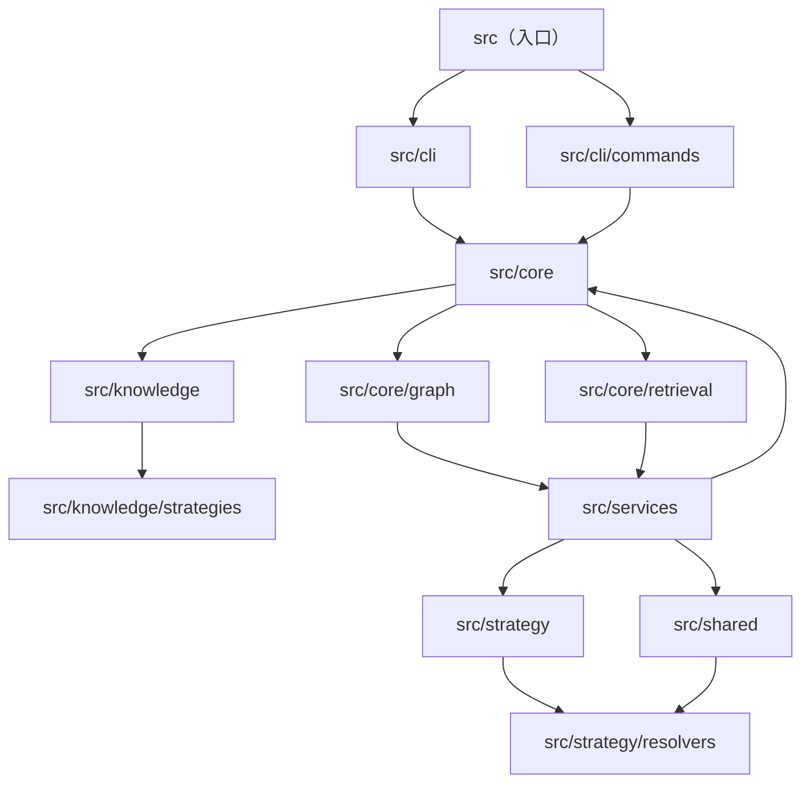

# 项目架构文档

## 整体架构设计思路

本系统采用分层架构设计，整体分为四个核心层级：命令行接口层（CLI）、核心业务逻辑层（Core）、服务层（Services）和策略解析层（Strategy）。各层职责清晰，通过单向依赖关系实现解耦，确保系统的可维护性和可扩展性。

最顶层为**命令行接口层**，负责接收用户命令并调度到对应的业务模块。该层包含命令注册与解析逻辑，是整个系统的入口。其下是**核心业务逻辑层**，提供数据库操作、图结构管理、检索以及知识库管理等基础能力，是系统的数据与计算核心。更下层为**服务层**，封装了索引构建、扫描、检索等业务服务，这些服务依赖于核心层提供的数据基础设施。最特殊的是**策略解析层**，它作为可插拔的框架解析器集合，被服务层调用，用于针对不同类型项目进行代码结构分析。

层层之间遵循严格的单向依赖：CLI层依赖Core层，Core层依赖Services层，Services层依赖Strategy层和Shared工具层。Shared层作为公共工具模块，被所有业务层依赖，提供哈希计算、ID生成等通用能力。这种分层使得各模块职责单一，便于独立测试和演进。

## 架构图

## 核心模块

### src（程序入口）
作为系统启动点，负责创建主程序对象并初始化命令行环境。该模块通过组合命令注册与配置参数，将控制权移交给CLI层。

### src/cli（命令行接口）
管理用户交互的命令行界面，包含命令的注册、解析与调度逻辑。该模块定义命令模型，并协调不同子命令（如init、ask、build）的执行流程。

### src/cli/commands（命令实现）
集中存放各个具体命令的实现代码，包括项目初始化、知识库问答、索引构建等操作。每个命令封装独立的业务逻辑，并统一通过命令注册机制挂载到主程序。

### src/core（核心层）
系统的数据与计算中枢，提供数据库连接、文件扫描、代码分块等基础能力。该层封装了存储引擎（SQLite）、分块策略和类型定义，是上层服务的数据基石。

### src/core/graph（图结构管理）
管理代码调用关系的图数据结构，定义节点、边和路径等核心模型。该模块支持图的构建、查询和序列化，为代码分析提供图论基础。

### src/core/retrieval（检索模块）
实现知识检索的底层能力，包含全文搜索、向量搜索和混合排序等功能。该模块提供统一的检索接口，支持基于意图的分类查询，是问答服务的数据查找引擎。

### src/knowledge（知识库）
管理项目知识库的上下文定义，涵盖API、架构和业务等不同维度的知识表示。该模块定义知识数据结构，并支持知识的持久化与重建。

### src/knowledge/strategies（知识策略）
实现不同场景下的知识构建策略，如Agent维基、后端维基和CLI维基等。每种策略负责从原始数据中提取特定类型的知识并组织成结构化文档。

### src/services（服务层）
封装高层次的业务服务，包括索引构建、文件扫描、问答处理和关系图管理。该层协调核心模块与策略解析器完成复杂的端到端业务流程，是系统灵活性的关键。

### src/shared（共享工具）
提供跨模块使用的通用工具函数和常量，如语言类型枚举、哈希计算和ID生成器。该模块作为基础库被所有业务层引用，避免功能重复实现。

### src/strategy（策略解析）
定义框架解析器的注册与发现机制，支持动态加载不同类型的项目解析策略。该模块维护解析器注册表，并对外提供统一的解析接口。

### src/strategy/resolvers（解析器实现）
实现针对具体前端框架或工具库的代码解析逻辑，如Commander、LangGraph、Mastra等。每个解析器负责从特定类型的项目中提取模块依赖和调用关系。

## 模块依赖

核心依赖关系体现在：**src/cli**模块依赖于**src/core**获取数据库与文件操作能力，而**src/core**又依赖**src/core/graph**和**src/core/retrieval**实现图与检索功能。**src/services**作为业务封装层，同时依赖**src/core**的数据基础设施和**src/strategy**的解析能力，并将**src/shared**作为工具库使用。**src/knowledge**及其子模块依赖于**src/core**的数据库连接，但独立于具体业务服务，形成可复用的知识管理单元。

各层之间均通过接口或抽象基类解耦，例如解析器通过注册机制插入服务层，而核心层的图与检索模块通过依赖注入方式被服务层使用。这种设计保证了模块替换与扩展的便利性。