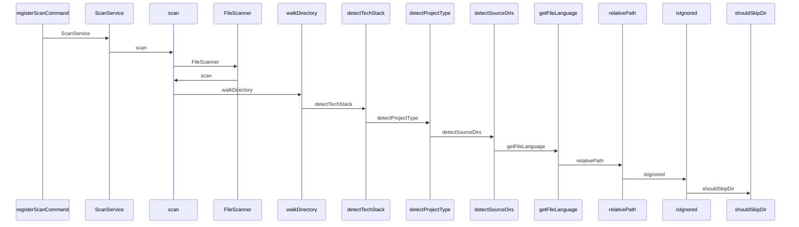

# Data Flow

## registerBuildCommand

```mermaid
sequenceDiagram
    participant registerBuildCommand
    participant src_cli_commands_scan_ts
    participant FileScanner
    participant CodebaseMemoryClient
    participant WikiService
    participant buildWiki
    participant WikiPageGenerator
    participant ensureIndexed
    participant WikiContextBuilder
    participant generatePage
    participant exec
    participant hasModel
    participant generateFallback
    participant generateWithLlm
    participant parseJsonOutput
    participant buildOverviewContext
    participant buildArchitectureContext
    participant buildDataFlowContext
    participant buildModulesContext
    participant buildApiContext
    participant buildBusinessContext
    participant buildDesignDecisionsContext
    participant buildGlossaryContext
    participant buildOnboardingContext
    participant buildTroubleshootingContext
    participant generateOverview
    participant generateArchitecture
    participant generateDataFlow
    participant generateModules
    participant generateApi
    participant generateBusiness
    participant generateDesignDecisions
    participant generateOnboarding
    participant generateTroubleshooting
    participant generateGlossary
    participant getArchitecture
    participant tracePath
    participant queryGraph
    participant labelToSymbolType
    participant generate
    registerBuildCommand->>src_cli_commands_scan_ts: src_cli_commands_scan_ts
    src_cli_commands_scan_ts->>FileScanner: FileScanner
    FileScanner->>CodebaseMemoryClient: CodebaseMemoryClient
    CodebaseMemoryClient->>WikiService: WikiService
    WikiService->>buildWiki: buildWiki
    buildWiki->>WikiPageGenerator: WikiPageGenerator
    WikiPageGenerator->>ensureIndexed: ensureIndexed
    ensureIndexed->>WikiContextBuilder: WikiContextBuilder
    WikiContextBuilder->>generatePage: generatePage
    generatePage->>exec: exec
    exec->>hasModel: hasModel
    hasModel->>generateFallback: generateFallback
    generateFallback->>generateWithLlm: generateWithLlm
    generateWithLlm->>parseJsonOutput: parseJsonOutput
    parseJsonOutput->>buildOverviewContext: buildOverviewContext
    buildOverviewContext->>buildArchitectureContext: buildArchitectureContext
    buildArchitectureContext->>buildDataFlowContext: buildDataFlowContext
    buildDataFlowContext->>buildModulesContext: buildModulesContext
    buildModulesContext->>buildApiContext: buildApiContext
    buildApiContext->>buildBusinessContext: buildBusinessContext
    buildBusinessContext->>buildDesignDecisionsContext: buildDesignDecisionsContext
    buildDesignDecisionsContext->>buildGlossaryContext: buildGlossaryContext
    buildGlossaryContext->>buildOnboardingContext: buildOnboardingContext
    buildOnboardingContext->>buildTroubleshootingContext: buildTroubleshootingContext
    buildTroubleshootingContext->>generateOverview: generateOverview
    generateOverview->>generateArchitecture: generateArchitecture
    generateArchitecture->>generateDataFlow: generateDataFlow
    generateDataFlow->>generateModules: generateModules
    generateModules->>generateApi: generateApi
    generateApi->>generateBusiness: generateBusiness
    generateBusiness->>generateDesignDecisions: generateDesignDecisions
    generateDesignDecisions->>generateOnboarding: generateOnboarding
    generateOnboarding->>generateTroubleshooting: generateTroubleshooting
    generateTroubleshooting->>generateGlossary: generateGlossary
    generateGlossary->>getArchitecture: getArchitecture
    getArchitecture->>tracePath: tracePath
    tracePath->>queryGraph: queryGraph
    queryGraph->>labelToSymbolType: labelToSymbolType
    labelToSymbolType->>generate: generate
    generate->>exec: exec
```

| From | To | Call | Location |
| --- | --- | --- | --- |
| registerBuildCommand | src/cli/commands/scan.ts | src/cli/commands/scan.ts | :0 |
| src/cli/commands/scan.ts | FileScanner | FileScanner | :0 |
| FileScanner | CodebaseMemoryClient | CodebaseMemoryClient | :0 |
| CodebaseMemoryClient | WikiService | WikiService | :0 |
| WikiService | buildWiki | buildWiki | :0 |
| buildWiki | WikiPageGenerator | WikiPageGenerator | :0 |
| WikiPageGenerator | ensureIndexed | ensureIndexed | :0 |
| ensureIndexed | WikiContextBuilder | WikiContextBuilder | :0 |
| WikiContextBuilder | generatePage | generatePage | :0 |
| generatePage | exec | exec | :0 |
| exec | hasModel | hasModel | :0 |
| hasModel | generateFallback | generateFallback | :0 |
| generateFallback | generateWithLlm | generateWithLlm | :0 |
| generateWithLlm | parseJsonOutput | parseJsonOutput | :0 |
| parseJsonOutput | buildOverviewContext | buildOverviewContext | :0 |
| buildOverviewContext | buildArchitectureContext | buildArchitectureContext | :0 |
| buildArchitectureContext | buildDataFlowContext | buildDataFlowContext | :0 |
| buildDataFlowContext | buildModulesContext | buildModulesContext | :0 |
| buildModulesContext | buildApiContext | buildApiContext | :0 |
| buildApiContext | buildBusinessContext | buildBusinessContext | :0 |
| buildBusinessContext | buildDesignDecisionsContext | buildDesignDecisionsContext | :0 |
| buildDesignDecisionsContext | buildGlossaryContext | buildGlossaryContext | :0 |
| buildGlossaryContext | buildOnboardingContext | buildOnboardingContext | :0 |
| buildOnboardingContext | buildTroubleshootingContext | buildTroubleshootingContext | :0 |
| buildTroubleshootingContext | generateOverview | generateOverview | :0 |
| generateOverview | generateArchitecture | generateArchitecture | :0 |
| generateArchitecture | generateDataFlow | generateDataFlow | :0 |
| generateDataFlow | generateModules | generateModules | :0 |
| generateModules | generateApi | generateApi | :0 |
| generateApi | generateBusiness | generateBusiness | :0 |
| generateBusiness | generateDesignDecisions | generateDesignDecisions | :0 |
| generateDesignDecisions | generateOnboarding | generateOnboarding | :0 |
| generateOnboarding | generateTroubleshooting | generateTroubleshooting | :0 |
| generateTroubleshooting | generateGlossary | generateGlossary | :0 |
| generateGlossary | getArchitecture | getArchitecture | :0 |
| getArchitecture | tracePath | tracePath | :0 |
| tracePath | queryGraph | queryGraph | :0 |
| queryGraph | labelToSymbolType | labelToSymbolType | :0 |
| labelToSymbolType | generate | generate | :0 |
| generate | exec | exec | :0 |

## registerScanCommand

| From | To | Call | Location |
| --- | --- | --- | --- |
| registerScanCommand | ScanService | ScanService | :0 |
| ScanService | scan | scan | :0 |
| scan | FileScanner | FileScanner | :0 |
| FileScanner | scan | scan | :0 |
| scan | walkDirectory | walkDirectory | :0 |
| walkDirectory | detectTechStack | detectTechStack | :0 |
| detectTechStack | detectProjectType | detectProjectType | :0 |
| detectProjectType | detectSourceDirs | detectSourceDirs | :0 |
| detectSourceDirs | getFileLanguage | getFileLanguage | :0 |
| getFileLanguage | relativePath | relativePath | :0 |
| relativePath | isIgnored | isIgnored | :0 |
| isIgnored | shouldSkipDir | shouldSkipDir | :0 |

## createProgram

```mermaid
sequenceDiagram
    participant createProgram
    participant registerInitCommand
    participant registerScanCommand
    participant registerBuildCommand
    participant ScanService
    participant scan
    participant src_cli_commands_scan_ts
    participant FileScanner
    participant CodebaseMemoryClient
    participant WikiService
    participant buildWiki
    participant WikiPageGenerator
    participant ensureIndexed
    participant WikiContextBuilder
    participant generatePage
    participant walkDirectory
    participant detectTechStack
    participant detectProjectType
    participant detectSourceDirs
    participant exec
    participant hasModel
    participant generateFallback
    participant generateWithLlm
    participant getFileLanguage
    participant relativePath
    participant isIgnored
    participant shouldSkipDir
    participant parseJsonOutput
    participant buildOverviewContext
    participant buildArchitectureContext
    participant buildDataFlowContext
    participant buildModulesContext
    participant buildApiContext
    participant buildBusinessContext
    participant buildDesignDecisionsContext
    participant buildGlossaryContext
    participant buildOnboardingContext
    participant buildTroubleshootingContext
    participant generateOverview
    participant generateArchitecture
    participant generateDataFlow
    participant generateModules
    participant generateApi
    participant generateBusiness
    participant generateDesignDecisions
    participant generateOnboarding
    participant generateTroubleshooting
    participant generateGlossary
    participant getArchitecture
    participant tracePath
    participant queryGraph
    participant labelToSymbolType
    participant generate
    createProgram->>registerInitCommand: registerInitCommand
    registerInitCommand->>registerScanCommand: registerScanCommand
    registerScanCommand->>registerBuildCommand: registerBuildCommand
    registerBuildCommand->>ScanService: ScanService
    ScanService->>scan: scan
    scan->>src_cli_commands_scan_ts: src_cli_commands_scan_ts
    src_cli_commands_scan_ts->>FileScanner: FileScanner
    FileScanner->>CodebaseMemoryClient: CodebaseMemoryClient
    CodebaseMemoryClient->>WikiService: WikiService
    WikiService->>buildWiki: buildWiki
    buildWiki->>FileScanner: FileScanner
    FileScanner->>scan: scan
    scan->>WikiPageGenerator: WikiPageGenerator
    WikiPageGenerator->>ensureIndexed: ensureIndexed
    ensureIndexed->>WikiContextBuilder: WikiContextBuilder
    WikiContextBuilder->>generatePage: generatePage
    generatePage->>walkDirectory: walkDirectory
    walkDirectory->>detectTechStack: detectTechStack
    detectTechStack->>detectProjectType: detectProjectType
    detectProjectType->>detectSourceDirs: detectSourceDirs
    detectSourceDirs->>exec: exec
    exec->>hasModel: hasModel
    hasModel->>generateFallback: generateFallback
    generateFallback->>generateWithLlm: generateWithLlm
    generateWithLlm->>getFileLanguage: getFileLanguage
    getFileLanguage->>relativePath: relativePath
    relativePath->>isIgnored: isIgnored
    isIgnored->>shouldSkipDir: shouldSkipDir
    shouldSkipDir->>parseJsonOutput: parseJsonOutput
    parseJsonOutput->>buildOverviewContext: buildOverviewContext
    buildOverviewContext->>buildArchitectureContext: buildArchitectureContext
    buildArchitectureContext->>buildDataFlowContext: buildDataFlowContext
    buildDataFlowContext->>buildModulesContext: buildModulesContext
    buildModulesContext->>buildApiContext: buildApiContext
    buildApiContext->>buildBusinessContext: buildBusinessContext
    buildBusinessContext->>buildDesignDecisionsContext: buildDesignDecisionsContext
    buildDesignDecisionsContext->>buildGlossaryContext: buildGlossaryContext
    buildGlossaryContext->>buildOnboardingContext: buildOnboardingContext
    buildOnboardingContext->>buildTroubleshootingContext: buildTroubleshootingContext
    buildTroubleshootingContext->>generateOverview: generateOverview
    generateOverview->>generateArchitecture: generateArchitecture
    generateArchitecture->>generateDataFlow: generateDataFlow
    generateDataFlow->>generateModules: generateModules
    generateModules->>generateApi: generateApi
    generateApi->>generateBusiness: generateBusiness
    generateBusiness->>generateDesignDecisions: generateDesignDecisions
    generateDesignDecisions->>generateOnboarding: generateOnboarding
    generateOnboarding->>generateTroubleshooting: generateTroubleshooting
    generateTroubleshooting->>generateGlossary: generateGlossary
    generateGlossary->>getArchitecture: getArchitecture
    getArchitecture->>tracePath: tracePath
    tracePath->>queryGraph: queryGraph
    queryGraph->>labelToSymbolType: labelToSymbolType
    labelToSymbolType->>generate: generate
```

| From | To | Call | Location |
| --- | --- | --- | --- |
| createProgram | registerInitCommand | registerInitCommand | :0 |
| registerInitCommand | registerScanCommand | registerScanCommand | :0 |
| registerScanCommand | registerBuildCommand | registerBuildCommand | :0 |
| registerBuildCommand | ScanService | ScanService | :0 |
| ScanService | scan | scan | :0 |
| scan | src/cli/commands/scan.ts | src/cli/commands/scan.ts | :0 |
| src/cli/commands/scan.ts | FileScanner | FileScanner | :0 |
| FileScanner | CodebaseMemoryClient | CodebaseMemoryClient | :0 |
| CodebaseMemoryClient | WikiService | WikiService | :0 |
| WikiService | buildWiki | buildWiki | :0 |
| buildWiki | FileScanner | FileScanner | :0 |
| FileScanner | scan | scan | :0 |
| scan | WikiPageGenerator | WikiPageGenerator | :0 |
| WikiPageGenerator | ensureIndexed | ensureIndexed | :0 |
| ensureIndexed | WikiContextBuilder | WikiContextBuilder | :0 |
| WikiContextBuilder | generatePage | generatePage | :0 |
| generatePage | walkDirectory | walkDirectory | :0 |
| walkDirectory | detectTechStack | detectTechStack | :0 |
| detectTechStack | detectProjectType | detectProjectType | :0 |
| detectProjectType | detectSourceDirs | detectSourceDirs | :0 |
| detectSourceDirs | exec | exec | :0 |
| exec | hasModel | hasModel | :0 |
| hasModel | generateFallback | generateFallback | :0 |
| generateFallback | generateWithLlm | generateWithLlm | :0 |
| generateWithLlm | getFileLanguage | getFileLanguage | :0 |
| getFileLanguage | relativePath | relativePath | :0 |
| relativePath | isIgnored | isIgnored | :0 |
| isIgnored | shouldSkipDir | shouldSkipDir | :0 |
| shouldSkipDir | parseJsonOutput | parseJsonOutput | :0 |
| parseJsonOutput | buildOverviewContext | buildOverviewContext | :0 |
| buildOverviewContext | buildArchitectureContext | buildArchitectureContext | :0 |
| buildArchitectureContext | buildDataFlowContext | buildDataFlowContext | :0 |
| buildDataFlowContext | buildModulesContext | buildModulesContext | :0 |
| buildModulesContext | buildApiContext | buildApiContext | :0 |
| buildApiContext | buildBusinessContext | buildBusinessContext | :0 |
| buildBusinessContext | buildDesignDecisionsContext | buildDesignDecisionsContext | :0 |
| buildDesignDecisionsContext | buildGlossaryContext | buildGlossaryContext | :0 |
| buildGlossaryContext | buildOnboardingContext | buildOnboardingContext | :0 |
| buildOnboardingContext | buildTroubleshootingContext | buildTroubleshootingContext | :0 |
| buildTroubleshootingContext | generateOverview | generateOverview | :0 |
| generateOverview | generateArchitecture | generateArchitecture | :0 |
| generateArchitecture | generateDataFlow | generateDataFlow | :0 |
| generateDataFlow | generateModules | generateModules | :0 |
| generateModules | generateApi | generateApi | :0 |
| generateApi | generateBusiness | generateBusiness | :0 |
| generateBusiness | generateDesignDecisions | generateDesignDecisions | :0 |
| generateDesignDecisions | generateOnboarding | generateOnboarding | :0 |
| generateOnboarding | generateTroubleshooting | generateTroubleshooting | :0 |
| generateTroubleshooting | generateGlossary | generateGlossary | :0 |
| generateGlossary | getArchitecture | getArchitecture | :0 |
| getArchitecture | tracePath | tracePath | :0 |
| tracePath | queryGraph | queryGraph | :0 |
| queryGraph | labelToSymbolType | labelToSymbolType | :0 |
| labelToSymbolType | generate | generate | :0 |