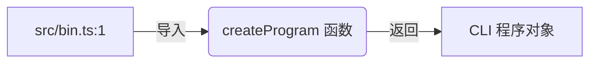
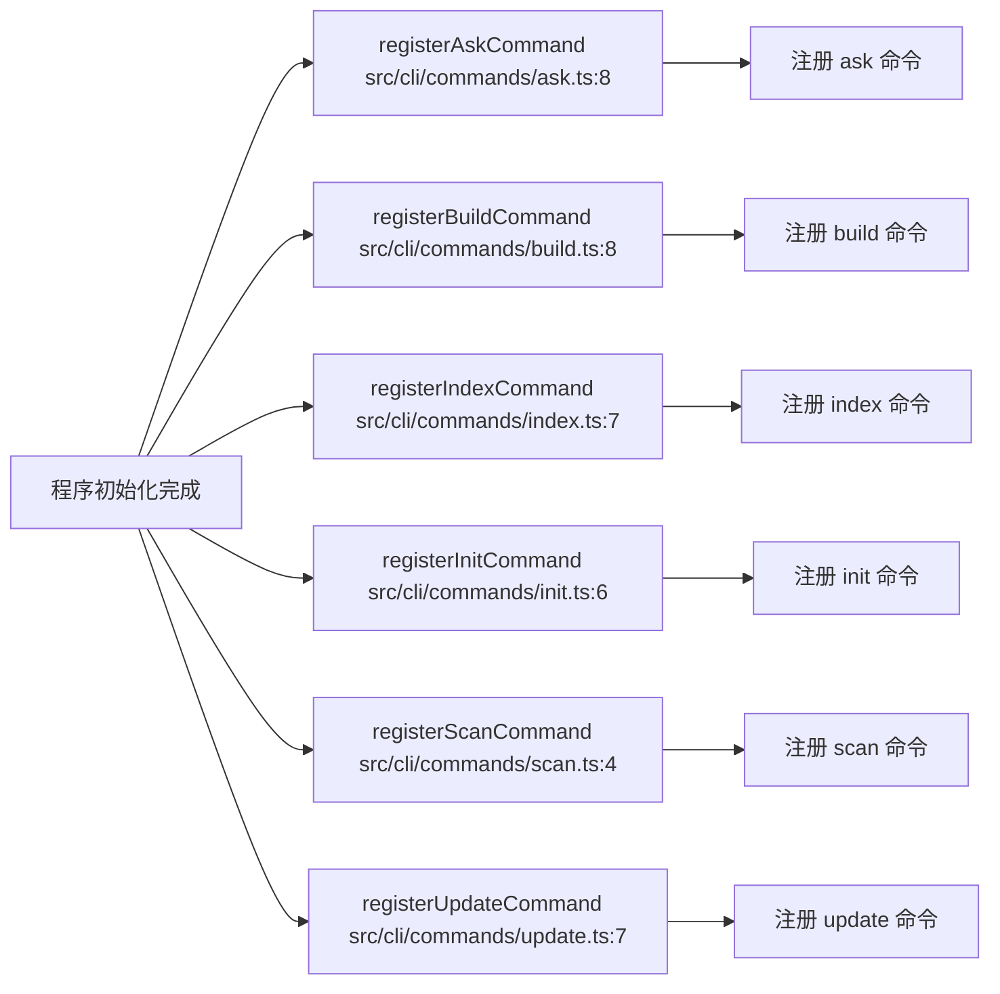
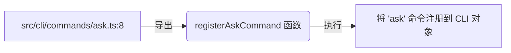

好的，根据您提供的执行管线数据，以下是该项目的数据流文档。

---

# 项目数据流文档

## 核心数据流概述

本项目是一个基于命令行的工具（CLI），其核心数据流遵循“入口初始化 → 命令注册 → 命令分发与执行”的经典模式。启动入口 `src/bin.ts` 是数据流的起点，它通过导入 `createProgram` 函数来初始化 CLI 框架。随后，程序会依次注册多个核心子命令（如 `ask`、`build`、`index`、`init`、`scan`、`update`），每个子命令的注册逻辑独立封装在 `src/cli/commands/` 目录下的对应文件中。整个数据流从“创建程序”开始，以“命令注册”为关键中间步骤，最终形成一个可响应用户输入的命令系统。

## 执行管线分析

以下将逐一分析项目中的核心执行管线，包括其完整流程和调用链。

### 1. 程序初始化管线 (`createProgram`)

**完整流程描述**：
此管线是项目的启动入口。数据流从 `src/bin.ts` 文件的第一行开始，通过 `import { createProgram }` 语句引入一个用于创建 CLI 程序的工厂函数。这个函数会配置基础选项（如程序名称、版本号等），并返回一个代表整个 CLI 应用的“程序”对象。这个对象是所有后续命令注册的容器。

**关键调用步骤**：
- `src/bin.ts:1` → 导入 `createProgram`，获取 CLI 程序实例

### 2. 核心命令注册管线 (`registerAskCommand`, `registerBuildCommand`, `registerIndexCommand`, `registerInitCommand`, `registerScanCommand`, `registerUpdateCommand`)

这六条管线结构高度相似，代表了项目的核心功能模块。它们共享一个通用的数据流模式。

**完整流程描述**：
在程序初始化完成后，数据流进入命令注册阶段。每个命令都有自己独立的注册函数，这些函数分别在 `src/cli/commands/` 目录下的对应文件中定义。例如，`registerAskCommand` 位于 `ask.ts:8`，它会将 `ask` 命令（通常用于提问或查询）挂载到之前创建的 CLI 程序对象上。整个注册过程是确定性的，按照预定义的顺序执行，最终形成一个完整的命令树。

以下是所有核心命令注册管线的总览：

以 `registerAskCommand` 为例，其独立的调用链为：

**关键调用步骤**：
- `src/cli/commands/ask.ts:8` → 导出并执行 `registerAskCommand`，注册 `ask` 子命令
- `src/cli/commands/build.ts:8` → 导出并执行 `registerBuildCommand`，注册 `build` 子命令
- `src/cli/commands/index.ts:7` → 导出并执行 `registerIndexCommand`，注册 `index` 子命令
- `src/cli/commands/init.ts:6` → 导出并执行 `registerInitCommand`，注册 `init` 子命令
- `src/cli/commands/scan.ts:4` → 导出并执行 `registerScanCommand`，注册 `scan` 子命令
- `src/cli/commands/update.ts:7` → 导出并执行 `registerUpdateCommand`，注册 `update` 子命令

### 数据流总结

从宏观上看，该 CLI 工具的数据流清晰地划分为两个阶段：

1.  **启动阶段**：`src/bin.ts` 作为唯一入口，通过调用 `createProgram` 构建基础程序框架。
2.  **命令构建阶段**：程序框架构建完毕后，随即调用各个独立的 `register*Command` 函数。每个函数都负责将一个具体的命令（如 `ask`、`build` 等）及其对应的处理逻辑注册到程序上。这六个命令的注册过程彼此独立且并行发生，共同构成了 CLI 的全部功能。

这种设计模式实现了“程序初始化”与“功能模块注册”的解耦，每个命令的实现都隔离在自己的文件中，便于维护和扩展。用户最终在终端输入的命令（如 `my-cli ask`）会由这个已注册的命令树进行解析和分发。