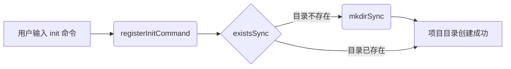
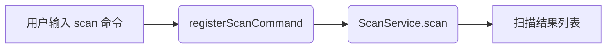
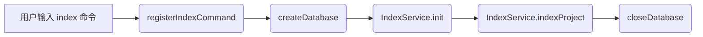
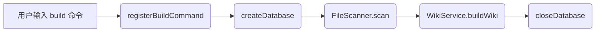
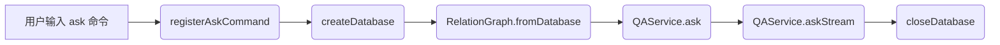
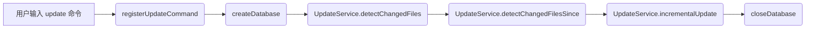
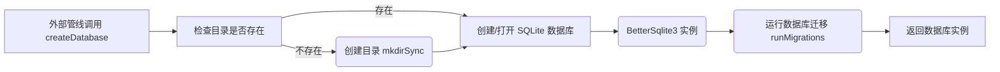
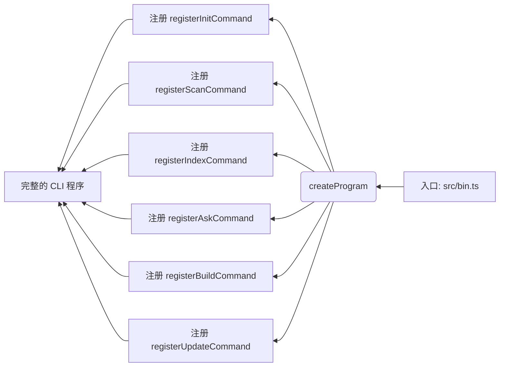

好的，这是根据您提供的管线数据生成的文档。

## 数据流文档

本项目是一个基于 CLI 的代码知识库工具，其核心数据流围绕一个 SQLite 数据库展开。用户通过不同的命令触发不同的处理管线。数据流的起点是用户的 CLI 命令输入，终点是生成持久化的数据库文件或输出查询结果。大部分命令（如 `index`, `build`, `ask`, `update`）都依赖于 `init` 命令建立的初始项目结构和一个由 `createDatabase` 管线创建的中央数据库。这个数据库是项目数据流的枢纽，所有扫描、索引、查询和更新操作都与之交互。

### 1. `init` 命令管线: 项目初始化

此管线负责创建项目所需的目录结构。流程从接收用户输入的命令开始，核心操作是检查并创建项目根目录。

**关键调用步骤:**
- **入口**: 命令注册 `registerInitCommand` (src/cli/commands/init.ts:6) → 检查目录 `existsSync` (src/cli/commands/init.ts:2) → 创建目录 `mkdirSync` (src/cli/commands/init.ts:2) → **终点**

### 2. `scan` 命令管线: 文件扫描

该管线负责扫描指定路径下的文件。它调用 `ScanService` 的 `scan` 方法进行实际的扫描操作。

**关键调用步骤:**
- **入口**: 命令注册 `registerScanCommand` (src/cli/commands/scan.ts:4) → 扫描文件 `ScanService.scan` (src/core/scanner.ts:43) → **终点**

### 3. `index` 命令管线: 建立索引

此管线将项目代码索引到数据库中。它首先创建数据库，然后初始化索引服务，最后执行实际的索引操作。

**关键调用步骤:**
- **入口**: 命令注册 `registerIndexCommand` (src/cli/commands/index.ts:7) → 创建/打开数据库 `createDatabase` (src/cli/commands/ask.ts:3) → 初始化解析器 `init` (src/core/parser.ts:24) → 执行索引 `indexProject` (src/services/index-service.ts:62) → 关闭数据库 `closeDatabase` (src/cli/commands/ask.ts:3) → **终点**

### 4. `build` 命令管线: 生成 Wiki

该管线会扫描文件并基于数据库内容生成 Wiki 格式的输出。流程与 `index` 类似，但使用了不同的服务。

**关键调用步骤:**
- **入口**: 命令注册 `registerBuildCommand` (src/cli/commands/build.ts:9) → 创建/打开数据库 `createDatabase` (src/cli/commands/ask.ts:3) → 扫描文件 `scan` (src/core/scanner.ts:43) → 构建 Wiki `buildWiki` (src/services/wiki-service.ts:34) → 关闭数据库 `closeDatabase` (src/cli/commands/ask.ts:3) → **终点**

### 5. `ask` 命令管线: 问答查询

此管线用于向索引好的数据库提问。它从数据库中读取关系图，然后使用 QAService 来回答问题。

**关键调用步骤:**
- **入口**: 命令注册 `registerAskCommand` (src/cli/commands/ask.ts:8) → 创建/打开数据库 `createDatabase` (src/cli/commands/ask.ts:3) → 从数据库加载图 `fromDatabase` (src/core/graph/relation-graph.ts:140) → 处理问题 `ask` (src/services/qa-service.ts:31) → 流式输出答案 `askStream` (src/services/qa-service.ts:74) → 关闭数据库 `closeDatabase` (src/cli/commands/ask.ts:3) → **终点**

### 6. `update` 命令管线: 增量更新

该管线检测自上次更新后发生变化的文件，并对数据库进行增量更新，避免了全量重建。

**关键调用步骤:**
- **入口**: 命令注册 `registerUpdateCommand` (src/cli/commands/update.ts:7) → 创建/打开数据库 `createDatabase` (src/cli/commands/ask.ts:3) → 检测所有变化文件 `detectChangedFiles` (src/services/update-service.ts:13) -> 检测特定时间点后的变化 `detectChangedFilesSince` (src/services/update-service.ts:32) → 执行增量更新 `incrementalUpdate` (src/services/update-service.ts:44) → 关闭数据库 `closeDatabase` (src/cli/commands/ask.ts:3) → **终点**

### 7. `createDatabase` 管线: 数据库创建与迁移

这是一个被其他多个管线（如 `index`, `build`, `ask`, `update`）调用的核心工具管线。它负责确保数据库文件存在，然后运行所有必要的数据库迁移。

**关键调用步骤:**
- **入口**: 调用 `createDatabase` (src/cli/commands/ask.ts:3) → 数据库目录检查 `existsSync` (src/cli/commands/init.ts:2) → 创建目录 `mkdirSync` (src/cli/commands/init.ts:2) → 实例化数据库 `BetterSqlite3` (src/core/database.ts:1) → 执行迁移 `runMigrations` (src/core/database.ts:93) → **终点**

### 8. `createProgram` 管线: 主程序入口

这是程序的启动入口，它负责将所有独立的子命令（管线）注册到一个主 CLI 程式中，从而形成完整的用户交互界面。

**关键调用步骤:**
- **入口**: `createProgram` (src/bin.ts:1) → 初始化命令 `registerInitCommand` (src/cli/commands/init.ts:6) → 扫描命令 `registerScanCommand` (src/cli/commands/scan.ts:4) → 索引命令 `registerIndexCommand` (src/cli/commands/index.ts:7) → 问答命令 `registerAskCommand` (src/cli/commands/ask.ts:8) → 构建命令 `registerBuildCommand` (src/cli/commands/build.ts:9) → 更新命令 `registerUpdateCommand` (src/cli/commands/update.ts:7) → **终点**